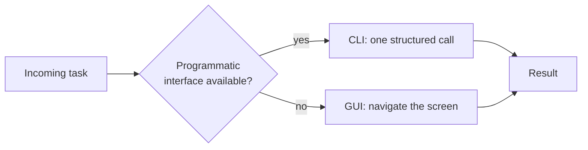
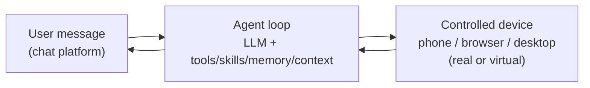

# A paper result is not a product

Train a GUI agent that nails 80% of ScreenSpot-Pro and ship nothing — and you've built a benchmark trophy, not a tool anyone uses. Real users don't run evals. They want to text "book me a window seat" from their couch and have it happen. ClawGUI-Agent is the paper's answer to a question most agent papers skip: **how does a trained policy reach an actual person?**

> "A trained agent that cannot be deployed, personalized, or integrated into daily workflows delivers no practical value." — *Section 3.4*

That gap — capable model, no path to a user — is what the rest of this lesson closes.

## CLI vs. GUI: pick one and you lose something

The CLI-agent wave (think OpenClaw-style command-driven control) is fast: one structured command replaces five taps through nested menus. But it has real limits.

| | CLI | GUI |
|---|---|---|
| Coverage | Only apps with programmatic interfaces | Any app, regardless of architecture |
| Steps per task | Fewer — one call can do what GUI needs many taps for | More — must navigate the visual layer |
| Transparency | Opaque — user can't observe or intervene | Visible — actions match what a human would see |

> "We argue that neither paradigm alone is sufficient." — *Section 3.4.1*

CLI is precise and efficient, but plenty of apps expose nothing programmatic to call, and even when they do, the user is left staring at a black box that bypasses the very visual layer that makes agent behavior interpretable. GUI fixes both: it works on *any* app and stays visible — at the cost of more steps per task.

ClawGUI-Agent's move is **hybrid**: use CLI where an interface permits it, fall back to GUI everywhere else. Fast where it can be, universal where it must be.

## Memory that recognizes you, not a transcript that remembers everything

Without memory, every session starts from zero — the agent re-asks who "Mom" is in your contacts every single time. ClawGUI-Agent fixes this with a **persistent personalized memory system**: during a task, it automatically extracts structured facts — contact names and relationships, frequently used apps, habits and preferences — and stores them as vector embeddings.

On the *next* task, it retrieves the top-k most semantically similar memories and injects them into context, so the agent recognizes recurring entities and adapts to your patterns over time. Crucially, duplicate memories are **detected and merged, not accumulated** — the store stays lean instead of growing into an unbounded log.

> **Wait — isn't this just chat history?** No. A transcript is raw and grows forever; replaying it would flood the context window with noise. Personalized memory is the opposite: deduplicated, structured *facts* ("prefers aisle seats", "DoorDash is the default delivery app"), retrieved by semantic similarity to the current task — not dumped wholesale.

## Same agent, two places it can live

ClawGUI-Agent ships in two deployment topologies:

- **Remote control** — you message the agent from 12+ chat platforms (Feishu, DingTalk, Telegram, Discord, Slack, QQ, and more) to control a *separate* target phone.
- **Local control** — the chat app runs on the very phone being controlled; the agent takes over locally, with no extra hardware or cloud relay needed.

This is Figure 4's architecture: a message-driven server-side loop that's identical whether it's reaching across the network to a remote phone, or running in place on the device the chat app already lives on.
