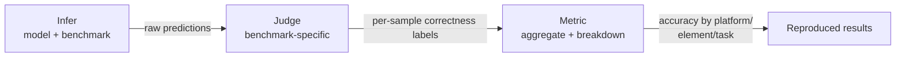

# Two papers, one benchmark, two different numbers

Picture this: Paper A reports their GUI agent hits 62% accuracy on ScreenSpot-Pro. Paper B, six months later, reports a "better" model at 64%. Is that a genuine advance? Or did Paper B just resize screenshots differently, shuffle the prompt order, or sample at a different temperature?

You can't tell. And that's the actual crisis, not a hypothetical one:

> "Prompt ordering, coordinate normalization conventions, image resolution, and sampling temperature interact in ways that shift reported accuracy by several points across implementations. As a result, numbers across papers are rarely comparable, and the community has no reliable baseline against which to measure true progress." — *Section 3.3*

Several points of swing from *formatting choices*, not modeling choices. That's enough to make a "state of the art" claim meaningless — the gap between two papers' numbers could be 100% prompt engineering and 0% model quality.

## The fix: pin everything, then split evaluation into stages

ClawGUI-Eval's answer has two parts. First, it **pins every evaluation choice per model** — no more silently-different resolution or temperature between runs. Second, it restructures evaluation itself into **three decoupled stages**: Infer → Judge → Metric. Each stage has a clean input/output contract, and — critically — each can be rerun on its own.

The payoff is concrete: a **95.8% reproduction rate** against official published results, across **6 benchmarks** and **11+ models** (Figure 3). That's the number that makes cross-paper comparison trustworthy again.

Each arrow is a stable handoff — which is what makes the next section's "rerun just one stage" trick possible.

## Coverage: breadth is the point

A reproducibility framework is only as convincing as what it covers. ClawGUI-Eval spans **6 benchmarks** — ScreenSpot-Pro, ScreenSpot-V2, UI-Vision, MMBench-GUI, OSWorld-G, and AndroidControl — covering both GUI *grounding* (find the right element) and *navigation* (complete a multi-step task). On the model side it supports **11+ models**, including Qwen3-VL, Qwen2.5-VL, UI-TARS, GUI-Owl, and Gemini. All inference outputs are published alongside the eval code, so anyone can check the work directly rather than trust a table.

## Inside the pipeline

**Infer** turns a (benchmark, model) pair into raw predictions. It supports two backends — local GPU via `transformers`, or any OpenAI-compatible remote API — and parallelizes across multiple GPUs automatically, one process per GPU. A long benchmark run is also fragile, so it uses **shard-level checkpointing**: if a run dies partway through, it resumes from the last completed shard instead of recomputing everything from scratch.

**Judge** is where "correct" actually gets decided, and it's deliberately *not* one-size-fits-all:

| Benchmark shape | Judge | Why it's different |
|---|---|---|
| Standard grounding (click the right element) | Point-in-box | A predicted point either lands inside the target's bounding box or it doesn't |
| OSWorld-G | Polygon + refusal-aware | Targets can be irregular polygons, and a model is allowed to refuse — that has to count as a distinct outcome, not a wrong answer |
| AndroidControl | Multi-action | Success can require a *sequence* of correct actions, not one point or click |

> **Wait — isn't decoupling Infer/Judge/Metric just a code-cleanliness thing?** No — it's an operational necessity. Inference is the expensive part (GPU-hours across 11+ models × 6 benchmarks). If you decide your point-in-box parser had an off-by-one bug, decoupling means you **re-judge the existing raw predictions** with the fixed parser in minutes — you never touch the Infer stage again. Bolt Judge directly onto Infer and every parser fix would force you to redo all the expensive inference too.

**Metric** takes the Judge stage's per-sample correctness labels and aggregates them into final accuracy — but not just one top-line number. It breaks results down by **platform, UI element type, and task category**, so you can see *where* a model is strong or weak instead of staring at a single blended percentage that hides the interesting variance.
