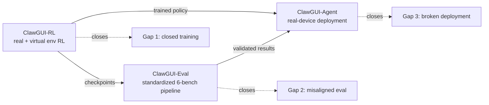

# Why GUI agents need more than a better model

Suppose you already have a great GUI agent. It grounds elements accurately, plans multi-step tasks, recovers from mistakes. Ship it — what happens next?

If you're being honest: probably nothing. It stays in a notebook, evaluated on whatever benchmark numbers you could scrounge up, never installed on a real phone, never touched by a real user. That gap between "we trained a good policy" and "people are actually using this" is the subject of this paper, and it's not a modeling problem.

## The pitch: GUIs are the universal interface

A GUI agent perceives a screen and emits taps, swipes, and keystrokes. Because every app — no matter how obscure, no matter whether it exposes an API — has a GUI, an agent that can drive *any* interface can in principle operate *any* application:

> "An agent that can perceive screen state and execute low-level interface actions such as tapping, swiping, and typing is, in principle, capable of operating any application on any device without requiring dedicated APIs or backend access." — Section 1

That's the appeal: no API integration tax, no backend access, no per-app special-casing. It's also why GUI agents have become one of the most actively pursued paths toward end-to-end digital automation over the last two years.

## Wait, isn't this just "train a bigger/better vision-language model"?

That's the natural assumption, and the paper pushes back on it directly:

> "Building a capable GUI agent, however, is not a single modeling problem but a full-stack engineering problem." — Section 1

Grounding accuracy has improved steadily. Navigation horizons have gotten longer. Online RL has started beating static supervised training. Each piece, in isolation, has gotten better. The paper's claim is that none of that is the bottleneck anymore — what's missing is a coherent pipeline connecting training, evaluation, and deployment. Try to assemble the pieces from different papers into one working system and the cracks show immediately: incompatible environments, non-comparable numbers, agents with nowhere to go once trained.

## Three concrete gaps

The paper names exactly three, each a systems/infrastructure failure rather than a missing technique:

| Gap | What's broken | Why it's an infra problem, not a modeling one |
|---|---|---|
| **Training ecosystem is closed** | Papers report strong online-RL results, but release no infrastructure; what code exists is emulator-only, real-device training is unexplored | The hard part is environment management — emulators drift unhealthy over long runs, real devices can't expose system-level verification signals, rewards are sparse by construction |
| **Evaluation is misaligned** | Reported numbers across papers aren't comparable | Prompt formatting, coordinate normalization, image resolution, and sampling config silently shift accuracy by several points — undocumented, so a 2% gain could be a real advance or just a different resolution |
| **Deployment loop is broken** | Trained agents almost never reach real users | CLI-based harnesses give precise control but cover a narrow slice of apps; systems that connect a policy to real hardware, real chat interfaces, and persistent personalization are largely absent |

> "The training ecosystem for GUI agents remains largely closed... Evaluation across GUI agent papers is badly misaligned... The deployment loop from research to real users is broken." — Section 1

Notice what's *not* in this list: better grounding accuracy, longer context, smarter planning. Every gap here is about plumbing — what environment you train in, what configuration you evaluate under, what device the agent eventually runs on.

## ClawGUI's answer: three modules closing all three gaps

Each module closes exactly one gap. **ClawGUI-RL** is open-source RL infrastructure validated on both parallel virtual environments *and* real physical devices, combining GiGPO with a Process Reward Model for dense, step-level supervision instead of relying solely on sparse outcome rewards. **ClawGUI-Eval** pins every evaluation choice per model across 6 benchmarks and 11+ models, reaching 95.8% reproduction against official baselines. **ClawGUI-Agent** brings a trained policy to Android, HarmonyOS, and iOS through 12+ chat platforms, with hybrid CLI-GUI control and persistent personalized memory.

The headline number ties it together: trained end to end inside this pipeline, **ClawGUI-2B reaches 17.1% Success Rate on MobileWorld GUI-Only**, beating the same-scale **MAI-UI-2B baseline at 11.1%** — a 6.0-point gain from the same model size, attributable to the pipeline, not a bigger model.
