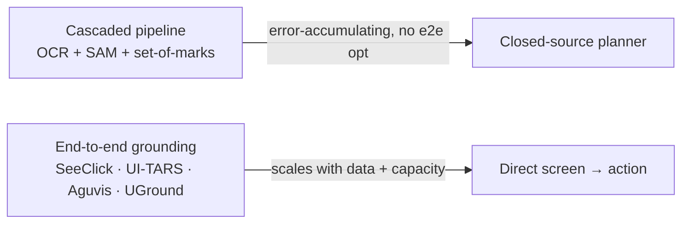

# Where ClawGUI sits in the GUI-agent landscape

Before you can tell whether ClawGUI is novel or just another wrapper, you need to know what already exists. Three lines of prior work matter here: the models that perceive and act on screens, the RL recipes that train them, and the benchmarks that supposedly measure them. ClawGUI doesn't try to out-build any of the three — it sits underneath all of them.

## From cascaded pipelines to end-to-end grounding

Early GUI agents were assembled, not trained: bolt an OCR module onto a SAM segmenter, add set-of-marks prompting, hand the result to a closed-source planner. It worked, sort of, but errors compounded across every stage and nothing could be optimized end-to-end.

As vision-language foundation models matured, **SeeClick**, **UI-TARS**, **Aguvis**, and **UGround** showed that localization accuracy simply scales with data and model capacity — no cascade required. A second wave then pushed beyond single-step grounding toward long-horizon navigation, splitting into two camps: modular systems pairing a grounding model with a proprietary planner, and unified policies that internalize perception and decision-making jointly.

> "ClawGUI is orthogonal to this modeling axis: rather than proposing a new grounding or navigation model, it provides a shared harness in which both paradigms can be trained, evaluated, and deployed under consistent conditions." — Section 2.1

That's the first positioning claim worth sitting with: ClawGUI isn't competing with SeeClick or UI-TARS for a benchmark leaderboard spot. It's the harness those models would plug into.

## Online RL: real gains, but nobody opens the box

Collecting labeled trajectories for long-horizon GUI tasks is expensive — every demonstration needs step-by-step execution and faithful environment replay. Online RL sidesteps this: let the agent generate its own experience and optimize against outcome rewards instead.

A real line of work has shown this works — **MobileGUI-RL**, **ComputerRL**, **MAI-UI**, **UI-Venus-1.5**, **UI-TARS-2** all report consistent gains over supervised fine-tuning from sandbox-based online training. But the paper is pointed about what's missing:

> "None of these works open-source their training infrastructure, and all are validated solely in virtual sandboxes, leaving real-device training almost entirely unexplored." — Section 2.2

Three difficulties recur across this line of work: reward signals are sparse over long action sequences, multi-step credit assignment is nontrivial, and the infrastructure cost — parallel simulation, episode management across heterogeneous apps — is substantial. **ClawGUI-RL** targets this gap directly: it's released, not just described, and validated on both parallel emulators and real physical devices, with dense step-level reward supervision to address the sparsity problem head-on.

## Wait, isn't a benchmark just... a benchmark? Why would the numbers not be comparable?

Because a benchmark score is the output of an entire undocumented configuration, not just a model. **ScreenSpot-Pro**, **ScreenSpot-V2**, **UI-Vision**, **MMBench-GUI**, **OSWorld-G**, **AndroidControl**, and interactive suites like **MobileWorld** have become the de facto yardsticks for GUI agent progress — but:

> "Prompt formatting, coordinate normalization, image resolution, sampling temperature, and post-processing rules interact in ways that shift reported accuracy by several points, and many of these choices are undocumented." — Section 2.3

| What silently shifts the score | Why it's invisible in a paper's table |
|---|---|
| Prompt formatting | Rarely reproduced verbatim |
| Coordinate normalization convention | Often unstated |
| Image resolution | Easy to vary, rarely logged |
| Sampling temperature / config | Usually omitted entirely |

The consequence: a 2-point improvement on a leaderboard might be a real advance, a friendlier prompt, or a different image resolution — and a reader has no way to tell which. Prior standardization attempts only made partial progress: some cover a single benchmark, some are bundled with one specific training recipe, some release evaluation scripts but not the inference predictions needed to independently re-judge results.

**ClawGUI-Eval** is built against exactly this failure mode: it decouples evaluation into standardized inference, judging, and metric computation; pins every configuration choice per model; and releases inference outputs across 6 benchmarks and 11+ models — so results can be reproduced and re-judged without re-running expensive inference from scratch.

## The pattern across all three sections

Look at the shape of each gap: GUI grounding models are plentiful and improving, but nobody supplies the harness to train, evaluate, and deploy them consistently. ClawGUI's contribution in every case is the same move — not a new point on the modeling axis, but the missing shared infrastructure underneath the whole axis.
