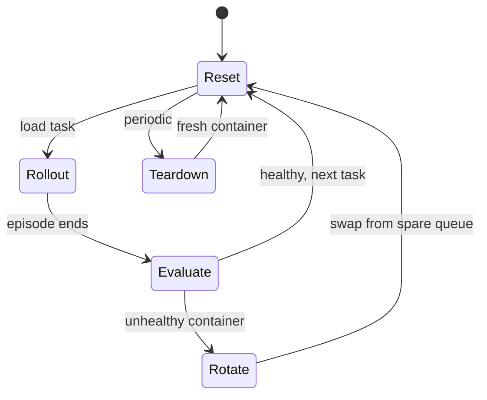

# A fleet of flaky devices, not a fancy algorithm

Here's the thing nobody warns you about when you set out to train a GUI agent with RL: the hard part isn't the RL. It's keeping hundreds of Android environments alive long enough for the RL to happen.

Picture a training run with dozens of emulators churning through GUI tasks in parallel, 24/7, for days. Emulators drift. They crash mid-rollout. They get stuck in a bad state and silently start returning garbage screenshots. And if you're training on a *real* physical phone instead of an emulator, there's no root access at all — you can't peek at the database or the app's internal state to check if a task actually succeeded. ClawGUI-RL's Environment Manager (Section 3.2.1, Figure 2) exists to make this mess invisible to the RL trainer above it.

## One interface, two very different backends

ClawGUI-RL abstracts virtual and real devices behind a single unified interface, so the RL trainer never has to know which one it's talking to:

- **Virtual environments** — dozens of Docker-based Android emulators launched in parallel via MobileWorld, each exposing a backend URL that training workers hit directly.
- **Real devices** — physical Android phones or cloud phones, wired into the *same* loop.

> **Wait — isn't a real device just an emulator that happens to be physical?** No. A Docker container is disposable: crash it, throw it away, spin up a fresh one from a spare queue. A physical phone is not disposable, and — critically — it gives you no root access. You can't inspect its database or local storage to verify a task. That single fact cascades into a completely different evaluation strategy, below.

## The four-stage lifecycle every environment goes through

Every environment, virtual or real, cycles through the same four stages on repeat:

1. **Task Reset** — at the start of each episode, the environment resets device state and loads a fresh task, so every rollout starts clean.
2. **Task Evaluation** — did the agent succeed? *Virtual* environments get the deluxe treatment: system-level root access lets ClawGUI-RL directly inspect app state and database records, **plus** an MLLM-as-judge cross-checks the final screen against the task instruction. *Real* devices get only the MLLM-as-judge — there's no root access to fall back on, so the judge model is the entire reward signal.
3. **Spare Server Rotation** — long training runs cause containers to stall or crash. Rather than let one dead container poison the whole run, ClawGUI-RL keeps a queue of healthy spare containers on standby. The moment a container is flagged unhealthy, the system swaps in a spare and the affected task resumes — no training interruption.
4. **Teardown** — containers get periodically restarted from scratch anyway, even if nothing's obviously wrong, to prevent slow state accumulation from quietly degrading fidelity over a long run.

## Why real devices are the harder problem

It's tempting to think real-device training is "the same thing, just slower." It isn't. Two extra problems show up that virtual environments never face:

| Problem | Virtual environment | Real device |
|---|---|---|
| Task source | Procedurally generated | Must be human-authored to be executable and verifiable |
| Task verification | System-level inspection + MLLM-as-judge | MLLM-as-judge only — no root access |

That second row is the load-bearing one. Without root access, there's no ground truth to fall back on if the judge model gets it wrong. The reward signal for real-device training is *only as good as the judge*.

The payoff for getting this infrastructure right: the RL trainer (next lesson) gets to assume every environment it talks to is healthy, fresh, and evaluated consistently — whether it's a disposable container or someone's actual phone.
