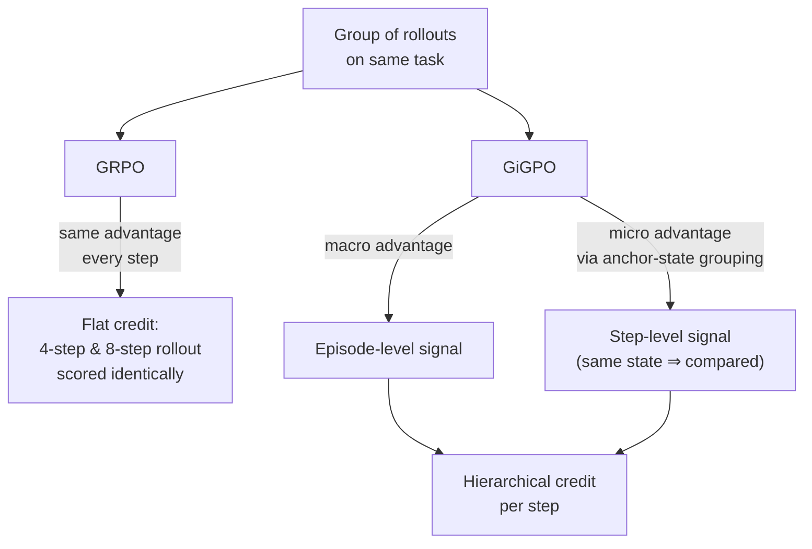

# Sparse rewards starve long-horizon GUI policies

Imagine learning to cook a recipe where you only find out if the meal was good or bad *after* eating it — no feedback on whether the chopping, the searing, or the seasoning was the part that went wrong. That's binary outcome reward for a 20-step GUI task: a single 1 or 0 at the very end, with execution latency and multi-step interaction stretching the gap between any one action and its consequence. ClawGUI-RL (Section 3.2.2) tackles this from two angles: a better reward signal, and a credit-assignment scheme that can actually use it.

## Fix #1: stop relying on one bit at the end

The primary signal is still a **binary outcome reward** — 1 for success, 0 for failure — because you ultimately do care whether the task got done. But on its own it's "extremely sparse," in the paper's words, giving almost no guidance about which of the 20 steps actually mattered.

So ClawGUI-RL adds a **Process Reward Model (PRM)**: after every action, it feeds the model the previous screenshot, the current screenshot, and the full action history so far, and asks it to judge whether *this specific action* meaningfully contributed to finishing the task. That produces a dense, per-step score, combined with the outcome reward as:

> 𝑅 = 𝑅outcome + 𝑅step  (Eq. 1)

Now the optimizer has feedback at *every* step, not just the last one — enough to tell a productive tap from a dead-end scroll.

## Fix #2: stop spreading that signal evenly across the episode

A dense reward is wasted if the RL algorithm immediately flattens it back into one number per trajectory. That's exactly what **GRPO** does. GRPO estimates advantages by normalizing returns within a group of rollouts on the same task — but it assigns one *uniform episode-level advantage* to every step in the trajectory.

Here's the concrete problem the paper raises (Section 3.2.3): rollout A solves a task in **4 steps**; rollout B solves the *same* task in **8 steps**. Both succeed, so GRPO gives both trajectories the same reward — and therefore the same advantage on every one of their steps. There is no signal anywhere that says "A's steps were efficient, B padded the trajectory with 4 redundant ones."

**GiGPO** fixes this with a two-level hierarchical advantage:

- **Macro (episode level)** — same idea as GRPO: normalize whole-trajectory returns against the group, preserving the global "was this trajectory good overall" signal.
- **Micro (step level)** — an *anchor-state grouping* trick: across different rollouts, find steps that land in the **same intermediate environment state**, retroactively cluster them into a sub-group, and compute a relative advantage *within that sub-group* via discounted return normalization.

> **Wait — isn't this just per-step reward shaping with a value network?** No. GiGPO doesn't train a learned value function and doesn't collect any extra rollouts. It re-derives credit from the trajectories you already have, by noticing when two different rollouts pass through the same state and comparing what happened *from there onward*.

The result: GiGPO can tell efficient steps from wasted ones on the *same successful task* — exactly the resolution long-horizon GUI training needs, without a heavier training setup.
