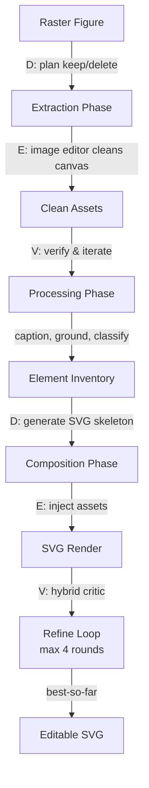

# CraftEditor: Converting Raster Figures to Editable SVGs

Raster figures do not support the element-level edits that research workflows demand—swapping icons, completing partial diagrams, or recoloring components. CraftEditor converts a raster figure (whether produced by Crafter or obtained externally) into a coordinate-faithful, editable SVG by instantiating the harness loop on vector composition rather than pixel synthesis.

CraftEditor organizes this conversion into three sequential phases, each instantiating the four-role harness (Designer, Executor, Verifier, Reviser):

## Phase 1: Extraction — Instruction-Driven Canvas Cleaning

Scientific figures—particularly conference posters with 25–50 visual assets—exhibit overlapping elements, text, and heterogeneous backgrounds that defeat off-the-shelf segmentation.

CraftEditor replaces segmentation with an instruction-driven extraction loop:

- **Designer**: A vision-language agent inspects the raster and authors a per-figure *keep/delete plan*, specifying which elements to preserve and which to remove.
- **Executor**: An instructable image editor executes the plan at the pixel level, producing a cleaned canvas.
- **Verifier**: Inspects the cleaned canvas and either accepts it or returns a diagnostic that triggers another round (max 3 iterations).
- **Reviser**: Refines the keep/delete plan based on what remains.

Per-element assets are cropped from the clean canvas, with a hallucination filter discarding blank, mismatched, or text-only extractions before composition.

## Phase 2: Processing

Each extracted element is:
- **Captioned**: A description of what it shows
- **Grounded**: Mapped to its location in the original raster
- **Classified**: Identified as vector (line art, shapes) or raster (bitmap content)

This creates a structured inventory for composition.

## Phase 3: Composition — Iterative SVG Assembly

A single language-model call to produce an SVG from the element inventory routinely generates layouts whose grid topology, arrow endpoints, or text labels disagree with the input raster. Instead, composition uses the full harness loop:

- **Designer**: Generates two candidate SVG skeletons at different decoding temperatures.
- **Convergence Judge**: Selects the better candidate via rapid visual comparison.
- **Executor**: Splices the extracted assets into the placeholders of the selected skeleton.
- **Verifier** (Hybrid Critic): Evaluates the rendered SVG against the original raster via two complementary channels:
  - A vision-language model assessing global layout fidelity and semantic correspondence
  - Programmatic checkers auditing structural properties (text overflow, arrow-endpoint accuracy, element overlap, missing components)
- **Reviser**: Modifies the SVG source in response to the diagnostic.

The loop runs for up to *T*=4 rounds, with best-so-far reversion guarding against non-monotonic regressions.

## Why the Hybrid Critic Works

Vision-language evaluation alone tends to miss structural problems. A text label might look correct to a VLM but overflow its container, or an arrow endpoint might be slightly misaligned in ways that matter geometrically. Combining VLM assessment (semantic meaning) with programmatic checks (geometric correctness) catches both types of errors.
