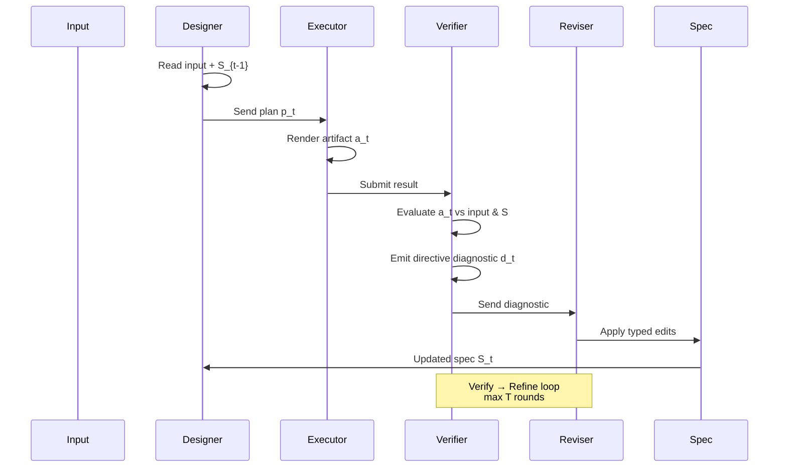

# The Harness Abstraction: Planning, Verification, and Revision

A **harness** is an orchestration layer that wraps an executor (like an image generator) with planning, verification, and structured revision. It detects and corrects the executor's failure modes without modifying the executor itself.

The harness operates as a four-role loop over a shared, evolving specification *S*—a structured record that accumulates the current plan, revision history, and prior diagnostics.

## The Four-Role Loop

At each round *t*, the loop executes:

- **Designer (D)** reads the input and current specification *S*_{t−1}, then produces an actionable plan *p*_t
- **Executor (E)** renders the plan into an artifact *a*_t (e.g., a generated image)
- **Verifier (V)** evaluates the artifact against the input and specification, emitting a **directive diagnostic** *d*_t
- **Reviser (R)** applies typed edits to the specification, modifying *S* in place rather than appending free text

The loop terminates when *V* accepts the artifact or a round budget *T* is reached, returning the best artifact *a\** found.

## Two Key Properties

**Pluggable executor**: All task-specific behavior resides in the prompts of the Designer, Verifier, and Reviser. You can swap the executor (from image generator to SVG coder, for example) without changing the orchestration.

**Typed edits over free text**: The Reviser writes structured operations—adding layout constraints, banning artifact categories, resizing named elements—to a shared record, not free-text amendments to a prompt. This keeps the specification internally consistent across rounds and prevents the contradictions that plague iterative free-text revision.

## What Directive Diagnostics Do

A scalar score ("5/10") provides no actionable target for the next round. A directive diagnostic instead contains:
- Per-dimension scores along multiple quality axes
- Identified defects and their locations
- Suggested corrections
- A revised description of what should be fixed

This gives the Reviser specific, structured targets to address rather than vague feedback.
