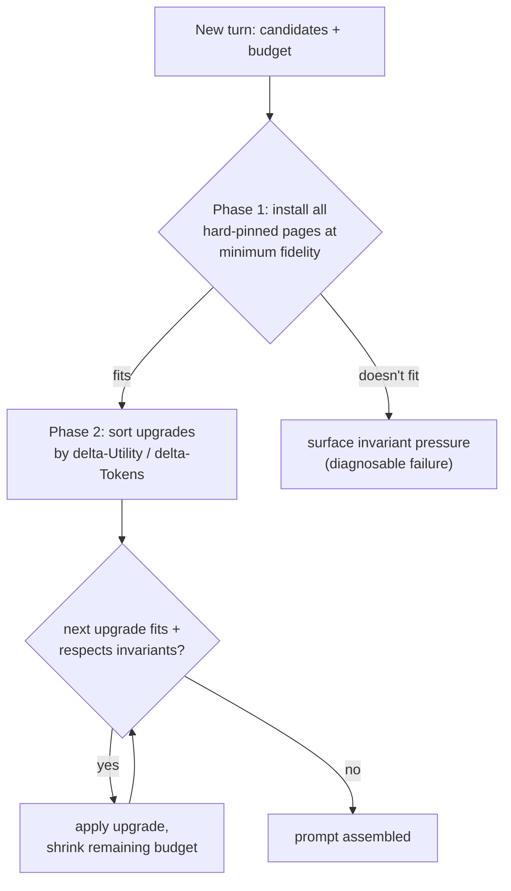
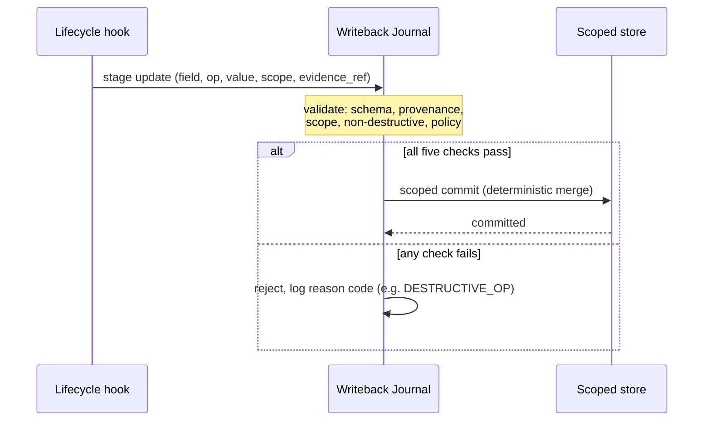

# Fault model, selection policy, and validated writeback

## Faults are silent

> "Unlike OS page faults, which the kernel resolves transparently from disk,
> agent faults are silent: without instrumentation the harness cannot detect
> missing state, and recovery means regeneration." — Section 3

ClawVM defines two families of **observable** faults — operationalizing the
residency, durability, and observability failures from Lesson 1.

| Family | Fault | What it means |
|---|---|---|
| Working-set (residency) | refetch | an evicted tool result is re-retrieved |
| | duplicate-tool | an equivalent tool call reruns because the result was evicted |
| | pinned-invariant-miss | a hard-pinned page is missing at prompt assembly |
| | post-compaction bootstrap | a required Bootstrap/Policy page is missing after compaction |
| Durability | silent-recall | lookup returns empty when the backend actually denied/errored |
| | flush-miss | dirty pages lost because the runtime destroyed context before commit |

These are **policy-controllable** — a correct policy can prevent them. Physical
insufficiency (budget too small for all pinned pages) and semantic errors (a
factually wrong update) are out of policy's control and evaluated separately.
Repeated tool calls that reuse a *resident* result are logged separately as
**duplicate-signature alerts** — workload signals, not policy failures.

## Quantifying instability: the thrash index

> "thrash = F / (H + 1), where F counts paging events (explicit faults plus
> duplicate-signature alerts) and H counts hits over the entire run; +1 prevents
> division by zero." — Appendix A

A high thrash index signals a working-set/budget mismatch — even a policy with
zero *faults* can have nonzero thrash from inherent tool-signature repetition.

## Phase 1 then Phase 2: a deterministic knapsack

Prompt assembly is "a multi-choice knapsack with hard constraints" (Section 3),
solved in two phases:

Phase 1 alone guarantees the structural floor: as long as the minimum-fidelity
set fits the budget, every requirement from Lesson 1 holds *regardless* of how
Phase 2 ranks its upgrades.

## Validated writeback: stage, validate, commit

A **set-with-version** update is only valid if the staged version matches the
journal's last committed version for that key — otherwise it's rejected as
`DESTRUCTIVE_OP`. This is what makes writeback non-destructive: the journal keeps
rejected updates with their reason codes rather than silently overwriting.
