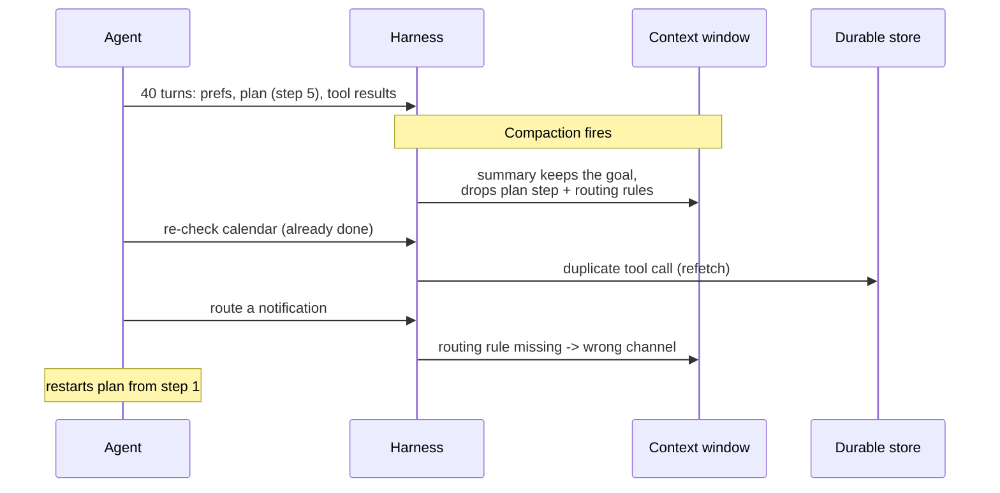

# The harness as a memory manager

## A context window is "physical memory"

Stateful agents like OpenClaw, Claude Code, or Codex CLI run for hours or days,
accumulating state across hundreds of tool calls. The context window — the text
the model actually sees — is tiny compared to everything the agent has learned:
preferences, plans, tool results, conversation history. Something has to decide
what stays in view and what gets pushed out.

> "Stateful tool-using LLM agents treat the context window as working memory, yet
> today's agent harnesses manage residency and durability as best-effort, causing
> recurring failures: lost state after compaction, bypassed flushes on reset, and
> destructive writeback." — Abstract

The paper's core move is naming this for what it already is:

> "every prompt-assembly decision (what to include, at what fidelity, what to
> drop) is a page-replacement decision: the context window is physical memory,
> durable stores are disk." — Section 2

## A failure that isn't an edge case

Picture an agent 40 turns into a morning routine: email triage, calendar
conflicts, smart-home configuration. It has loaded preferences, a multi-step plan
(currently on step 5), and a dozen tool results. Then **compaction** fires.

The summary preserves the high-level goal but drops the current step, the routing
rules, and the evidence that conflicts were already resolved. The agent re-queries
calendars it already inspected, misroutes a notification, and restarts a plan it
had completed through step 5. On reset, all 40 turns of decisions can vanish the
same way — the runtime evicts dirty state without writing it back.

## Three failure classes, one set of root causes

| Failure class | What practitioners see |
|---|---|
| **Residency** | Compaction drops directives and tool outputs |
| **Durability** | Flushes bypassed on reset; destructive overwrites |
| **Observability** | Recall returns empty with no reason why |

Practitioners trace all three to the same root causes: **capture is optional,
recall is optional, and compaction is destructive** (Section 2).

## Six requirements, independent of model or retriever

| Requirement | Demands |
|---|---|
| Invariants survive destruction | Restore instructions/constraints after compaction & reset |
| Capture & recall are policy | Harness drives them — not model discretion |
| Durability is lifecycle-complete | Commit dirty state at every destructive boundary |
| Writeback is validated & non-destructive | Deterministic checks, append/merge, rejectable overwrites |
| Recall is observable | Distinguish "no match" / "denied" / "backend error" |
| Eviction is cost-aware | Account for the cost of re-running tool calls |

ClawVM is the harness-managed virtual memory layer built to satisfy all six —
the next lesson covers how.
