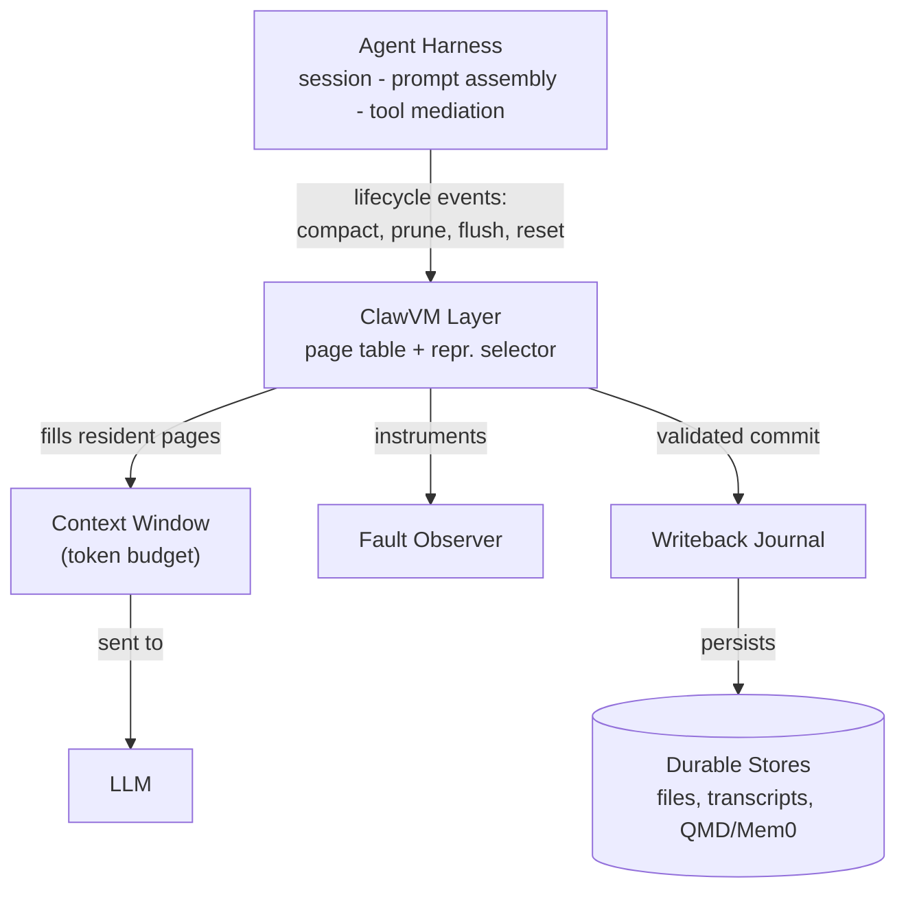
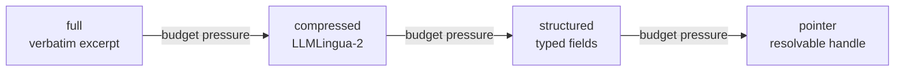

# Typed pages and multi-resolution fidelity

## Three enforced choices

> "ClawVM makes three choices explicit and enforceable: (i) the unit of residency
> is typed pages, (ii) admissible degradations under budget pressure are
> multi-resolution representations, and (iii) lifecycle points at which state
> becomes durable use validated writeback." — Section 3

This lesson covers (i) and (ii) — the **what** that gets managed. The next lesson
covers (iii), plus the fault model and the policy that decides.

## Architecture: where ClawVM sits

ClawVM interposes between the harness and everything else: it feeds the prompt
assembler, watches lifecycle events, and gates what reaches durable storage.

## Pages: the unit of residency

A **page** is a typed record with a stable identifier, **scope** (session-private
vs. project-shared), **provenance** (which tool call or transcript span produced
it), and a **minimum-fidelity invariant** — how far it may degrade before ClawVM
reclaims its space. Six page types cover the failure-prone state:

| Type | Min. fidelity | Scope | Degrades to |
|---|---|---|---|
| Bootstrap/Policy | structured (after compact/reset) | proj. + sess. | full -> structured |
| Constraint | structured (hard-pinned) | sess. | full -> structured |
| Plan | goal + current step | sess. | full -> structured -> pointer |
| Preference | scope + provenance | proj. | full -> compressed -> structured -> pointer |
| Evidence | pointer resolves deterministically | sess. | full -> compressed -> structured -> pointer |
| Conversation Segment | span id + timestamps | sess. | full -> compressed -> structured -> pointer |

*(Bootstrap/Policy pages hold system instructions — losing them is the "forgot
its protocol" failure from Lesson 1.)*

## Four fidelity levels

Pages degrade along this chain while **preserving invariants**: Constraint pages
never drop below *structured*; Evidence pointers must remain resolvable so the
full page can be reconstructed on demand. Structured and pointer representations
exist precisely so compaction is never all-or-nothing.

## Precomputed, not improvised

> "Representations are generated at page creation time, not on demand under
> budget pressure: the harness extracts structured fields and computes
> token-reduced variants when a page is first ingested or updated... so
> budget-pressure decisions involve only table lookups and token arithmetic, not
> runtime LLM calls or compression passes." — Section 3

This is why ClawVM can make paging decisions in microseconds: by the time the
budget gets tight, every candidate representation already exists.
