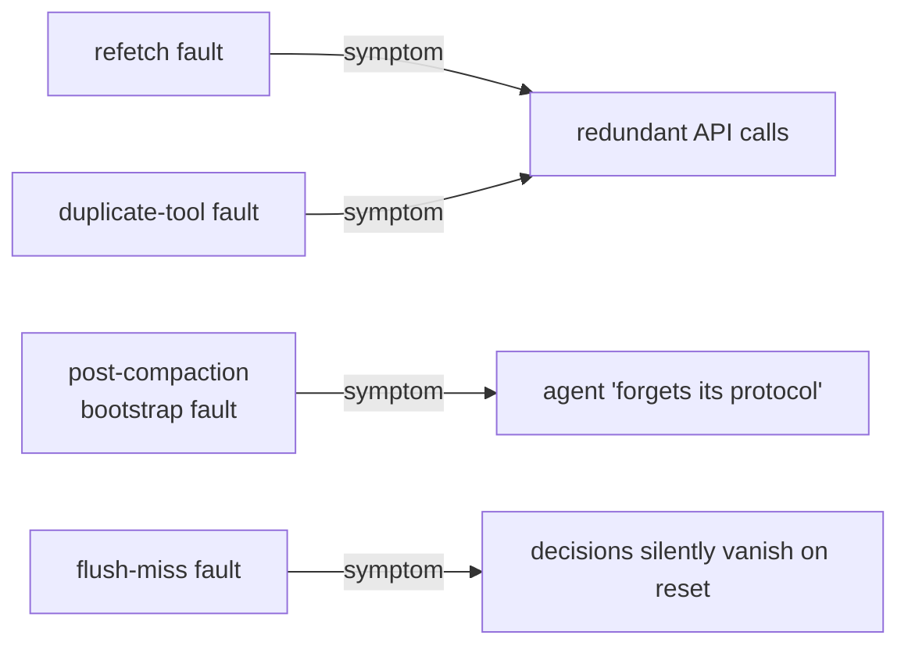

# What ClawVM buys you — and what it costs

## RQ1: fault elimination

Averaged over 4 workloads x 6 token budgets (120-500):

| Baseline | Explicit faults | Δ | Thrash | Δ |
|---|---|---|---|---|
| Retrieval | 67.8 | -100% | 3.993 | -77.4% |
| Retr.+Cache | 10.8 | -100% | 1.642 | -45.2% |
| Comp-Hybrid | 1.5 | -100% | 1.017 | -11.4% |
| **ClawVM** | **0.0** | — | **0.901** | — |
| Oracle (h=3) | 0.0 | 0.0% | 0.901 | 0.0% |

ClawVM ties the offline oracle exactly — there's no remaining headroom to find. At
the tightest budget (120 tokens), Comp-Hybrid alone incurs 26 faults across the 4
workloads (7 bootstrap, 5 flush-miss); ClawVM produces zero.

## RQ2: which features actually matter

Subtractive ablation at budget 180 (faults summed across 4 workloads):

| Remove | Bootstrap | Flush | Dup+Refetch | Total |
|---|---|---|---|---|
| (full ClawVM) | 0 | 0 | 0 | **0** |
| - pointer resolution | 0 | 0 | 126 | **126** |
| - writeback@compaction | 0 | 20 | 0 | **20** |
| - auto-pin | 9 | 0 | 0 | **9** |
| - writeback@reset | 0 | 3 | 0 | **3** |
| - upgrade scoring | 0 | 0 | 0 | **0** |
| - prefetch | 0 | 0 | 0 | **0** |

Pointer resolution alone prevents **84%** of all faults — every evicted page stays
reachable via a resolvable pointer, so the agent never needs to refetch or re-call
a tool. Auto-pinning and lifecycle writeback close the rest. Removing the **Phase
2 upgrade heuristic** (utility scoring or prefetch) causes *zero* extra faults: an
LRU variant with the same structural features (pinning, writeback, pointer
resolution) achieves identical fault counts to utility-based ClawVM across all
budgets 120-300.

> "Fault elimination is robust by construction... regardless of the Phase 2
> upgrade heuristic. Utility scoring operates in the quality regime *above* the
> fault-free floor." — Section 5.2

## RQ3: real traces and adversarial stress

| Setting | Retrieval | Comp-Hybrid | ClawVM |
|---|---|---|---|
| 12 real traces, 100 turns (median faults) | 51 | 1/trace (flush-miss) | **0** |
| 12 real traces, 200 turns (median faults) | 83 | 0 | **0** |
| 30 synthetic tasks, budget 180 (success) | — | 76.7% | **100%** |

All 7 of Comp-Hybrid's task failures at budget 180 are **bootstrap faults in
debugging tasks** — mid-task compaction evicts unprotected bootstrap pages. At
budget 300 the failures vanish, but only because the larger budget avoids
triggering compaction in the first place — the structural gap is still there.

## What it costs

The policy engine adds a median of **18-44 µs** per turn (p95 < 60 µs, worst case
114 µs) and under **83 KB** peak memory — negligible next to model and tool
latency.

## From abstract fault to user complaint

Each of these maps to a real field report (Section 2) — they aren't abstractions
invented for the evaluation.
