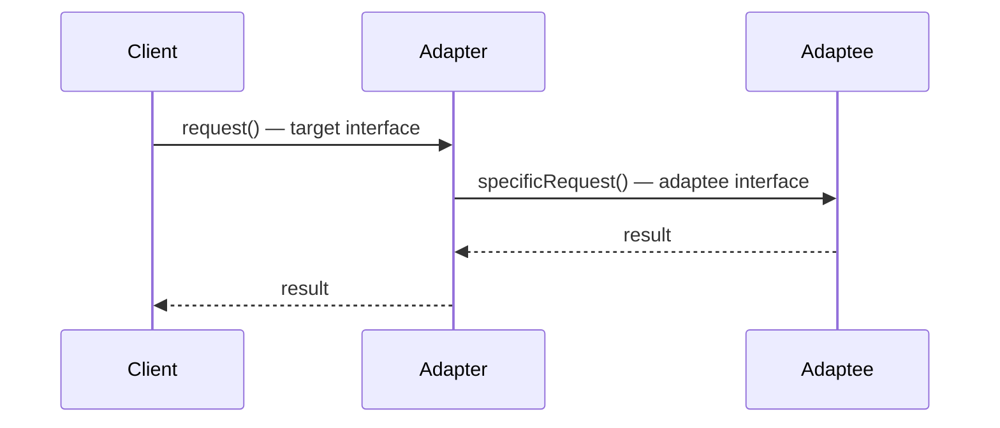
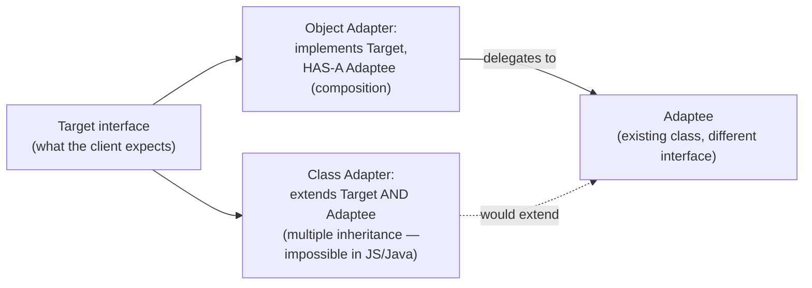
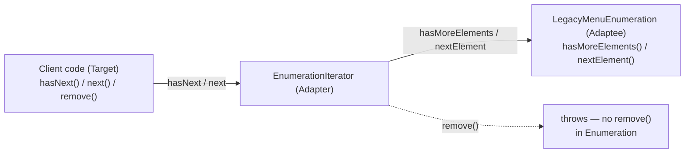

# Adapter: same job, different plug

## The AC power adapter you already own

> "You know what the adapter does: it sits in between the plug of your laptop and
> the British AC outlet; its job is to adapt the British outlet so that you can
> plug your laptop into it and receive power. Or look at it this way: the adapter
> changes the interface of the outlet into one that your laptop expects." — Ch7,
> p276

The physical adapter doesn't change what electricity *is* — it changes the
**shape of the connector** so two things that should work together, can. OO
adapters play exactly the same role: they sit between a client and a class whose
interface doesn't match what the client expects, and translate.

## The vendor-class problem

> "Say you've got an existing software system that you need to work a new vendor
> class library into, but the new vendor designed their interfaces differently
> than the last vendor... The adapter acts as the middleman by receiving requests
> from the client and converting them into requests that make sense on the vendor
> classes." — Ch7, p277

This is the everyday version of the AC-adapter story: your code is *already
written* against one interface, a new dependency speaks a *different* interface,
and rewriting every call site is out of the question. An adapter is new code that
sits in the gap — your existing code and the vendor's code both stay untouched.

## Turkeys, ducks, and a very literal "gobble translator"

The chapter's running example: `Duck` has `quack()` and `fly()`. A new `Turkey`
class has `gobble()` and `fly()` — same *idea*, different *interface*. Some code
only knows how to `testDuck(duck)` — it calls `quack()` and `fly()` on whatever
it's handed. To pass a `Turkey` to that code, wrap it:

```java
public class TurkeyAdapter implements Duck {
    Turkey turkey;

    public TurkeyAdapter(Turkey turkey) {
        this.turkey = turkey;
    }

    public void quack() {
        turkey.gobble();
    }

    public void fly() {
        for (int i = 0; i < 5; i++) {
            turkey.fly();
        }
    }
}
```

`TurkeyAdapter` *is a* `Duck` (it implements `Duck`'s interface) and *has a*
`Turkey` (it holds a reference and delegates). Notice `fly()` isn't a 1:1 call —
since turkeys fly in short bursts and ducks fly long distances, the adapter calls
`turkey.fly()` five times to make up the difference. **Adapting isn't just renaming
methods — it's translating behavior between two interfaces that don't line up
perfectly.**

> "The TurkeyAdapter says... Gobble gobble / I'm flying a short distance ×5 ...
> The testDuck() method never knows it has a turkey disguised as a duck!" — Ch7,
> p280

## The Adapter Pattern explained

> "The client makes a request to the adapter by calling a method on it using the
> target interface. The adapter translates the request into one or more calls on
> the adaptee using the adaptee interface. The client receives the results of the
> call and never knows there is an adapter doing the translation." — Ch7, p281



Three roles, three vocabulary words worth keeping straight: the **Client** only
ever talks to the **target interface** (`Duck`, in our example); the **Adaptee**
is the thing with the incompatible interface (`Turkey`); the **Adapter**
implements the target interface and *holds* the adaptee, translating each call.

## Adapter Pattern, defined

> "The Adapter Pattern converts the interface of a class into another interface
> the clients expect. Adapter lets classes work together that couldn't otherwise
> because of incompatible interfaces." — Ch7, p283

> "This acts to decouple the client from the implemented interface, and if we
> expect the interface to change over time, the adapter encapsulates that change
> so that the client doesn't have to be modified each time it needs to operate
> against a different interface." — Ch7, p283

The client is bound to the **target interface**, not to any concrete adaptee — so
you could swap in a different adapter wrapping a different adaptee, and the client
would never notice.

## Object adapters vs. class adapters

> "There are actually two kinds of adapters: object adapters and class adapters...
> So what's a class adapter...? Because you need multiple inheritance to implement
> it, which isn't possible in Java." — Ch7, p284



The fireside chat (p287) puts the trade-off in the adapters' own words:

> Object Adapter: "Because I use composition I've got a leg up. I can adapt not
> only an adaptee class, but any of its subclasses." — Ch7, p287

> Class Adapter: "...I have a huge advantage because I don't have to reimplement
> my entire adaptee. I can also override the behavior of my adaptee if I need to
> because I'm just subclassing." — Ch7, p287

JavaScript has no multiple inheritance, so **every adapter you write in JS is an
object adapter** — composition (a stored reference + delegation) is not a
fallback here, it's the *only* option, and (per the chat above) the more flexible
one anyway: an object adapter built around a base class also works for every
subclass of that adaptee.

## Real-world adapters: Enumeration → Iterator

> "We are sometimes faced with legacy code that exposes the `Enumeration`
> interface, yet we'd like for our new code to use only `Iterator`s. It looks like
> we need to build an adapter." — Ch7, p288

`Enumeration` (old) has `hasMoreElements()`/`nextElement()`. `Iterator` (newer) has
`hasNext()`/`next()`/`remove()`. The first two pairs map directly — but
`Enumeration` has **nothing** that corresponds to `remove()`:



> "Well, we know Enumeration doesn't support remove(). It's a 'read only'
> interface. There's no way to implement a fully functioning remove() method on
> the adapter. The best we can do is throw a runtime exception." — Ch7, p290

This is the honest answer when an adapter's two interfaces *don't* line up
perfectly: implement what maps cleanly, and for the rest, **fail loudly** (throw)
rather than silently doing nothing. The client (coded against `Iterator`) has to
tolerate that `remove()` might throw — but everything else works transparently.
You'll build exactly this adapter in the challenge.

## Decorator vs. Adapter

Both wrap an object. The fireside chat (p292-293) draws the line precisely:

> Decorator: "...I'd say a decorator is like an adapter; it's just that you don't
> change the interface!"
>
> Adapter: "No, no, no, not at all. We always convert the interface of what we
> wrap; you never do." — Ch7, p293

A `Mocha` decorator wrapping a `DarkRoast` is *still* a `Beverage` with
`cost()`/`getDescription()` — same shape, extra behavior. A `TurkeyAdapter`
wrapping a `Turkey` exposes `Duck`'s shape (`quack()`/`fly()`), which `Turkey`
never had. **Same wrapping mechanism, opposite intents**: Decorator keeps the
interface and adds behavior; Adapter keeps the behavior (translated) and changes
the interface.

## Tools for your Design Toolbox

> "Adapter - Converts the interface of a class into another interface clients
> expect. Lets classes work together that couldn't otherwise because of
> incompatible interfaces." — Ch7, p310

> "When you need to use an existing class and its interface is not the one you
> need, use an adapter... There are two forms of the Adapter Pattern: object and
> class adapters. Class adapters require multiple inheritance." — Ch7, p310
