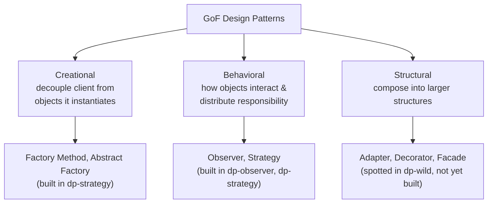

# Organizing the pattern catalog

## Why categorize at all

> "As the number of discovered Design Patterns grows, it makes sense to partition them into classifications so that we can organize them, narrow our searches to a subset of all Design Patterns, and make comparisons within a group of patterns." — Ch13, p613

You've now built or met five patterns: Observer, Strategy, Simple Factory, Factory Method, Abstract Factory. Before any more get added, here's the map the rest of the catalog hangs on.

## The three categories

> "The most well-known scheme... partitions patterns into three distinct categories based on their purposes: Creational, Behavioral, and Structural." — Ch13, p613

- **Creational** — "involve object instantiation and all provide a way to decouple a client from the objects it needs to instantiate." — p613. *Factory Method, Abstract Factory, Singleton, Builder, Prototype.*
- **Behavioral** — "concerned with how classes and objects interact and distribute responsibility." — p613. *Observer, Strategy, State, Template Method, Command, Iterator, ...*
- **Structural** — "let you compose classes or objects into larger structures." — p613. *Adapter, Decorator, Facade, Composite, Proxy, Bridge, Flyweight.*

Mapping what you've already built:

Simple Factory isn't on this map — it's the "Head First Pattern Honorable Mention," an idiom rather than one of the cataloged patterns.

## A second axis: class vs. object patterns

> "Patterns are often classified by a second attribute: whether or not the pattern deals with classes or objects... Object Patterns describe relationships between objects and are primarily defined by composition. Relationships in object patterns are typically created at runtime and are more dynamic and flexible." — Ch13, p615

Every pattern in this subject so far — Observer, Strategy, Factory Method, Abstract Factory — is an **object pattern**: the relationships (Duck HAS-A FlyBehavior, Subject holds Observers, PizzaStore holds a factory) are wired up at runtime via composition, not baked in at compile time via inheritance. That's not a coincidence — it's Design Principle 3 again.

## The five principles, collected

Every pattern you've seen is one concrete application of a small set of recurring principles:

1. **Encapsulate what varies.** (Ch1, p47) — pull the part that changes into its own family of interchangeable classes.
2. **Program to an interface, not an implementation.** (Ch1, p51 / Ch2, p111) — hold a reference typed to the interface, never the concrete class.
3. **Favor composition over inheritance.** (Ch1, p61) — HAS-A beats IS-A when behavior varies per instance.
4. **Strive for loosely coupled designs between objects that interact.** (Ch2, p92) — the Subject in Observer knows only that Observers implement `update()`.
5. **Depend upon abstractions. Do not depend upon concrete classes.** (Ch4, p177) — the Dependency Inversion Principle; both high- and low-level code depend on the same interface.

Keep this list running — every new pattern you meet will turn out to be one more way of applying some combination of these five.
