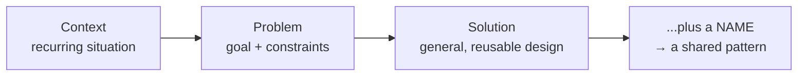
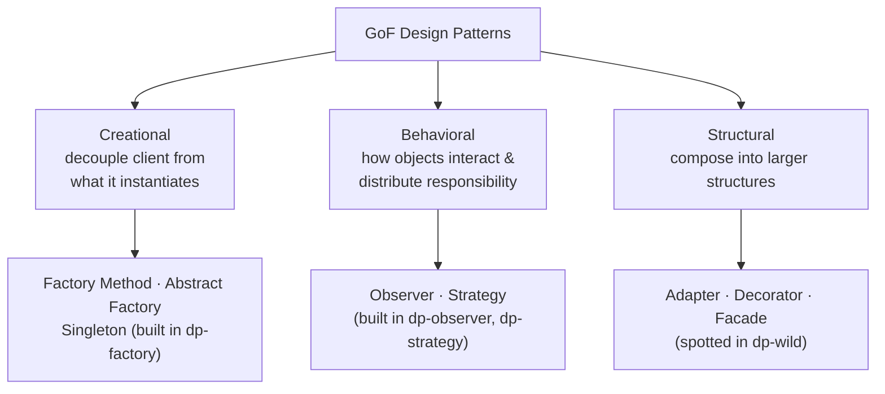
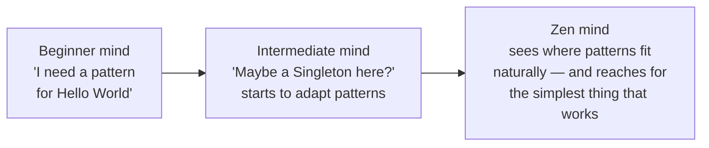

# Better living with patterns

You've now built or met a handful of patterns. This lesson is the book's final chapter,
where it steps back and asks the questions you actually face on the job: *what even is a
pattern? how are they organized? and — the hardest one — when should you NOT use one?*

## What a pattern actually is

The common definition is almost uselessly short:

> "A Pattern is a solution to a problem in a context." — Ch13, p603

The book unpacks it in three parts, with a running Iterator example:

- **Context** — the recurring situation the pattern applies to. *(You have a collection of
  objects.)*
- **Problem** — the goal you want, plus the constraints in the way. *(Step through the
  objects without exposing the collection's implementation.)*
- **Solution** — a general design anyone can apply to resolve goal + constraints.
  *(Encapsulate the iteration in a separate class.)*

### Why "break the car window" is not a pattern

The book's sharpest intuition comes from a *counter*-example. Problem: get to work on time.
Context: you locked your keys in the car. Solution: break the window, get in, drive. That
fits "solution to a problem in a context" perfectly — yet it isn't a pattern. Why?

> "A pattern needs to apply to a **recurring** problem. While an absent-minded person might
> lock his keys in the car often, breaking the car window doesn't qualify as a solution that
> can be applied over and over... it also fails [because] it isn't easy to take this
> description, hand it to someone, and have him apply it to his own unique problem... and we
> haven't even given it a **name!**" — Ch13, p605

So a real pattern needs three things the broken window lacks: **recurrence**,
**transferability**, and a **name** (so it can join a shared vocabulary). The goal-plus-
constraints part of the problem even has a nickname — gurus call them **forces** — and a
solution is only a pattern when it *balances* the forces (your goal vs. the constraints).

## Who does what? (the catalog's matching drill)

A patterns catalog (the original is the Gang of Four's, 23 patterns) describes each pattern
with a name, intent, motivation, applicability, structure, and — most usefully — how it
relates to *other* patterns. Internalizing those one-line intents is what lets you reach for
the right tool. The book drills it as a matching exercise; here are the intents worth
memorizing:

| Pattern | One-line intent (Ch13, p612) |
|---|---|
| **Strategy** | Encapsulates interchangeable behaviors and uses **delegation** to decide which to use |
| **State** | Encapsulates **state-based** behaviors and uses delegation to *switch* between them |
| **Factory Method** | Subclasses decide **which concrete class** to create |
| **Abstract Factory** | Lets a client create **families** of objects without naming concretes |
| **Observer** | Notifies objects when state changes |
| **Adapter** | Wraps an object to give it a **different interface** |
| **Facade** | **Simplifies** the interface of a set of classes |
| **Decorator** | Wraps an object to add **new behavior** |
| **Proxy** | Wraps an object to **control access** to it |
| **Composite** | Treats collections and individual objects **uniformly** |
| **Iterator** | Traverses a collection without exposing its implementation |
| **Singleton** | Ensures one and only one object is created |
| **Command** | Encapsulates a **request** as an object |
| **Template Method** | Subclasses implement **steps** of an algorithm |

Notice how close some intents sit — *Strategy vs. State* (both delegate; State switches on
state), *Adapter vs. Facade vs. Decorator* (all wrap; they change interface vs. simplify vs.
add behavior). The relationships *are* the knowledge.

## Organizing patterns: three categories

> "As the number of discovered Design Patterns grows, it makes sense to partition them into
> classifications so that we can... narrow our searches... and make comparisons within a
> group." — Ch13, p613

The GoF scheme has three categories, by *purpose*:

- **Creational** — "involve object instantiation and... provide a way to decouple a client
  from the objects it needs to instantiate." → *Factory Method, Abstract Factory, Singleton,
  Builder, Prototype.*
- **Behavioral** — "concerned with how classes and objects interact and distribute
  responsibility." → *Observer, Strategy, State, Command, Template Method, Iterator.*
- **Structural** — "let you compose classes or objects into larger structures." → *Adapter,
  Decorator, Facade, Composite, Proxy, Bridge, Flyweight.*

The catch the book is honest about:

> "You probably found the exercise difficult, because many of the patterns seem like they
> could fit into more than one category." — Ch13, p614

The classic trap is **Decorator**: it *adds behavior*, so it feels Behavioral — but it's
filed under **Structural**.

> "The Decorator Pattern allows you to compose objects by wrapping one object with another...
> the focus is on how you **compose** the objects... rather than on the communication...
> which is the purpose of behavioral patterns. But remember, the **intent** of these patterns
> is different, and that's often the key to understanding which category a pattern belongs
> to." — Ch13, p615

**Intent decides the category, not surface behavior.**

There's also a second axis: **class patterns** (relationships fixed at compile time via
inheritance) vs. **object patterns** (relationships formed at runtime via composition).
Almost everything you built — Observer, Strategy, Abstract Factory — is an *object pattern*,
which is just Principle 3 (favor composition) showing up again.

## The five principles, collected

Every pattern you've met is one concrete application of these:

1. **Encapsulate what varies.** (Ch1, p47)
2. **Program to an interface, not an implementation.** (Ch1, p49)
3. **Favor composition over inheritance.** (Ch1, p61)
4. **Strive for loosely coupled designs between objects that interact.** (Ch2, p92)
5. **Classes should be open for extension but closed for modification.** (Ch3 / OCP)
6. **Depend upon abstractions. Do not depend upon concrete classes.** (Ch4, p177 — DIP)

## Thinking in patterns: when NOT to use one

This is the part that separates a senior from someone who just memorized the catalog.

> "When you design, solve things in the simplest way possible. Your goal should be
> simplicity, not 'how can I apply a pattern to this problem?'" — Ch13, p618 (KISS)

> "Patterns aren't a magic bullet; in fact, they're not even a bullet!" — Ch13, p618

Use a pattern when you're **sure** it addresses a real problem — especially when you expect
an aspect of the system to vary. But:

> "Just make sure you are adding patterns to deal with **practical** change that is likely to
> happen, not **hypothetical** change that may happen." — Ch13, p619

And — the line nobody expects — you should also be willing to *remove* a pattern:

> "When do you remove a pattern? When your system has become complex and the flexibility you
> planned for isn't needed. In other words, when a simpler solution without the pattern would
> be better." — Ch13, p619

The book frames maturity as three minds:

> "The Zen mind is not obsessed with using patterns; rather, it looks for **simple
> solutions** that best solve the problem... When a need for a pattern naturally arises, the
> Zen mind applies it knowing well that it may require adaptation." — Ch13, p621

That's the lens for the picker quizzes below: every scenario is asking *which forces are in
play*, and sometimes the right answer is **no pattern at all.**
