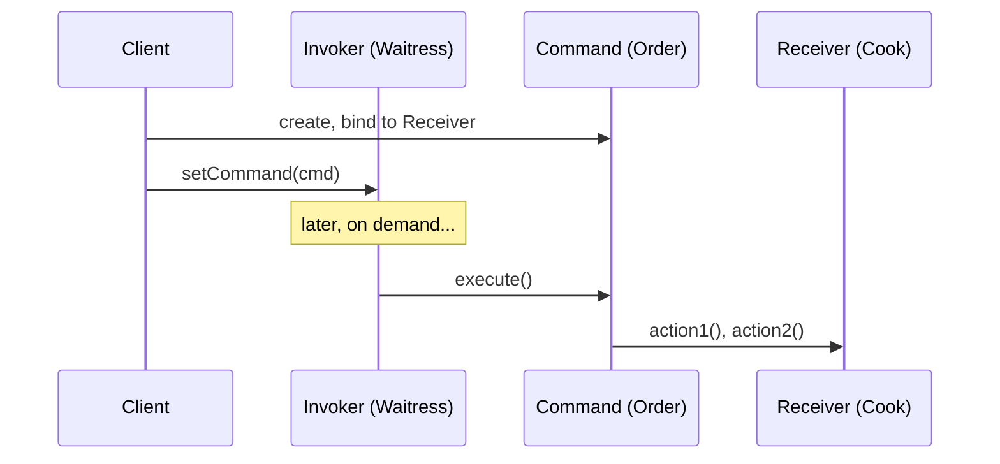
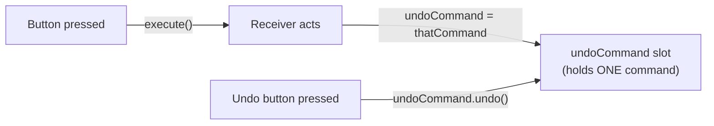
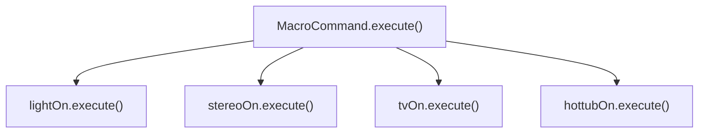

# Command: encapsulating a request as an object

## The problem: one remote, a zoo of vendor classes

Home Automation or Bust, Inc. wants a universal remote with seven programmable
slots, each wired to a different household device — lights, a hot tub, a garage
door, a stereo. The catch: every vendor's API is different.

> "It looks like we have quite a set of classes here, and not a lot of industry
> effort to come up with a set of common interfaces. Not only that, it sounds like
> we can expect more of these classes in the future." — Ch6, p232

`Light` has `on()`/`off()`. `Hottub` has `circulate()`, `jetsOn()`,
`setTemperature()`. `GarageDoor` has `up()`/`down()`/`stop()`. The naive design —
a giant `if` chain inside the remote that knows every vendor method by name — is
exactly the kind of code the cubicle conversation rejects on sight:

> "We don't want the remote to consist of a set of if statements, like 'if slot1
> == Light, then light.on(), else if slot1 == Hottub then hottub.jetsOn()'. We know
> that is a bad design." — Ch6, p233

> "Whenever a new vendor class comes out, we'd have to go in and modify the code,
> potentially creating bugs and more work for ourselves!" — Ch6, p233

## The diner detour: Order Slip as a request object

Before building the remote, the book revisits the Objectville Diner from Chapter
1 to show the shape of the fix. A Customer hands the Waitress an **Order** — not
a cooking instruction, just an object. The Waitress never learns to cook; she
just calls one method on whatever Order she's holding:

> "The Order Slip... has an interface that consists of only one method,
> orderUp(), that encapsulates the actions needed to prepare the meal. It also has
> a reference to the object that needs to prepare it (in our case, the
> Short-Order Cook)." — Ch6, p237

> "The Waitress and the Cook are totally decoupled: the Waitress has Order Slips
> that encapsulate the details of the meal; she just calls a method on each Order
> to get it prepared. Likewise, the Cook gets his instructions from the Order
> Slip; he never needs to directly communicate with the Waitress." — Ch6, p237

Rename the roles and you have the pattern: Customer → **Client**, Waitress →
**Invoker**, Order → **Command**, Short-Order Cook → **Receiver**.



## Command Pattern, defined

> "The Command Pattern encapsulates a request as an object, thereby letting you
> parameterize other objects with different requests, queue or log requests, and
> support undoable operations." — Ch6, p244

A `ConcreteCommand` binds together exactly two things: a **receiver** (the object
that knows how to do the work) and the **action(s)** to call on it. It exposes
one method, `execute()`, and the caller never sees the receiver at all:

```java
public class LightOnCommand implements Command {
    Light light;
    public LightOnCommand(Light light) { this.light = light; }
    public void execute() { light.on(); }
}
```

> "The execute() method calls the on() method on the receiving object, which is
> the light we are controlling. The constructor is passed the specific light...
> and stashes it in the light instance variable." — Ch6, p241

A `SimpleRemoteControl` invoker is even simpler than the diner — one slot, one
method that fires whatever command currently occupies it:

```java
public class SimpleRemoteControl {
    Command slot;
    public void setCommand(Command command) { slot = command; }
    public void buttonWasPressed() { slot.execute(); }
}
```

The remote doesn't know it's controlling a `Light` versus a `GarageDoor` — it
just knows every slot holds *something* with an `execute()` method. **That's the
decoupling**: swap the command object in the slot, and the same `buttonWasPressed()`
call now does something completely different.

## The real remote: seven slots, on AND off, and a Null Object

Scaling to seven slots means two parallel arrays, `onCommands[]` and
`offCommands[]`, indexed by slot number:

```java
public void onButtonWasPushed(int slot) {
    onCommands[slot].execute();
}
```

But what goes in a slot nobody has assigned yet? Rather than null-checking every
button press, the constructor pre-fills every slot with a `NoCommand` — a command
whose `execute()` does nothing:

> "We didn't want to check to see if a command was loaded every time we
> referenced a slot... So, how do we get around that? Implement a command that
> does nothing!" — Ch6, p214

> "The NoCommand object is an example of a **null object**. A null object is
> useful when you don't have a meaningful object to return, and yet you want to
> remove the responsibility for handling null from the client." — Ch6, p214

This is the chapter's "Pattern Honorable Mention" — Null Object isn't Command
itself, but it's the standard companion whenever a Command-shaped slot needs a
safe default.

## Adding undo: execute()'s mirror image

The remote's global undo button needs every command to know how to reverse
itself. The `Command` interface grows a second method:

```java
public interface Command {
    public void execute();
    public void undo();
}
```

For `LightOnCommand`, the reverse of "turn on" is just "turn off" — no extra
state needed:

```java
public void execute() { light.on(); }
public void undo() { light.off(); }
```

But undo isn't always the exact opposite action. `CeilingFanHighCommand` has to
remember what speed the fan was running *before* `execute()` changed it, because
"undo" might mean "go back to medium," not "turn off":

> "To properly implement undo, I'd have to take the previous speed of the ceiling
> fan into account..." — Ch6, p259

```java
public void execute() {
    prevSpeed = ceilingFan.getSpeed();
    ceilingFan.high();
}
public void undo() {
    if (prevSpeed == CeilingFan.HIGH) ceilingFan.high();
    else if (prevSpeed == CeilingFan.MEDIUM) ceilingFan.medium();
    else if (prevSpeed == CeilingFan.LOW) ceilingFan.low();
    else ceilingFan.off();
}
```

The lesson: **undo is state-aware**. A command that supports undo often has to
capture a snapshot at `execute()`-time precisely because it might need to restore
that snapshot later.

The remote tracks only the single last command pressed — one `undoCommand`
field, overwritten on every button press:



> "How can I implement a history of undo operations? ...you keep a stack of
> previous commands. Then, whenever undo is pressed, your invoker pops the first
> item off the stack and calls its undo() method." — Ch6, p266 (Q&A)

That's the upgrade path from "one last command" to a real **undo stack**: push
every executed command onto a stack instead of overwriting a single field, and
pop-and-undo on each press of the undo button — which is exactly what you'll
build in the challenge.

## Macro commands: a command made of commands

"Party mode" — one button that dims the lights, fires up the stereo and TV, and
turns on the hot tub — doesn't need a new pattern. A `MacroCommand` just holds an
array of other commands and runs them in sequence:

```java
public class MacroCommand implements Command {
    Command[] commands;
    public MacroCommand(Command[] commands) { this.commands = commands; }
    public void execute() {
        for (int i = 0; i < commands.length; i++) {
            commands[i].execute();
        }
    }
}
```



To the remote, a `MacroCommand` is indistinguishable from any other command — it
goes in a slot and gets `execute()`-called just the same. This is the **Meta
Command Pattern**: composing many Commands behind the same one-method interface
that ordinary Commands expose, so the invoker never has to know the difference.

Undo for a macro reverses the list **in the opposite order** it executed —
unwinding a stack, not replaying it forwards:

```java
public void undo() {
    for (int i = commands.length - 1; i >= 0; i--) {
        commands[i].undo();
    }
}
```

> Q: "Could I have just implemented party mode as a Command by creating a
> PartyCommand...?" A: "You could; however, you'd essentially be 'hardcoding' the
> party mode... With MacroCommand, you can decide dynamically which Commands you
> want to go into PartyCommand, so you have more flexibility." — Ch6, p266 (Q&A)

## Beyond remotes: queues, logs, and "smart" commands

Because a Command packages "a receiver plus a set of actions" into one ordinary
object, that object can be handed to code that has nothing to do with where it
was created — a **job queue** of worker threads, for instance, pulling commands
off one at a time and calling `execute()`, with zero knowledge of what each
command actually does:

> "Note that the job queue classes are totally decoupled from the objects that
> are doing the computation... the job queue objects don't care; they just
> retrieve commands and call execute()." — Ch6, p267

The same shape supports crash recovery: log every executed command to disk (via
`store()`/`load()`), and after a crash, reload and re-`execute()` them in order —
useful for systems (like a spreadsheet) where re-running logged operations is
cheaper than saving full state on every change (p268).

And the chapter is upfront that "dumb" commands which only delegate to a
receiver aren't mandatory:

> "In general, we strive for 'dumb' command objects that just invoke an action on
> a receiver; however, there are many examples of 'smart' command objects that
> implement most, if not all, of the logic needed to carry out a request...
> just keep in mind you'll no longer have the same level of decoupling between
> the invoker and receiver." — Ch6, p266 (Q&A)

## In the wild: Swing's ActionListener

The chapter closes by pointing out that Java's `ActionListener` — already
familiar from the Observer chapter — is *also* a Command interface in disguise:
one abstract method (`actionPerformed()`, standing in for `execute()`), a button
as Invoker, and the listener implementation as a concrete Command (Ch6, p269).
The same interface can honestly satisfy two different pattern vocabularies at
once, depending on which relationship you're looking at.

## Command vs Strategy — same shape, different job

Command and Strategy both wrap a chunk of behavior inside an object behind a
single abstract method, and both let you swap that object at runtime. They get
confused constantly. The difference is **why** you're wrapping it:

- **Strategy** swaps the *algorithm* used at one fixed call site. The client
  picks a `CompressionStrategy` or a `DuckBehavior` once, and the call site
  (`compress(data)`, `performFly()`) stays the same no matter which strategy is
  plugged in. There's no `undo()`, no queueing, no logging — just "do the job, one
  of several ways."
- **Command** decouples *who asks* from *who acts*, and exists specifically so the
  request itself can be stored, passed around, queued, logged, or undone later.
  The remote doesn't call `light.on()` through a strategy interface picked for
  performance reasons — it stores an *Order Slip* it can replay, undo, or hand to
  a macro.

If your object's job is "here's one of several ways to do the same kind of
thing, chosen by the client up front," that's Strategy. If your object's job is
"here's a request, frozen in time, that something else will fire later — and
maybe reverse," that's Command.
