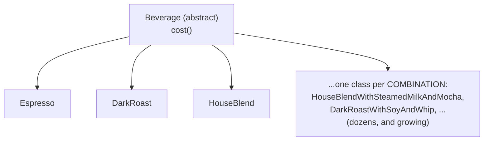
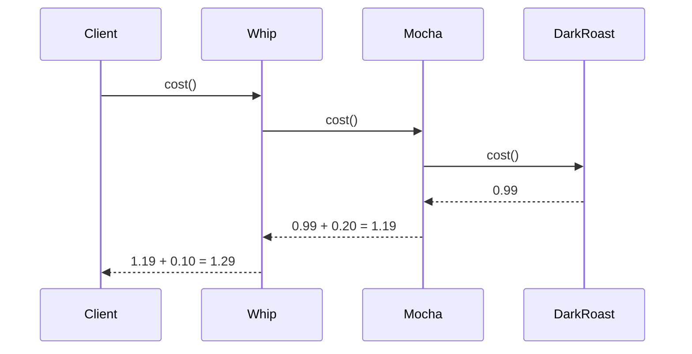
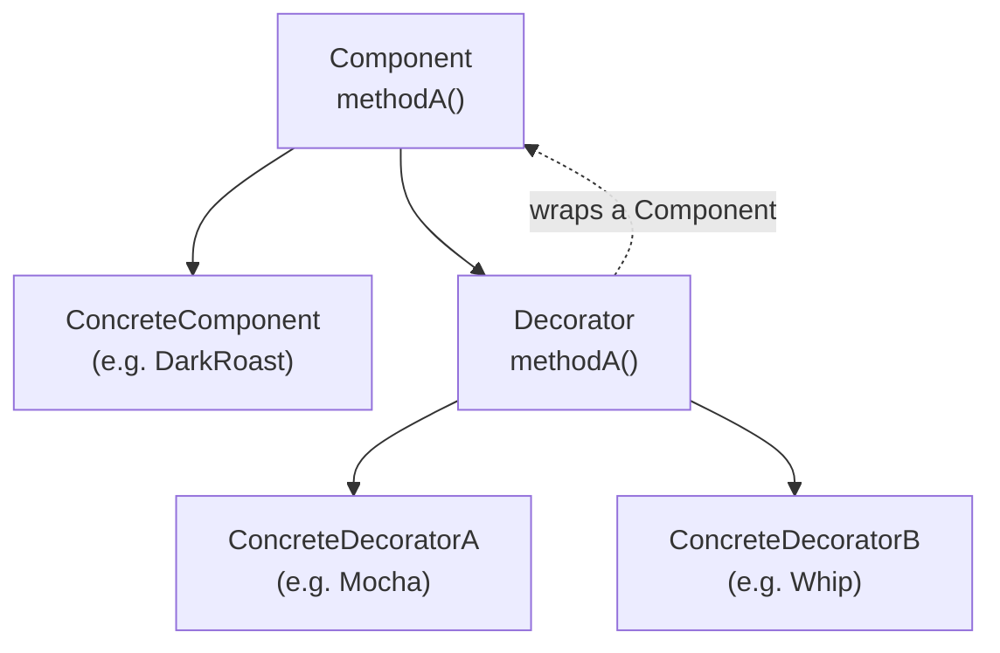
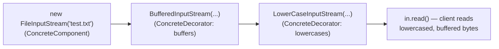

# Decorator: wrap, don't extend

## Welcome to Starbuzz Coffee

Starbuzz sells four coffees — `Espresso`, `HouseBlend`, `DarkRoast`, `Decaf` — each a
subclass of an abstract `Beverage` with a `cost()`. Simple. Then marketing adds
condiments: steamed milk, soy, mocha, whip — any combination, on any coffee.

The first attempt gives every combination its own subclass:
`HouseBlendWithSteamedMilkAndMocha`, `DarkRoastWithSoyAndWhip`,
`DecafWithWhipAndSoyAndMocha`... for 4 coffees and 4 condiments, that's dozens of
classes, and a new condiment multiplies them again.

> "In addition to your coffee, you can also ask for several condiments like steamed
> milk, soy, and mocha (otherwise known as chocolate), and have it all topped off
> with whipped milk... Whoa! Can you say 'class explosion'?" — Ch3, p119

## Take two: push condiments into the superclass

Drop the exploded subclasses. Instead, give `Beverage` boolean fields —
`milk`/`soy`/`mocha`/`whip` — with `has*()`/`set*()` methods, and implement `cost()`
in the superclass to total up whichever condiments are set. Each beverage subclass
overrides `cost()` but calls `super.cost()` to add the condiment total.

It looks like it solves the explosion — until you ask what happens when things
change:

> "Price changes for condiments will force us to alter existing code. New
> condiments will force us to add new methods and alter the cost method in the
> superclass. We may have new beverages (iced tea?) [where] the condiments may not
> be appropriate, yet the Tea subclass will still inherit methods like hasWhip()."
> — Ch3, p122

The exercise asks: *which design principles are being violated here — and the book
warns "they're violating two of them in a big way!"* Hold that thought; the rest of
this chapter exists to answer it.

## Composition at runtime — the Guru and the Student

> "When I inherit behavior by subclassing, that behavior is set statically at
> compile time... If, however, I can extend an object's behavior through
> composition, then I can do this dynamically at runtime." — Ch3, p123

> "By dynamically composing objects, I can add new functionality by writing new
> code rather than altering existing code. Because I'm not changing existing code,
> the chances of introducing bugs or causing unintended side effects in
> pre-existing code are much reduced." — Ch3, p123

The Guru's closing line names the destination directly: *"code should be closed (to
change)... yet open (to extension)."*

## The Open-Closed Principle

> "Classes should be open for extension, but closed for modification." — Ch3, p124

This is the answer to the "two violated principles" question: the boolean-flag
`Beverage` is **not** closed to modification (a price change or a new condiment
edits the superclass) and it does **not** encapsulate what varies (condiment
behavior is baked into every beverage, whether or not that beverage even wants
condiments).

> "Be careful when choosing the areas of code that need to be extended; applying
> the Open-Closed Principle EVERYWHERE is wasteful and unnecessary, and can lead to
> complex, hard-to-understand code." — Ch3, p125

## Meet the Decorator Pattern

Instead of baking condiments into `Beverage`, **wrap** a beverage with condiment
objects at runtime. For a Dark Roast with Mocha and Whip:

> "1. Start with a `DarkRoast` object. 2. Decorate it with a `Mocha` object. 3.
> Decorate it with a `Whip` object. 4. Call the `cost()` method and rely on
> delegation to add up the condiment costs." — Ch3, p126

Each wrapper — `Mocha`, `Whip` — is the *same type* as what it wraps (a
`Beverage`), so it can be wrapped again, or passed anywhere a `Beverage` is
expected. Calling `cost()` on the outermost wrapper triggers a chain of delegation
that unwinds from the inside out:

> "First, we call cost() on the outermost decorator, Whip... Mocha adds its cost,
> 20 cents, to the result from DarkRoast, and returns the new total, $1.19. Whip
> adds its total, 10 cents, to the result from Mocha, and returns the final
> result — $1.29." — Ch3, p128

> "Decorators have the same supertype as the objects they decorate... The decorator
> adds its own behavior before and/or after delegating to the object it decorates
> to do the rest of the job. Objects can be decorated at any time, so we can
> decorate objects dynamically at runtime with as many decorators as we like." —
> Ch3, p128

## The Decorator Pattern, defined

> "The Decorator Pattern attaches additional responsibilities to an object
> dynamically. Decorators provide a flexible alternative to subclassing for
> extending functionality." — Ch3, p129

`ConcreteDecoratorA`/`B` extend `Decorator`, which extends `Component` — that's
**inheritance for type**, so a decorator can stand in anywhere a `Component` is
expected. But each decorator also *holds a reference to* the `Component` it wraps —
that's **composition for behavior**, the source of the new functionality.

## Decorating our Beverages

Applied to Starbuzz: `Beverage` is the abstract component; `Espresso`, `HouseBlend`,
`DarkRoast`, `Decaf` are concrete components; `CondimentDecorator` (itself
abstract, extending `Beverage`) is the decorator base; `Mocha`, `Soy`, `Whip` are
concrete decorators. A cubicle conversation catches the exact confusion a first-time
reader has:

> "Mary: Look at the class diagram. The CondimentDecorator is extending the
> Beverage class. That's inheritance, right? Sue: True. I think the point is that
> it's vital that the decorators have the same type as the objects they are going
> to decorate. So here we're using inheritance to achieve the type matching, but we
> aren't using inheritance to get behavior... We are acquiring new behavior not by
> inheriting it from a superclass, but by composing objects together." — Ch3, p131

> "If we relied on inheritance, then our behavior can only be determined statically
> at compile time. In other words, we get only whatever behavior the superclass
> gives us or that we override. With composition, we can mix and match decorators
> any way we like... at runtime." — Ch3, p131

## Real-World Decorators: Java I/O

`java.io` is built on Decorator. `FileInputStream` is a concrete component;
`FilterInputStream` is the abstract decorator; `BufferedInputStream` and
`ZipInputStream` are concrete decorators that wrap it:

> "BufferedInputStream adds buffering behavior to a FileInputStream: it buffers
> input to improve performance... ZipInputStream is also a concrete decorator. It
> adds the ability to read zip file entries as it reads data from a zip file." —
> Ch3, p138

The book has you write your own: a `LowerCaseInputStream` that wraps any
`InputStream` and lowercases every character as it's read — stacked three deep:

> "Java I/O also points out one of the downsides of the Decorator Pattern: designs
> using this pattern often result in a large number of small classes that can be
> overwhelming to a developer trying to use the Decorator-based API." — Ch3, p139

## Confessions of a Decorator

The chapter closes with the pattern's own "interview," naming its dark side
directly:

> "I can sometimes add a lot of small classes to a design, and this occasionally
> results in a design that's less than straightforward for others to understand." —
> Ch3, p142

> "[I]f you have code that relies on the concrete component's type, decorators will
> break that code. As long as you only write code against the abstract component
> type, the use of decorators will remain transparent... However, once you start
> writing code against concrete components, you'll want to rethink your application
> design and your use of decorators." — Ch3, p142 (from the Q&A on p137)

> "Introducing decorators can increase the complexity of the code needed to
> instantiate the component. Once you've got decorators, you've got to not only
> instantiate the component, but also wrap it with who knows how many decorators." —
> Ch3, p142

That last complaint is a cliffhanger on purpose — the book's very next chapters
(Factory, then Builder) exist partly to tame the "who constructs the wrapped
object?" problem Decorator creates.

## Tools for your Design Toolbox

> "Decorator - Attach additional responsibilities to an object dynamically.
> Decorators provide a flexible alternative to subclassing for extending
> functionality." — Ch3, p143

Two new entries for the running list: **Open-Closed Principle** ("classes should be
open for extension but closed for modification") and **Decorator**. Notice the
chapter's own rhetorical question: *"here's our first pattern for creating designs
that satisfy the Open-Closed Principle. Or was it really the first? Is there
another pattern we've used that follows this principle as well?"* — Observer, from
Chapter 2, qualifies too: new observers extend a subject without modifying it.
