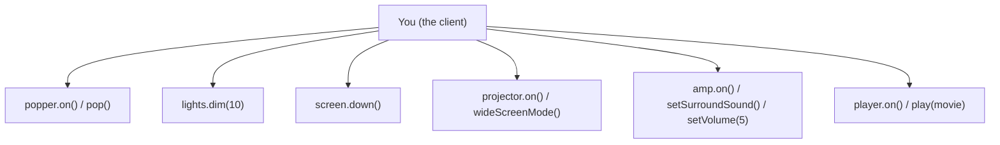
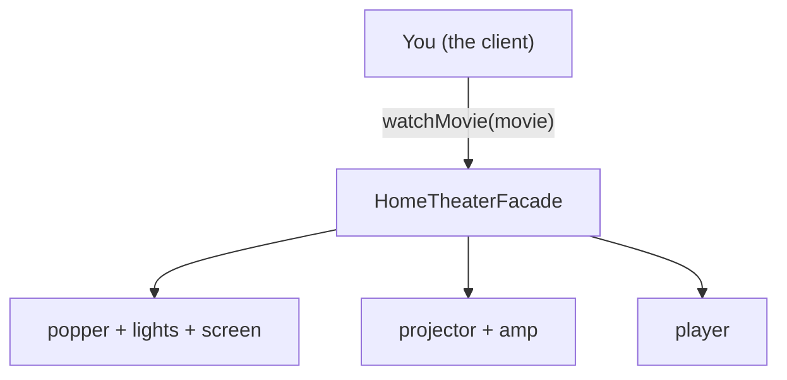
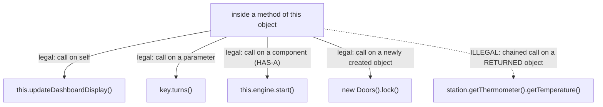

# Facade: one switch for everything

## And now for something different...

> "You've seen how the Adapter Pattern converts the interface of a class into one
> that a client is expecting... We're going to look at a pattern now that alters
> an interface, but for a different reason: to simplify the interface. It's aptly
> named the Facade Pattern because this pattern hides all the complexity of one or
> more classes behind a clean, well-lit facade." — Ch7, p294

Adapter and Facade both wrap something and hand the client a different interface.
The reason *why* is what tells them apart — and this chapter sets that question up
on purpose before answering it.

## Home Sweet Home Theater

> "Before we dive into the details of the Facade Pattern, let's take a look at a
> growing national obsession: building a nice theater to binge-watch all those
> movies and TV series... That's a lot of classes, a lot of interactions, and a
> big set of interfaces to learn and use." — Ch7, p295

The system: a streaming player, projector, automated screen, surround-sound amp,
theater lights, and a popcorn popper — six classes, each with its own little API
(`on()`, `off()`, `setSurroundSound()`, `wideScreenMode()`, `dim(level)`, ...).

## Watching a movie (the hard way)

To actually watch a movie, *you* — the client — have to call all six, in the right
order, with the right arguments:

> "Turn on the popcorn popper / Start the popper popping / Dim the lights / Put
> the screen down / Turn the projector on / Put the projector on widescreen mode /
> Turn the sound amplifier on / Set the amplifier to streaming player input / Set
> the amplifier to surround sound / Set the amplifier volume to medium (5) / Turn
> the streaming player on / Set the projector input to streaming player / Start
> playing the movie" — Ch7, p296-297



And when the movie ends, you do roughly all of it again, in reverse, to shut
everything down — and again from scratch if you just want to listen to the radio.
**The complexity didn't go away when each class got its own clean API — it just
moved into every client that uses all of them together.**

## Lights, Camera, Facade!

> "A Facade is just what you need: with the Facade Pattern you can take a complex
> subsystem and make it easier to use by implementing a Facade class that provides
> one, more reasonable interface. Don't worry; if you need the power of the
> complex subsystem, it's still there for you to use, but if all you need is a
> straightforward interface, the Facade is there for you." — Ch7, p298



Same six classes, same six APIs underneath — but the client now makes **one**
call. `HomeTheaterFacade` is built with composition: it holds a reference to each
subsystem component and, inside `watchMovie()`, makes exactly the 13-step sequence
from the previous section *for* you.

## Facade vs. Adapter — the actual difference

> "A facade not only simplifies an interface, it decouples a client from a
> subsystem of components. Facades and adapters may wrap multiple classes, but a
> facade's intent is to simplify, while an adapter's is to convert the interface
> to something different." — Ch7, p300

> "The difference between the two is not in terms of how many classes they 'wrap,'
> it is in their intent. The intent of the Adapter Pattern is to alter an
> interface so that it matches one a client is expecting. The intent of the Facade
> Pattern is to provide a simplified interface to a subsystem." — Ch7, p300

It's tempting to guess "Adapter wraps one class, Facade wraps many" — the book
calls this out directly and says **no**: an adapter can wrap several adaptees
(to assemble one target interface), and a facade can sit in front of a *single*
class with a sprawling API. Count the classes wrapped, and you're answering the
wrong question. The right question is **why** you're wrapping: to make an
incompatible interface *fit* (Adapter), or to make a complicated interface
*simpler* (Facade)?

## Implementing the simplified interface

```java
public void watchMovie(String movie) {
    System.out.println("Get ready to watch a movie...");
    popper.on();
    popper.pop();
    lights.dim(10);
    screen.down();
    projector.on();
    projector.wideScreenMode();
    amp.on();
    amp.setStreamingPlayer(player);
    amp.setSurroundSound();
    amp.setVolume(5);
    player.on();
    player.play(movie);
}

public void endMovie() {
    System.out.println("Shutting movie theater down...");
    popper.off();
    lights.on();
    screen.up();
    projector.off();
    amp.off();
    player.stop();
    player.off();
}
```

> "watchMovie() follows the same sequence we had to do by hand before, but wraps
> it up in a handy method that does all the work. Notice that for each task we are
> delegating the responsibility to the corresponding component in the subsystem."
> — Ch7, p302

Nothing here is clever — every line is a delegation to a subsystem object the
facade already holds. The value isn't *new* behavior; it's that this sequence now
lives in **one place**, written once.

## Facade Pattern, defined

> "The Facade Pattern provides a unified interface to a set of interfaces in a
> subsystem. Facade defines a higher-level interface that makes the subsystem
> easier to use." — Ch7, p304

> "...the Facade Pattern allows us to avoid tight coupling between clients and
> subsystems, and... also helps us adhere to a new object-oriented principle." —
> Ch7, p304

That new principle is next — and it's the real reason Facade earns a place in your
toolbox, beyond just "fewer lines at the call site."

## The Principle of Least Knowledge

> "Principle of Least Knowledge: talk only to your immediate friends." — Ch7, p305

> "This principle prevents us from creating designs that have a large number of
> classes coupled together so that changes in one part of the system cascade to
> other parts. When you build a lot of dependencies between many classes, you are
> building a fragile system that will be costly to maintain and complex for others
> to understand." — Ch7, p305

The concrete rule — from any method, only call methods on:

> "The object itself / Objects passed in as a parameter to the method / Any object
> the method creates or instantiates / Any components of the object" — Ch7, p306

The one move the principle rules out: calling a method on something you got back
from *another* call.



> Without the Principle: `Thermometer thermometer = station.getThermometer();
> return thermometer.getTemperature();`
>
> With the Principle: `return station.getTemperature();` — Ch7, p306

The fix isn't "don't use `Thermometer`" — it's that `WeatherStation` grows a
`getTemperature()` method that asks its *own* thermometer for the reading. The
caller now has **one friend** (`station`) instead of two (`station` *and* whatever
`station.getThermometer()` happens to return).

> "Can you think of a common use of Java that violates the Principle of Least
> Knowledge? ... Answer: How about `System.out.println()`?" — Ch7, p308

`System.out` is itself a returned object (a `PrintStream` you got from `System`),
and you immediately call `.println()` on it — textbook violation. The book's point
isn't "never do this" (every principle trades off against something — see below);
it's that **violations are everywhere once you know how to spot them**, and the
question is whether the coupling they create is worth it.

> "Are there any disadvantages to applying the Principle of Least Knowledge? ...
> applying this principle results in more 'wrapper' classes being written to
> handle method calls to other components. This can result in increased
> complexity and development time as well as decreased runtime performance." —
> Ch7, p307

And the payoff for the home theater, specifically:

> "This client only has one friend: the HomeTheaterFacade. In OO programming,
> having only one friend is a GOOD thing!" — Ch7, p309

A facade isn't just a convenience method — it's a **structural fix** for Least
Knowledge. Without it, a client that wants to "watch a movie" has six friends
(every subsystem class). With it, the client has one friend (the facade), and the
facade itself has six — the coupling didn't vanish, it got **concentrated into the
one class whose entire job is managing it**.

## Tools for your Design Toolbox

> "Facade - Provides a unified interface to a set of interfaces in a subsystem.
> Facade defines a higher-level interface that makes the subsystem easier to use."
> — Ch7, p310

> "An adapter wraps an object to change its interface, a decorator wraps an object
> to add new behaviors and responsibilities, and a facade 'wraps' a set of objects
> to simplify." — Ch7, p310

Three wrapping patterns, three different jobs for the wrapper — and now you've
built all three.
