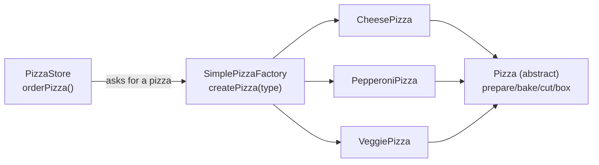
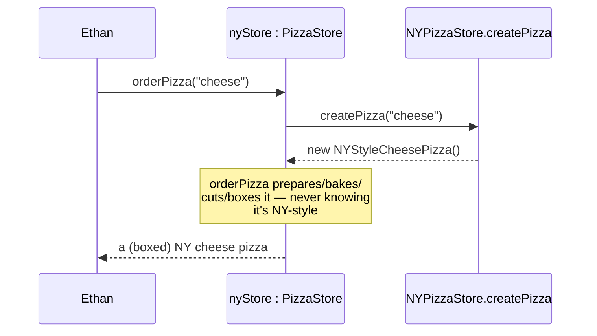
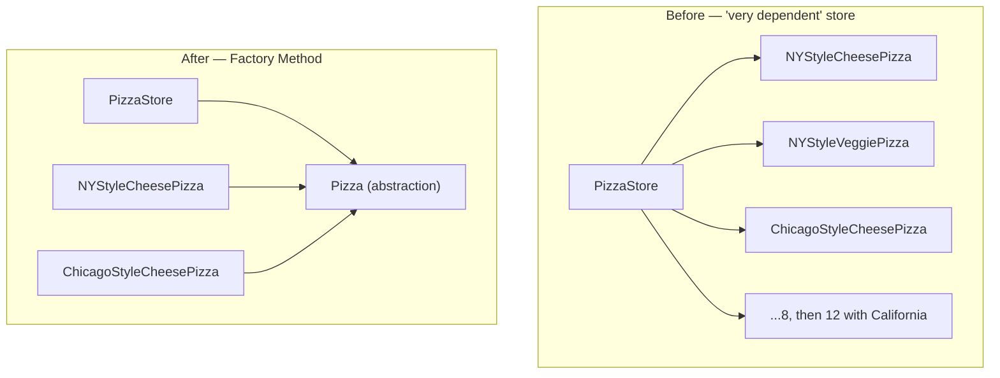
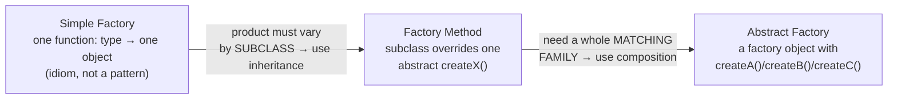

# Factory: corral the `new` keyword

The Strategy lesson ended on a small `pricingFor(type)` lookup — a **Simple Factory**. This
lesson takes the long road through the book's pizza-store story to earn the two *real*
factory patterns: **Factory Method** and **Abstract Factory**. The thing they all fight is
the same: `new`.

## When you see `new`, think "concrete"

You've been told to program to an interface. But every object has to be created somewhere,
and creation means `new SomethingConcrete()`. Look at this:

```js
let duck;
if (picnic)       duck = new MallardDuck();
else if (hunting) duck = new DecoyDuck();
else if (inBathTub) duck = new RubberDuck();
```

> "When you see code like this, you know that when it comes time for changes or extensions,
> you'll have to reopen this code... Often this kind of code ends up in several parts of the
> application, making maintenance and updates more difficult and error-prone." — Ch4, p148

The culprit isn't `new` itself — it's **change**. Code full of concrete instantiations is
*not closed for modification*: every new type forces you to reopen it. So we apply Principle
1 again — find what varies (object creation) and encapsulate it.

## The pizza if/else jungle

You run a pizza store. `orderPizza` starts clean, then the menu grows:

```js
function orderPizza(type) {
  let pizza;
  if (type === 'cheese')         pizza = new CheesePizza();
  else if (type === 'pepperoni') pizza = new PepperoniPizza();
  else if (type === 'clam')      pizza = new ClamPizza();
  else if (type === 'veggie')    pizza = new VeggiePizza();
  // add 'greek'? drop 'clam'? reopen this function every time.
  pizza.prepare(); pizza.bake(); pizza.cut(); pizza.box();
  return pizza;
}
```

The book draws the line for you:

> "[The if/else block] is what varies. As the pizza selection changes over time, you'll have
> to modify this code over and over. [prepare/bake/cut/box] is what we expect to stay the
> same." — Ch4, p151

## Simple Factory: move creation to one object

Pull the creation block into an object whose only job is making pizzas:

```js
class SimplePizzaFactory {
  createPizza(type) {
    if (type === 'cheese')         return new CheesePizza();
    if (type === 'pepperoni')      return new PepperoniPizza();
    if (type === 'clam')           return new ClamPizza();
    if (type === 'veggie')         return new VeggiePizza();
  }
}

class PizzaStore {
  constructor(factory) { this.factory = factory; }
  orderPizza(type) {
    const pizza = this.factory.createPizza(type);  // no more `new` here
    pizza.prepare(); pizza.bake(); pizza.cut(); pizza.box();
    return pizza;
  }
}
```

The win isn't fewer `if`s — it's *one place* to change creation, shared by every client
(`PizzaShopMenu`, `HomeDelivery`, …). But note what the book says about its status:

> "The Simple Factory isn't actually a Design Pattern; it's more of a programming idiom. But
> it is commonly used, so we'll give it a Head First Pattern **Honorable Mention.**"
> — Ch4, p155



## Franchising breaks the Simple Factory

Your store is a hit; everyone wants a franchise, with **regional styles** (NY thin crust,
Chicago deep dish). You could hand each franchise its own factory — `NYPizzaFactory`,
`ChicagoPizzaFactory` — and compose a store with one. That works… until quality control
slips:

> "[Franchises] were using your factory to create pizzas, but starting to employ their own
> home-grown procedures for the rest of the process: they'd bake things a little
> differently, they'd forget to cut the pizza, and they'd use third-party boxes." — Ch4, p157

You want the **whole process** (prepare/bake/cut/box) bound to your store framework, while
still letting each region decide *which* pizza gets made. Composition alone won't enforce
that. You need inheritance.

## Factory Method: let subclasses decide

Put `createPizza()` back into `PizzaStore` — but as an **abstract method** — and make a
subclass per region:

```js
class PizzaStore {                 // abstract creator
  orderPizza(type) {
    const pizza = this.createPizza(type);   // the FACTORY METHOD
    pizza.prepare(); pizza.bake(); pizza.cut(); pizza.box();
    return pizza;
  }
  createPizza(type) { throw new Error('abstract: subclass must implement'); }
}

class NYPizzaStore extends PizzaStore {
  createPizza(type) {
    if (type === 'cheese') return new NYStyleCheesePizza();
    // ...NY versions
  }
}
class ChicagoPizzaStore extends PizzaStore {
  createPizza(type) {
    if (type === 'cheese') return new ChicagoStyleCheesePizza();
    // ...Chicago versions
  }
}
```

`orderPizza()` lives in the superclass and is the *same* for everyone — that's the quality
control. The one varying step, `createPizza()`, is **deferred to the subclass**.

### "But the subclasses aren't deciding anything!"

This is the sentence everyone trips on. The book confronts it head-on:

> "So the subclasses aren't really 'deciding' — it was *you* who decided by choosing which
> store you wanted — but they do determine which kind of pizza gets made." — Ch4, p160

`orderPizza()` is written in the abstract `PizzaStore`. It calls `createPizza()` with **no
idea** which subclass is running. It's *decoupled* from the concrete pizza. The "decision"
is just: which subclass did the caller instantiate?



> "**The Factory Method Pattern** defines an interface for creating an object, but lets
> subclasses decide which class to instantiate. Factory Method lets a class defer
> instantiation to subclasses." — Ch4, p172

The creator and product hierarchies run **parallel**: `PizzaStore`/`NYPizzaStore` alongside
`Pizza`/`NYStyleCheesePizza`. The factory method is the seam between them.

## Why it matters: the Dependency Inversion Principle

Picture the "very dependent" store that skips factories and `new`s every pizza directly. It
depends on *all 8* concrete pizza classes (4 NY + 4 Chicago); add California and it's 12.
Every new pizza is a new dependency pointing *down* at a concrete class.

> "Depend upon abstractions. Do not depend upon concrete classes." — Ch4, p177 (Design
> Principle 6, the **Dependency Inversion Principle**)

Factory Method inverts those arrows: after applying it, both `PizzaStore` (high-level) and
the concrete pizzas (low-level) depend on the **`Pizza` abstraction** — neither reaches for
the other's concrete type.



> "The 'inversion'... is there because it inverts the way you typically might think... the
> low-level components now depend on a higher-level abstraction. Likewise, the high-level
> component is also tied to the same abstraction." — Ch4, p179

## Abstract Factory: when you need a whole family

New problem: some franchises substitute cheap ingredients. You'll ship them quality
ingredients — but ingredients come in **regional families**: NY uses Marinara + Reggiano +
fresh clams; Chicago uses Plum Tomato + Mozzarella + frozen clams. You must never mix a NY
sauce into a Chicago pizza.

Define one interface that creates the *whole family*:

```js
// the abstract factory — one method per ingredient in the family
class PizzaIngredientFactory {
  createDough()  { throw new Error('abstract'); }
  createSauce()  { throw new Error('abstract'); }
  createCheese() { throw new Error('abstract'); }
  // ...createVeggies, createClam
}

class NYPizzaIngredientFactory extends PizzaIngredientFactory {
  createDough()  { return new ThinCrustDough(); }
  createSauce()  { return new MarinaraSauce(); }
  createCheese() { return new ReggianoCheese(); }
}
```

A `Pizza` is now **composed** with a factory and asks it for ingredients in `prepare()`:

```js
class CheesePizza extends Pizza {
  constructor(ingredientFactory) { super(); this.factory = ingredientFactory; }
  prepare() {
    this.dough  = this.factory.createDough();   // NY factory → thin crust
    this.sauce  = this.factory.createSauce();   // NY factory → marinara
    this.cheese = this.factory.createCheese();  // NY factory → reggiano
  }
}
```

Hand a pizza the NY factory and *every* ingredient is NY — the family can't be mixed.

> "**The Abstract Factory Pattern** provides an interface for creating families of related or
> dependent objects without specifying their concrete classes." — Ch4, p194

## Factory Method vs Abstract Factory

They get confused because both encapsulate creation and decouple you from concretes. The
book settles it in an "interview" — the difference is **how** they create:

> Factory Method: "I do it through **inheritance**... you need to extend a class and provide
> an implementation for a factory method." Abstract Factory: "...and I do it through **object
> composition.**" — Ch4, p197

- **Factory Method** = *inheritance*. One product, one abstract method, subclasses override
  it. `PizzaStore` is a Factory Method because the product varies **by region/subclass**.
- **Abstract Factory** = *composition*. A factory **object** with a method per product in a
  family; you pass it in. `PizzaIngredientFactory` is an Abstract Factory because you need a
  **matching set** of ingredients. (Its methods are often *implemented as* factory methods —
  the two cooperate.)



## The challenge ahead

You'll build the **Factory Method** PizzaStore: an abstract `PizzaStore` whose `orderPizza()`
runs the fixed prepare→bake→cut→box framework and calls an abstract `createPizza()`, plus
`NYPizzaStore` and `ChicagoPizzaStore` subclasses that each return their region's pizza. The
tests check the things that actually break: that the base `createPizza()` is abstract, that
`orderPizza()` works **without knowing** which style it made, and that adding a new region is
purely additive (open/closed).
