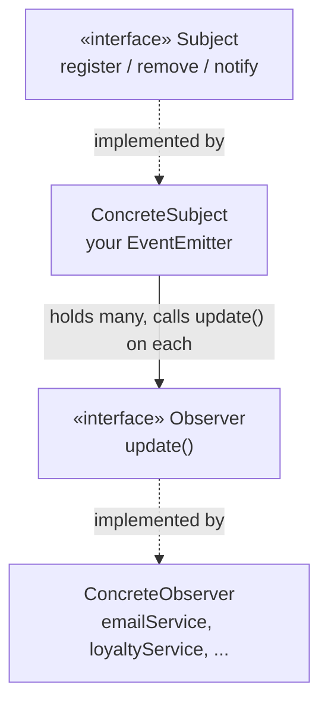
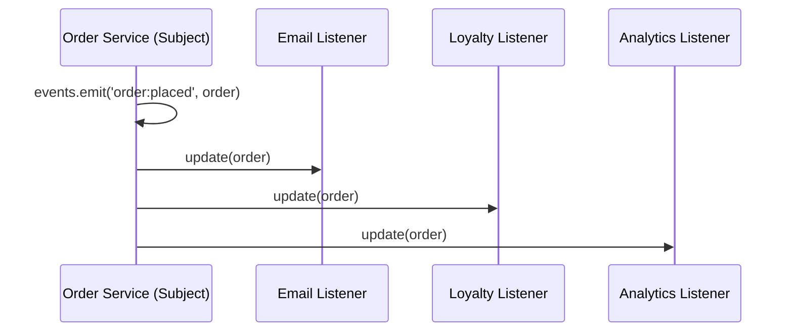

# Observer: build your own EventEmitter

## The problem it solves

Your e-commerce order service must, when an order is placed: send email, update inventory, award loyalty points, notify analytics. Naive version:

```js
function placeOrder(order) {
  chargeCard(order);
  emailService.send(order);       // order service now knows email exists
  inventoryService.reserve(order); // ...and inventory
  loyaltyService.award(order);     // ...and loyalty
  analytics.track(order);          // ...and analytics
}
```

Every new feature edits `placeOrder`. The order service — the most critical code you own — churns weekly for reasons that have nothing to do with orders. Teams block on each other. This is **tight coupling**, and it's the disease.

## The inversion

Flip the dependency: the order service announces *what happened* and knows nobody:

```js
function placeOrder(order) {
  chargeCard(order);
  events.emit('order:placed', order);  // "something happened" — that's all
}

// elsewhere, each team independently:
events.on('order:placed', (order) => emailService.send(order));
events.on('order:placed', (order) => loyaltyService.award(order));
```

New feature? **Add a listener. Touch nothing.** The arrow of knowledge reversed — that inversion *is* the Observer pattern. (Sound familiar? It's the in-process version of the message queue from System Design. Same idea, different scale.)

## The formal definition

> "The Observer Pattern defines a one-to-many dependency between objects so that when one object changes state, all of its dependents are notified and updated automatically." — Ch2, p89

Map this onto what you just built: `events` (the order service's emitter) is the **Subject** — the one object that holds state (*"an order just happened"*) and controls it. Each `events.on('order:placed', …)` registration is an **Observer** — a dependent that reacts when that state changes. The book's canonical shape is two interfaces:



In JS you rarely write `Subject`/`Observer` interfaces explicitly — `on`/`off`/`emit` *are* the Subject contract, and "any function" satisfies the Observer contract. Same structure, less ceremony.

## The Power of Loose Coupling

> Design Principle: "Strive for loosely coupled designs between objects that interact." — Ch2, p92

This is *why* Observer matters, not just *what* it is. Walk through what the order service does and doesn't know:

- **The subject only knows observers implement `update()`** (in JS: "is a function") — never their concrete type. `events.emit` has no idea `emailService` or `loyaltyService` exist.
- **New observer types need zero subject changes.** A team ships SMS notifications by adding one `events.on(...)` call — `placeOrder` is untouched, untested-again, unreviewed.
- **Subject and observers are reusable independently.** The `events` emitter has no idea it's wired to "orders" — it'd work identically for `'user:signed_up'`.



Each listener runs in registration order, synchronously — but the *subject* doesn't know how many there are, or that they exist at all. That's loose coupling.

## Where you'll meet it

`button.addEventListener('click', …)` — the DOM is one giant Observer. Node's `EventEmitter`, React state → re-render, RxJS, Kafka consumers, webhooks, database triggers. Arguably the most-used pattern in existence.

**Observer in the wild, Java edition:** if you've touched Java, you've used this under different names — Swing's `addActionListener`/`actionPerformed`, JavaBeans' `PropertyChangeListener`, RxJava's `subscribe`. Same one-to-many notify-on-change shape as `on`/`emit`, just with interface ceremony JS skips. (Observer is also the ancestor of **Publish/Subscribe** — Pub/Sub adds named *topics* and decouples publishers from subscribers further, the in-process `events.emit` becoming a message broker like Kafka.)

## What you'll build

The real thing, the same core API as Node's `EventEmitter`:

- `on(event, fn)` — subscribe; returns an **unsubscribe function**
- `off(event, fn)` — unsubscribe explicitly
- `emit(event, ...args)` — call every listener for that event with the args; returns how many ran
- `once(event, fn)` — fire one time, then auto-unsubscribe

Two real-world details the tests will force you to get right:

1. **Emitting an event nobody listens to is fine** (return 0, don't crash) — announcers don't know their audience, that's the whole point.
2. **`once` must unsubscribe *before* invoking the handler** — if the handler itself emits the same event, a wrong order means infinite recursion. (This exact bug has taken down real services.)
