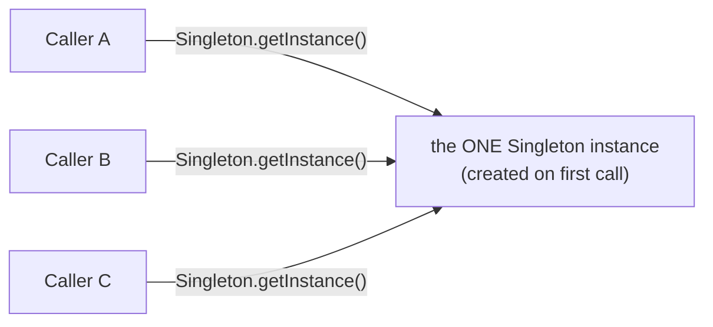
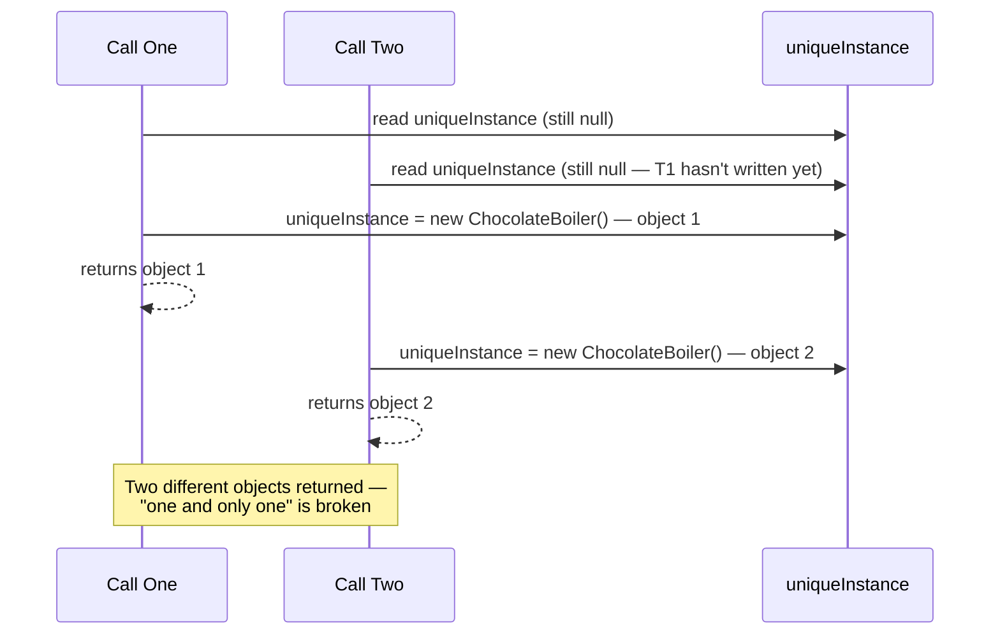
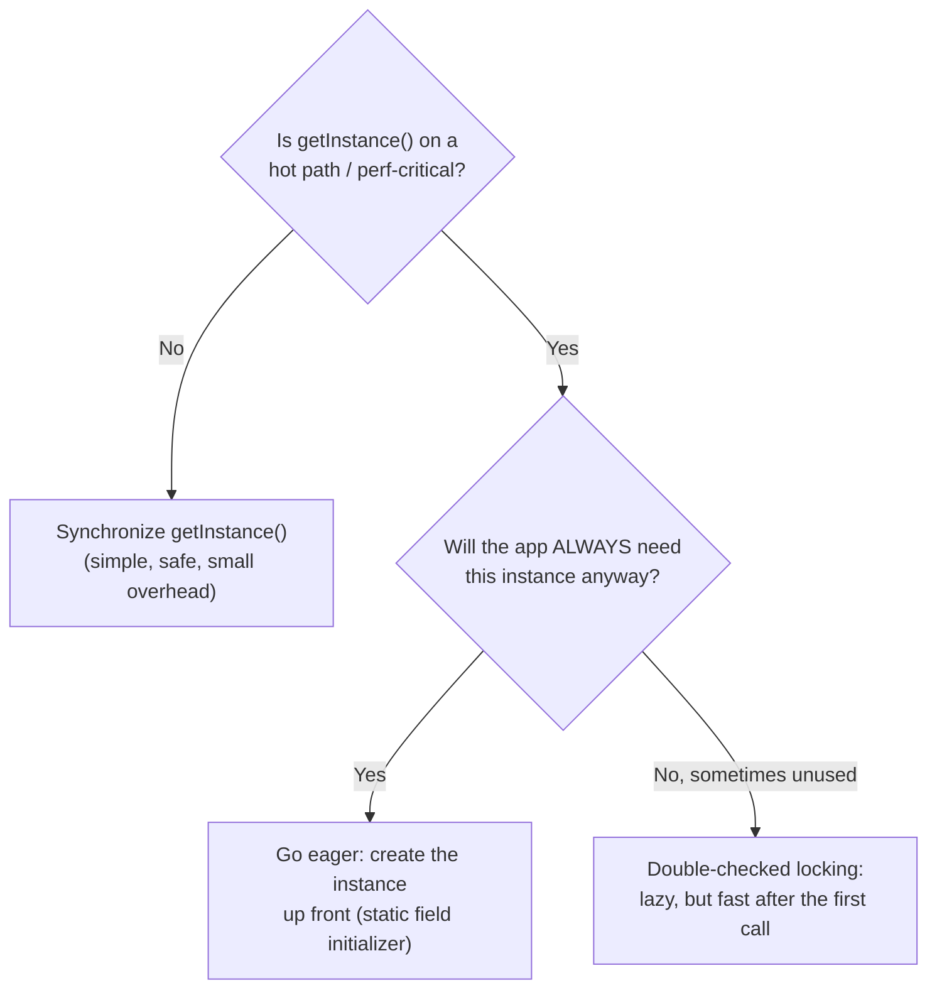

# Singleton: exactly one, on purpose

## Why would you want only one?

Most patterns so far have been about creating *more* flexibility — more strategies,
more decorators, more pizza regions. Singleton goes the other way: it makes sure a
class can **never** have more than one instance.

> "There are many objects we only need one of: thread pools, caches, dialog boxes,
> objects that handle preferences and registry settings, objects used for logging,
> and objects that act as device drivers... if we were to instantiate more than one
> we'd run into all sorts of problems like incorrect program behavior, overuse of
> resources, or inconsistent results." — Ch5, p208

## "Just use a global variable"? — the lazy-instantiation argument

The obvious alternative is a global/static variable. The book's Guru picks it apart
on exactly one axis: **when** the object gets created.

> "If you assign an object to a global variable, then that object might be created
> when your application begins. What if this object is resource intensive and your
> application never ends up using it? ...with the Singleton Pattern, we can create
> our objects only when they are needed." — Ch5, p208

That's **lazy instantiation** — the entire reason `getInstance()` exists instead of
just exporting an already-built object.

## The Little Singleton — deriving it step by step

A Socratic exercise (p209-210) builds the pattern from first principles:

1. **"Could you write a class that can't be instantiated by anyone else?"** — yes:
   give it a **private constructor**. `public class MyClass { private MyClass() {} }`
2. **"Then how does ANYONE get an instance?"** — chicken-and-egg: you'd need an
   instance to call the constructor, but you can't get one.
3. **The way out:** a **static method** — `MyClass.getInstance()` — doesn't need an
   instance to be called; it's called on the *class*.
4. **Combine them:** private constructor + a static `getInstance()` that calls the
   constructor *itself* and hands back the result.

```java
public class Singleton {
    private static Singleton uniqueInstance;

    private Singleton() {}

    public static Singleton getInstance() {
        if (uniqueInstance == null) {
            uniqueInstance = new Singleton();
        }
        return uniqueInstance;
    }
}
```

> "If uniqueInstance is null, then we haven't created the instance yet... if it
> doesn't exist, we instantiate Singleton through its private constructor and
> assign it to uniqueInstance. Note that if we never need the instance, it never
> gets created; this is lazy instantiation." — Ch5, p211

JavaScript has no `private` constructor, but the same guarantee is reachable: have
the constructor itself refuse to run a second time, and let `getInstance()` create
the first instance lazily. You'll build exactly this in the challenge.

## Singleton Pattern, defined

> "The Singleton Pattern ensures a class has only one instance, and provides a
> global point of access to it." — Ch5, p215



Every caller goes through the same class-level door, and every caller gets back the
*same object*. That's the "global point of access" half of the definition; the
private-constructor-plus-lazy-`getInstance()` machinery is the "only one instance"
half.

> "I have no public constructor... to get a hold of a Singleton object, you don't
> instantiate one, you just ask for an instance. So my class has a static method
> called getInstance(). Call that, and I'll show up at once, ready to work. In fact,
> I may already be helping other objects when you request me." — Ch5, p212
> (Confessions of a Singleton)

## The Chocolate Factory — a real "one of a kind"

The running example is `ChocolateBoiler`: a controller for one physical boiler that
takes in milk and chocolate, boils it, then drains it. Its methods enforce
real-world invariants:

> "To fill the boiler it must be empty, and, once it's full, we set the empty and
> boiled flags. To drain the boiler, it must be full (non-empty) and also boiled...
> To boil the mixture, the boiler has to be full and not already boiled." — Ch5,
> p213

> "You probably suspect that if two ChocolateBoiler instances get loose, some very
> bad things can happen." — Ch5, p214

This is Singleton for a reason that has nothing to do with convenience: **there is
physically one boiler**. Two `ChocolateBoiler` *objects* tracking the state of one
*physical* boiler is a recipe for "fill an already-full boiler" or "drain 500
gallons of unboiled mixture."

## Houston, we have a problem — the lazy-init race

After converting `ChocolateBoiler` to the classic Singleton, the factory adds
multithreading — and the boiler overflows anyway. The "BE the JVM" exercise (p217)
asks you to trace two threads both calling `getInstance()` at nearly the same
moment, on this code:

```java
if (uniqueInstance == null) {
    uniqueInstance = new ChocolateBoiler();
}
return uniqueInstance;
```



> "Two different objects are returned! We have two ChocolateBoiler instances!!!" —
> Ch5, p226 (BE the JVM solution)

**This isn't a Java-only problem.** JavaScript's single-threaded — no two lines of
*synchronous* code interleave like this — but the same shape of race shows up with
**async** lazy initialization: two concurrent `await getConnection()` calls can each
read `connection === null` before either `await` resolves and assigns it, so both
create (and leak) a connection. The fix-family is the same one the book reaches
for next.

## Fixing the race: synchronize, go eager, or double-check

The book offers three options (p219-220), and is explicit that the "right" one
depends on **whether `getInstance()` is performance-critical** and **whether the
instance is always needed anyway**:



> "Synchronizing a method can decrease performance by a factor of 100, so if a
> high-traffic part of your code begins using getInstance(), you may have to
> reconsider." — Ch5, p219

> "If your application always creates and uses an instance of the Singleton... you
> may want to create your Singleton eagerly... This code is guaranteed to be thread
> safe!" — Ch5, p219-220

The async analogue of "eager": create the instance (or kick off the connection)
once at module-load time, not inside the first call that happens to need it.

## The Q&A: what Singleton costs you

The chapter doesn't let Singleton off easy. Two principle violations, straight from
the book's own Q&A:

> "The loose coupling principle says to 'strive for loosely coupled designs between
> objects that interact.' It's easy for Singletons to violate this principle: if
> you make a change to the Singleton, you'll likely have to make a change to every
> object connected to it." — Ch5, p222

> "You would be referring to the Single Responsibility Principle... the Singleton
> is responsible not only for managing its one instance (and providing global
> access), but also for whatever its main role is in your application... certainly
> you could argue it is taking on two responsibilities." — Ch5, p222

And a closing warning that matters most in practice:

> "If you are using a large number of Singletons in your application, you should
> take a hard look at your design. Singletons are meant to be used sparingly." —
> Ch5, p222

## Tools for your Design Toolbox

> "Singleton - Ensure a class only has one instance and provide a global point of
> access to it." — Ch5, p224

> "When you need to ensure you only have one instance of a class running around
> your application, turn to the Singleton. ...Examine your performance and resource
> constraints and carefully choose an appropriate Singleton implementation for
> multithreaded applications (and we should consider all applications
> multithreaded!)." — Ch5, p224
