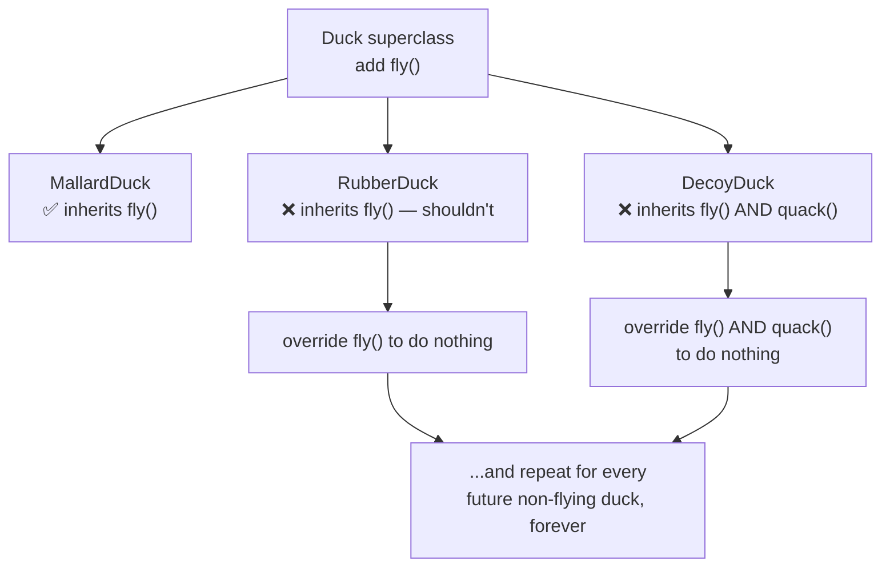
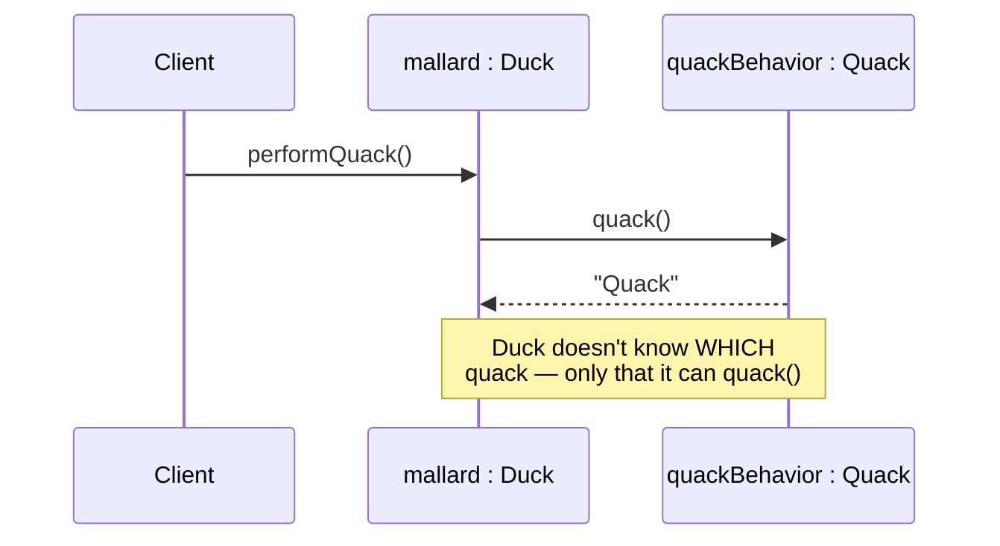

# Strategy: discover a pattern by watching a design break

This is the longest read in the subject, and on purpose. The Strategy Pattern is easy to
*state* and hard to *feel* — so we'll do what the book does: take the long road. We'll
watch Joe's duck app break, fix it the wrong way twice, then derive the pattern from three
plain OO principles. By the end the formal definition should read like a description of
something you already understand.

## It started with a simple SimUDuck app

> "Joe works for a company that makes a highly successful duck pond simulation game,
> SimUDuck. The game can show a large variety of duck species swimming and making quacking
> sounds. The initial designers... created one Duck superclass from which all other duck
> types inherit." — Ch1, p40

So far, textbook OO. `Duck` has `quack()`, `swim()`, and an abstract `display()` (every duck
looks different). `MallardDuck` and `RedheadDuck` extend it. Reuse via inheritance — clean.

Then the executives want a demo that blows away the competition: **the ducks need to fly.**
Joe's manager volunteers him. *"He's an OO programmer… how hard can it be?"*

## But something went horribly wrong

Joe does the obvious thing — adds `fly()` to the `Duck` superclass so every duck inherits it:

> "Joe failed to notice that not all subclasses of Duck should fly. When Joe added new
> behavior to the Duck superclass, he was also adding behavior that was not appropriate for
> some Duck subclasses. He now has flying inanimate objects in the SimUDuck program."
> — Ch1, p42

`RubberDuck` inherited `fly()`. At the shareholders' meeting, **rubber duckies were flying
around the screen.** The book's one-line diagnosis is the whole lesson:

> "A localized update to the code caused a non-local side effect (flying rubber ducks)!"
> — Ch1, p42



## Two wrong turns

**Wrong turn 1 — keep overriding.** Joe can override `fly()` to do nothing in `RubberDuck`,
and `quack()` too in `DecoyDuck`. But the execs now want to update the product *every six
months*. Every new duck type means hunting down and possibly overriding `fly()`/`quack()`
again — forever. Inheritance has made the thing that changes most the hardest to change.

**Wrong turn 2 — interfaces.** Joe pulls `fly()` into a `Flyable` interface and `quack()`
into `Quackable`, so only ducks that should fly implement `Flyable`. This fixes the flying
rubber ducks — but a Java interface has no code, so **every flying duck re-implements
`fly()` from scratch.** Change the flying behavior and you edit it in all 48 flying
subclasses. The book's narrator is blunt:

> "Can you say, 'duplicate code'? If you thought having to override a few methods was bad,
> how are you gonna feel when you need to make a little change to the flying behavior...in
> all 48 of the flying Duck subclasses?!" — Ch1, p45

So: inheritance gives reuse but no flexibility; interfaces give flexibility but no reuse.
We need both. Time for principles.

## Principle 1: identify what varies, and encapsulate it

> "The one constant in software development: **CHANGE.**" — Ch1, p46

What changes here? `fly()` and `quack()` — they vary across ducks and across releases.
What *doesn't* change? Swimming, the existence of ducks, `display()` being per-type. The
first design principle names the move:

> "Identify the aspects of your application that vary and separate them from what stays the
> same." — Ch1, p47 (Design Principle 1)

> "Take the parts that vary and **encapsulate** them, so that later you can alter or extend
> the parts that vary without affecting those that don't." — Ch1, p47

So we pull `fly` and `quack` *out* of `Duck` entirely, into two new sets of classes — one
per behavior. Flying gets `FlyWithWings`, `FlyNoWay`; quacking gets `Quack`, `Squeak`,
`MuteQuack`.

## Principle 2: program to an interface, not an implementation

How do those behavior classes connect back to `Duck`? Through an interface. We define
`FlyBehavior` (with `fly()`) and `QuackBehavior` (with `quack()`), and each concrete
behavior implements one of them.

> "Program to an interface, not an implementation." — Ch1, p49 (Design Principle 2)

The book is careful that "interface" here is the *concept*, not the Java keyword:

> "'Program to an interface' really means 'Program to a supertype.' ...the declared type of
> the variables should be a supertype... so that the objects assigned to those variables can
> be of any concrete implementation." — Ch1, p50

Its tiny example makes it stick. Programming to an *implementation*:

```js
const d = new Dog();   // locked to Dog
d.bark();
```

Programming to an *interface/supertype*, with the concrete type assigned at runtime:

```js
const animal = getAnimal();  // could be any Animal
animal.makeSound();          // we only care that it CAN makeSound()
```

`Duck` will hold its behaviors as the **interface types** `FlyBehavior` and `QuackBehavior`,
so the actual flying/quacking code is never locked into the duck.

## Delegation: the duck asks its behavior to act

Now wire it. `Duck` gets two instance variables typed to the interfaces, and the old
`fly()`/`quack()` become `performFly()`/`performQuack()` that **delegate**:

```js
class Duck {
  // flyBehavior and quackBehavior are set by each concrete duck
  performQuack() { this.quackBehavior.quack(); }  // delegate, don't do it yourself
  performFly()   { this.flyBehavior.fly(); }
}

class MallardDuck extends Duck {
  constructor() {
    super();
    this.quackBehavior = new Quack();        // a real quack
    this.flyBehavior   = new FlyWithWings();  // it flies
  }
}
```

> "A Duck will now **delegate** its flying and quacking behaviors, instead of using quacking
> and flying methods defined in the Duck class." — Ch1, p53



## The payoff: change behavior at runtime

Because the behavior is an object the duck *holds* (not code it *is*), you can swap it while
the program runs. Add setters and a rocket:

```js
setFlyBehavior(fb) { this.flyBehavior = fb; }
// ...
const model = new ModelDuck();
model.performFly();                          // "I can't fly" (FlyNoWay)
model.setFlyBehavior(new FlyRocketPowered());
model.performFly();                          // "I'm flying with a rocket!"
```

> "If it worked, the model duck dynamically changed its flying behavior! You can't do THAT
> if the implementation lives inside the Duck class." — Ch1, p59

## Principle 3: favor composition over inheritance

Each duck now **HAS-A** `FlyBehavior` and **HAS-A** `QuackBehavior` instead of getting
those behaviors by **IS-A** inheritance.

> "Favor composition over inheritance." — Ch1, p61 (Design Principle 3)

> "Instead of inheriting their behavior, the ducks get their behavior by being composed with
> the right behavior object." — Ch1, p61

HAS-A is why the duck call from a hunting-supply company can reuse `Quack` without being a
`Duck` at all — it just composes itself with a `QuackBehavior`. IS-A could never do that.

## Speaking of design patterns…

> "Congratulations on your first pattern! You just applied... the **Strategy Pattern.**"
> — Ch1, p62

Here's the formal definition. Read it now that you've built the thing it describes:

> "**The Strategy Pattern** defines a family of algorithms, encapsulates each one, and makes
> them interchangeable. Strategy lets the algorithm vary independently from clients that use
> it." — Ch1, p62

Map it back: the **family of algorithms** is `FlyWithWings`/`FlyNoWay` (and the quack
family); **encapsulated** means each lives in its own class; **interchangeable** is the
runtime swap; and the **client** (`Duck`) varies independently because it only ever talks to
the `FlyBehavior` interface. The book even reframes the behaviors as "a family of
algorithms" precisely so you'd see that *computing state sales tax by state* would use the
exact same shape (p60).

## The challenge ahead: same shape, no ducks

You'll build a ride-hailing **fare system** — the SimUDuck design with the serial numbers
filed off. `economyPricing`, `premiumPricing`, `sharedPricing` are your `FlyBehavior`
family (each encapsulates one fare algorithm behind a `{ base, perKm, adjust }` interface);
`calculateFare(trip, pricing)` is the client that's programmed to that interface. A tiny
`pricingFor(type)` lookup answers "who picks the strategy from the API string?" — that's a
**Simple Factory**, and it's the bridge into the next lesson, where factories get their own
deep dive (PizzaStore, Factory Method, Abstract Factory). Surge pricing is applied **once**,
in the calculator — not copy-pasted into each strategy, which is exactly the duplication
Strategy exists to kill.
