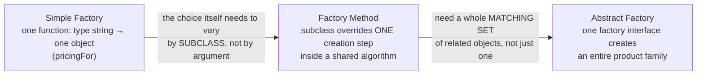

# Strategy & Factory: kill the if-else jungle

## The smell

Your ride-hailing app computes fares. It starts innocently, then product management happens:

```js
function calculateFare(trip, rideType) {
  if (rideType === 'economy') {
    return 30 + trip.km * 12;
  } else if (rideType === 'premium') {
    return 80 + trip.km * 22;
  } else if (rideType === 'shared') {
    let fare = 20 + trip.km * 8;
    if (trip.riders > 1) fare *= 0.9;
    return fare;
  } else if (rideType === 'xl') { /* ... */ }
  // 14 more branches, surge pricing mixed in, nobody dares touch it
}
```

Symptoms: every new ride type edits this function (and risks every existing type); testing one branch means wading through all; surge logic gets copy-pasted into three branches and drifts apart. The `if-else` on a *type tag* is the smell.

## Strategy: each behavior becomes an object

Pull each variant behind one interface:

```js
const economyPricing = { base: 30, perKm: 12, adjust: (fare) => fare };
const sharedPricing  = {
  base: 20, perKm: 8,
  adjust: (fare, trip) => trip.riders > 1 ? fare * 0.9 : fare,
};

function calculateFare(trip, pricing) {       // depends on the INTERFACE
  return pricing.adjust(pricing.base + trip.km * pricing.perKm, trip);
}
```

Now: new ride type = new object, zero edits to existing code (the **Open/Closed Principle** — open for extension, closed for modification). Each strategy unit-tests in isolation. In JS, a strategy can be a plain object or even just a function — no class ceremony required.

> "The Strategy Pattern defines a family of algorithms, encapsulates each one, and makes them interchangeable. Strategy lets the algorithm vary independently from clients that use it." — Ch1, p62

This is the SimUDuck principles, named. `economyPricing`, `premiumPricing`, `sharedPricing` are this lesson's `FlyBehavior`/`QuackBehavior` family — each *encapsulates* one algorithm (Principle 1: encapsulate what varies). `calculateFare(trip, pricing)` is *programmed to the interface* `{ base, perKm, adjust }`, never to a specific pricing object (Principle 2) — exactly how `Duck.performFly()` calls `flyBehavior.fly()` without knowing which behavior it holds.

## Factory: centralize the choosing

One question remains: who picks the strategy from the string `"shared"` that came over the API? If every call site does its own `if (type === ...)`, you've just smeared the jungle around. Put the mapping in **one place**:

```js
const PRICING = { economy: economyPricing, premium: premiumPricing, shared: sharedPricing };

function pricingFor(rideType) {              // the factory
  const p = PRICING[rideType];
  if (!p) throw new Error('Unknown ride type: ' + rideType);
  return p;
}
```

Strategy says *behaviors are swappable objects*; Factory says *the choosing happens in exactly one place*. They're a couple — you'll almost always deploy them together: `calculateFare(trip, pricingFor(type))`.

## Simple Factory vs Factory Method vs Abstract Factory

`pricingFor` above is what the book calls a **Simple Factory**: one function, a type string in, one object out. It's the workhorse you'll reach for most of the time — but the GoF catalog has two heavier relatives for when "one function with a switch" stops being enough.

> "The Simple Factory isn't actually a Design Pattern; it's more of a programming idiom. But it is commonly used, so we'll give it a Head First Pattern Honorable Mention." — Ch4, p155

**Factory Method** kicks in when the *choice itself* needs to vary by **subclass**, not by an argument you pass in. Picture a `PizzaStore` whose `orderPizza()` runs the shared steps (prepare, bake, cut, box), but the one step that creates the pizza — `createPizza()` — is left abstract; `NYPizzaStore` and `ChicagoPizzaStore` subclasses each override just that step to return their region's pizza:

> "The Factory Method Pattern defines an interface for creating an object, but lets subclasses decide which class to instantiate. Factory Method lets a class defer instantiation to subclasses." — Ch4, p172

**Abstract Factory** kicks in when you need a whole **matching set** of related objects, not just one — and the sets must never get mixed. A `NYPizzaIngredientFactory` and a `ChicagoPizzaIngredientFactory` each produce a *dough + sauce + cheese + clams* family; hand a New York pizza the Chicago factory and you get the wrong cheese on every pizza, not just one ingredient.

> "The Abstract Factory Pattern provides an interface for creating families of related or dependent objects without specifying their concrete classes." — Ch4, p194



All three share the same underlying move: encapsulate object creation behind an interface so the rest of the code depends on abstractions, not concretes.

> Design Principle: "Depend upon abstractions. Do not depend upon concrete classes." — Ch4, p177

This **Dependency Inversion Principle** is a stronger cousin of "program to an interface": it says *both* the high-level code (`PizzaStore`, `calculateFare`) *and* the low-level objects (`NYStyleCheesePizza`, `premiumPricing`) should depend on a shared abstraction, with neither one reaching directly for the other's concrete type.

## Real-world sightings

- Payment processing: `processorFor('upi' | 'card' | 'paypal')`
- Compression: zip/gzip/brotli behind one `compress()` interface
- Auth: OAuth/SAML/password strategies (the passport.js library is literally named for carrying strategies)
- React: passing a render function or comparator prop — Strategy without the name

## The challenge ahead

You'll build the fare system: three pricing strategies + a factory + the calculator, with a surge multiplier applied uniformly (in ONE place — the calculator), not copy-pasted into each strategy. The tests check exactly the mistakes real candidates make.
