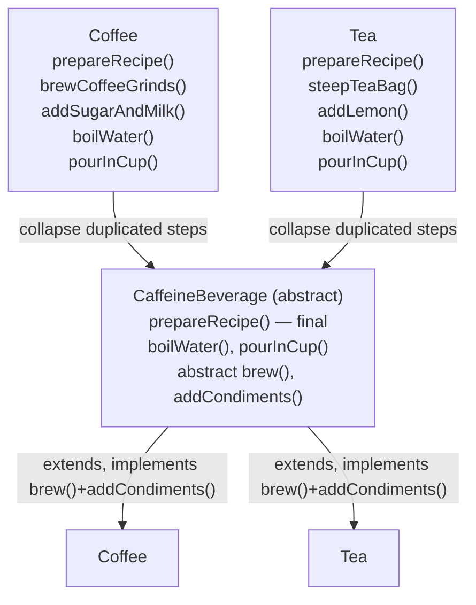
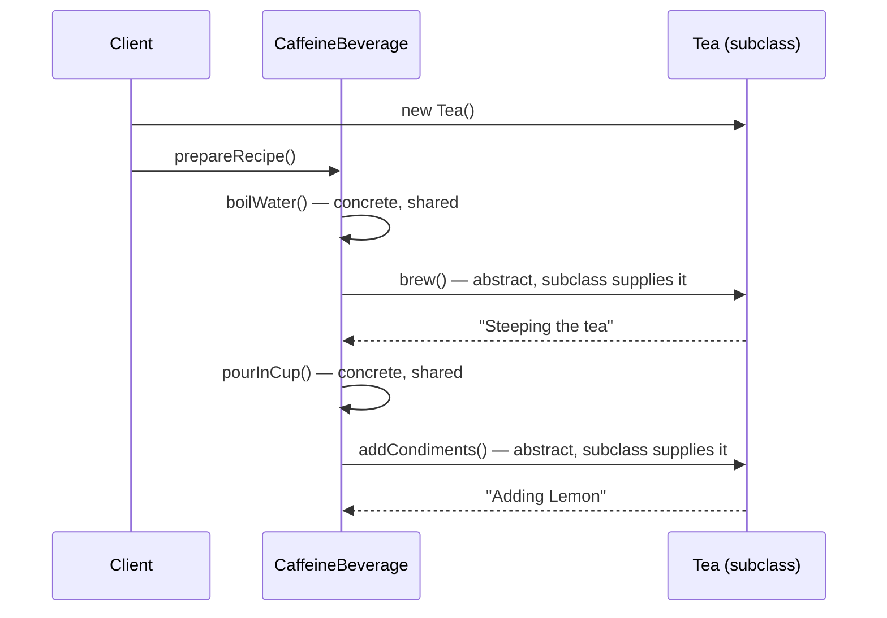
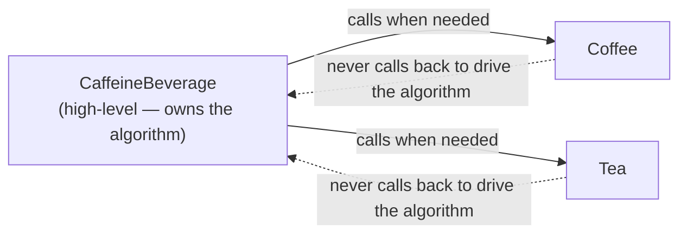

# Template Method: the algorithm's skeleton

## Coffee and tea: the same recipe, twice

Starbuzz's own training manual gives baristas two recipes that are suspiciously alike:

> "(1) Boil some water (2) Brew coffee in boiling water (3) Pour coffee in cup (4) Add
> sugar and milk" — Ch8, p316 (Coffee)

> "(1) Boil some water (2) Steep tea in boiling water (3) Pour tea in cup (4) Add
> lemon" — Ch8, p316 (Tea)

The first-pass code matches the duplication exactly: `Coffee` and `Tea` each implement
their own `prepareRecipe()`, `boilWater()`, and `pourInCup()` — even though
`boilWater()` and `pourInCup()` are *word-for-word identical* between the two classes.

> "Notice that these two methods are exactly the same as they are in Coffee!... So we
> definitely have some code duplication going on here." — Ch8, p318

## First cut: pull up the shared steps only

The obvious fix is a `CaffeineBeverage` superclass holding `boilWater()` and
`pourInCup()`, with `prepareRecipe()` left abstract so each subclass still defines its
own version. That removes *some* duplication — but `prepareRecipe()` itself is still
written out twice, and the two copies have the *same shape*:

> "Notice that both recipes follow the same algorithm: 1 Boil some water. 2 Use the
> hot water to extract the coffee or tea. 3 Pour the resulting beverage into a cup.
> 4 Add the appropriate condiments to the beverage." — Ch8, p321

Steps 1 and 3 are already shared. Steps 2 and 4 only *look* different because they're
named differently — `brewCoffeeGrinds()`/`steepTeaBag()` are really the same step
("extract the beverage"), and `addSugarAndMilk()`/`addLemon()` are really the same step
("add condiments"). Rename them to `brew()` and `addCondiments()` and the entire
algorithm becomes identical text in both classes:

> "Let's think through this: steeping and brewing aren't so different; they're pretty
> analogous. So let's make a new method name, say, brew()... Likewise, adding sugar and
> milk is pretty much the same as adding a lemon... addCondiments()." — Ch8, p322

## Pulling `prepareRecipe()` up into the superclass

```java
public abstract class CaffeineBeverage {
    final void prepareRecipe() {
        boilWater();
        brew();
        pourInCup();
        addCondiments();
    }
    abstract void brew();
    abstract void addCondiments();
    void boilWater() { System.out.println("Boiling water"); }
    void pourInCup() { System.out.println("Pouring into cup"); }
}
```

> "prepareRecipe() is declared final because we don't want our subclasses to be able to
> override this method and change the recipe! We've generalized steps 2 and 4 to
> brew() the beverage and addCondiments()." — Ch8, p323

`Coffee` and `Tea` shrink down to exactly the two methods that actually differ:

```java
public class Coffee extends CaffeineBeverage {
    public void brew() { System.out.println("Dripping Coffee through filter"); }
    public void addCondiments() { System.out.println("Adding Sugar and Milk"); }
}
public class Tea extends CaffeineBeverage {
    public void brew() { System.out.println("Steeping the tea"); }
    public void addCondiments() { System.out.println("Adding Lemon"); }
}
```



## Meet the Template Method

> "The Template Method Pattern defines the skeleton of an algorithm in a method,
> deferring some steps to subclasses. Template Method lets subclasses redefine certain
> steps of an algorithm without changing the algorithm's structure." — Ch8, p329

`prepareRecipe()` is the **template method**: a method that lays out an algorithm as a
fixed sequence of steps, where one or more of those steps is deferred to a subclass.
Tracing a call shows the control flow precisely:



> "The prepareRecipe() method controls the algorithm. No one can change this, and it
> counts on subclasses to provide some or all of the implementation." — Ch8, p327

## Three kinds of method, one consistent vocabulary

The general shape of `AbstractClass` (p330-331) names three distinct roles, and the
chapter is precise about which is which — worth keeping straight because the names
recur in every Java-API example later in the chapter:

- **Abstract method** — declared `abstract`, no implementation in the superclass. A
  subclass **must** implement it, or it won't compile. `brew()` and `addCondiments()`
  are abstract methods.
- **Concrete method** — fully implemented in the superclass, usually shared as-is
  (sometimes marked `final` so subclasses *can't* override it). `boilWater()` and
  `pourInCup()` are concrete methods.
- **Hook** — a concrete method with an empty or default implementation. A subclass
  **may** override it, but doesn't have to; if it doesn't, the default behavior runs.

> "We can also have concrete methods that do nothing by default; we call these
> 'hooks.' Subclasses are free to override these but don't have to." — Ch8, p331

## Hooking into the algorithm: `CaffeineBeverageWithHook`

The chapter's hook example adds a `boolean customerWantsCondiments()` hook that
defaults to `true`, then makes one step of the template method conditional on it:

```java
final void prepareRecipe() {
    boilWater();
    brew();
    pourInCup();
    if (customerWantsCondiments()) {
        addCondiments();
    }
}
boolean customerWantsCondiments() { return true; }
```

> "A hook is a method that is declared in the abstract class, but only given an empty
> or default implementation. This gives subclasses the ability to 'hook into' the
> algorithm at various points, if they wish; a subclass is also free to ignore the
> hook." — Ch8, p332

`CoffeeWithHook` overrides the hook to ask the customer and return their answer,
turning a fixed step into an optional one — without touching `prepareRecipe()` at all:

> "Use abstract methods when your subclass MUST provide an implementation of the
> method or step in the algorithm. Use hooks when that part of the algorithm is
> optional. With hooks, a subclass may choose to implement that hook, but it doesn't
> have to." — Ch8, p335 (Q&A)

## The Hollywood Principle

> "The Hollywood Principle: Don't call us, we'll call you." — Ch8, p336

> "With the Hollywood Principle, we allow low-level components to hook themselves into
> a system, but the high-level components determine when they are needed, and how."
> — Ch8, p336

`CaffeineBeverage` is the high-level component: it owns `prepareRecipe()` and decides
exactly when to call `brew()` or `addCondiments()`. `Tea` and `Coffee` never call back
into `CaffeineBeverage` to drive the algorithm — they just wait to be called.

> "CaffeineBeverage is our high-level component. It has control over the algorithm for
> the recipe, and calls on the subclasses only when they're needed for an
> implementation of a method." — Ch8, p337



## Template Method in the wild: not always textbook

Two Java API examples (p340-348) show the pattern showing up *without* the classic
inheritance shape:

- **`Arrays.sort()`** is a template method without subclassing: `sort()`/`mergeSort()`
  control the algorithm, but rely on the array elements implementing `compareTo()`
  (the `Comparable` interface) to fill in the one step they can't do themselves.

  > "The algorithm that Arrays implements for sort() is incomplete; it needs a class
  > to fill in the missing compareTo() method. So, in that way, it's more like
  > Template Method [than Strategy]." — Ch8, p345 (Q&A)

- **`JFrame.paint()`** is a pure hook: by default it draws nothing, and overriding it
  lets you "hook into" the frame's drawing algorithm.

  > "By default, paint() does nothing because it's a hook! By overriding paint(), you
  > can insert yourself into JFrame's algorithm for displaying its area of the
  > screen." — Ch8, p346

- **`AbstractList.subList()`** is a template method relying on two abstract methods,
  `get()` and `size()`, that any custom list subclass must supply.

## Template Method vs Strategy — the recurring confusion

Both patterns "encapsulate algorithms," which is exactly why they get mixed up. The
chapter's own fireside chat (p348-349) draws the line directly:

> "My intent's a little different from yours; my job is to define the outline of an
> algorithm, but let my subclasses do some of the work. That way, I can have different
> implementations of an algorithm's individual steps, but keep control over the
> algorithm's structure." — Template Method, Ch8, p348

> "I'm not stuck using inheritance for algorithm implementations. I offer clients a
> choice of algorithm implementation through object composition." — Strategy, Ch8, p348

The difference isn't "which one varies an algorithm" — both do. It's **how much
varies, and by what mechanism**:

| | Template Method | Strategy |
|---|---|---|
| Mechanism | Inheritance — subclass fills in steps | Composition — client holds a swappable object |
| What varies | One or more **steps** of a fixed algorithm | The **entire** algorithm, swapped as one unit |
| Who decides | The abstract superclass calls the shots (Hollywood Principle) | The client picks a strategy object, often at runtime |
| Can you change it after construction? | No — the subclass IS the variant, fixed at compile time | Yes — swap the strategy object at runtime |

> "But you have to depend on methods implemented in your subclasses, which are part of
> your algorithm. I don't depend on anyone; I can do the entire algorithm myself!"
> — Strategy, needling Template Method, Ch8, p349

## Tools for your Design Toolbox

> "Template Method - Define the skeleton of an algorithm in an operation, deferring
> some steps to subclasses. Template Method lets subclasses redefine certain steps of
> an algorithm without changing the algorithm's structure." — Ch8, p351

> "The template method's abstract class may define concrete methods, abstract methods,
> and hooks... To prevent subclasses from changing the algorithm in the template
> method, declare the template method as final... Factory Method is a specialization
> of Template Method." — Ch8, p351
