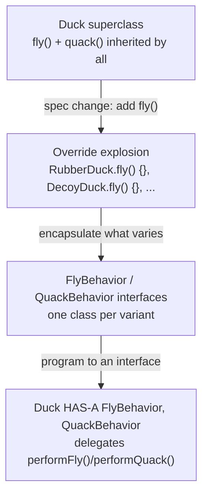

# Design patterns in the wild

Forget the textbook for a second. You already *use* design patterns daily — you just haven't been introduced. Let's name what you've been touching, then make the catalog stick.

## You've met these before

- **Observer** — you tap *Subscribe* on YouTube. The channel doesn't know your name; it keeps a list of subscribers and notifies all of them on upload. Every `addEventListener`, every React re-render on state change, every webhook: Observer.
- **Strategy** — checkout offers UPI, card, or COD. Same checkout flow, swappable payment behavior behind one interface. Your maps app picking walk/drive/transit routing: Strategy.
- **Factory** — you order "a medium latte"; the barista decides which machine, beans, and steps produce it. `fetch()` hands you a Response without you ever `new`-ing one. Creation logic centralized in one place: Factory.
- **Singleton** — there is one electricity meter for your whole flat, on purpose. Your app's config object, the connection pool, the logger: one shared instance, globally reachable.
- **Decorator** — coffee +cream +caramel +extra shot: each wrapper adds behavior and a price *without changing the base coffee class*. HTTP middleware (auth wrapping logging wrapping your handler) is Decorator all the way down.
- **Adapter** — your laptop's USB-C-to-HDMI dongle. Neither the laptop nor the monitor changed; a translator made incompatible interfaces fit. Every third-party API wrapper you've written is an Adapter.
- **Facade** — a hotel concierge: one friendly interface ("book me a taxi") hiding five gnarly subsystems. `video.play()` hiding codecs, buffering, and audio sync: Facade.

## SimUDuck: watch a pattern get discovered

Head First's running example, condensed. SimUDuck is a duck-pond simulator: every duck type — `MallardDuck`, `RedheadDuck`, `RubberDuck` — inherits `quack()`, `swim()`, and `display()` from a `Duck` superclass. Only `display()` differs per type, since every duck looks different.

Then the spec changes: ducks must fly. The obvious "OO" move is to add `fly()` to `Duck` so every subclass inherits it for free. Result: rubber ducks flying across the screen during the shareholder demo. `RubberDuck` had already overridden `quack()` to squeak, but nobody thought to override `fly()` — **a localized change to the superclass had a non-local side effect on every subclass**, because inheritance hands out behavior whether or not it fits the subtype.

Overriding `fly()` per duck (`RubberDuck.fly() { /* do nothing */ }`) doesn't scale either: every future duck type needs the same defensive override, and a tweak to "how flying works" means hunting through dozens of subclasses.

> "If you've got some aspect of your code that is changing, say with every new requirement, then you know you've got a behavior that needs to be pulled out and separated from all the stuff that doesn't change. Take what varies and **encapsulate** it so it won't affect the rest of your code." — Ch1, p47

**Design Principle 1 — Encapsulate what varies.** `fly()` and `quack()` vary per duck; `swim()` and the rest don't. Pull the *varying* parts into their own families of classes — `FlyBehavior` and `QuackBehavior` — with one implementation per variant (`FlyWithWings`, `FlyNoWay`, `Quack`, `Squeak`, `MuteQuack`, …).

**Design Principle 2 — Program to an interface, not an implementation.** `Duck` holds a `flyBehavior` field typed as the `FlyBehavior` *interface*, never as a concrete class. `performFly()` just calls `flyBehavior.fly()` — `Duck` never needs to know *which* flying behavior it has, only that it has one. New behavior = new class implementing the interface; zero edits to `Duck` or any existing subclass.

The relationship between `Duck` and its behaviors is **HAS-A, not IS-A**: a duck *has* a flying behavior rather than *being* defined by inheriting one.

> Design Principle 3: "Favor composition over inheritance." — Ch1, p61

Composing objects from interchangeable parts — instead of inheriting a fixed bundle of behavior — is **the basis of nearly every pattern in this subject**. You just watched a pattern get discovered, beat by beat, without anyone naming it. Its formal definition, for when you need to impress: *"defines a family of algorithms, encapsulates each one, and makes them interchangeable. Strategy lets the algorithm vary independently from clients that use it."* — Ch1, p62 (you'll build this exact pattern in the next lesson).

## What a pattern actually is

A pattern is a **named, reusable answer to a recurring design force** — usually the force is *"this part will change, and I don't want the change to ripple."*

- Things that **vary** get pulled behind an interface (Strategy, Observer)
- Things that are **created in messy ways** get a dedicated creator (Factory, Builder)
- Things that **don't fit** get translators (Adapter, Facade)
- Things that need **layered add-ons** get wrappers (Decorator)

That's 80% of the Gang of Four in four bullets.

## Why interviewers care (it's not trivia)

Saying "I'd use Strategy here" compresses a paragraph of design discussion into a word both of you understand — patterns are **vocabulary**. The real test isn't defining Observer; it's *noticing* that your three nested if-else blocks on `paymentType` are a Strategy begging to exist.

## The warning label

Patterns are painkillers, not vitamins: take them when something hurts, not daily for general health. A `PaymentStrategyFactoryProvider` for an app with one payment method is a disease with its own name (*overengineering*) and it fails interviews just as hard as spaghetti. **The senior skill is knowing when NOT to use one.** A pattern earns its complexity only when the variation it isolates actually exists or is concretely expected.

Next up: you'll *build* Observer and Strategy — they're the two you'll use most for the rest of your career.
