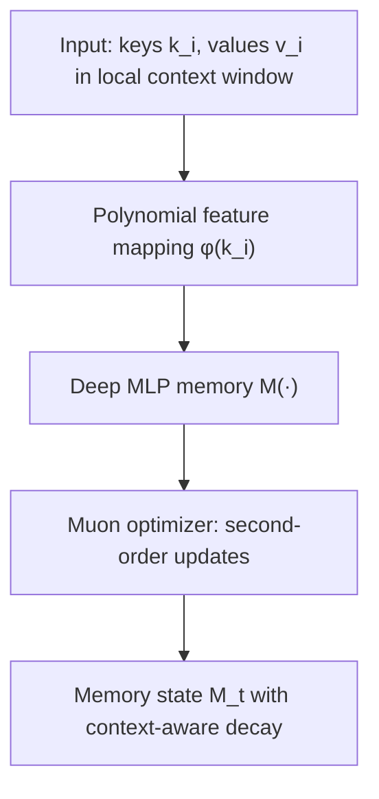

# Atlas: Locally Optimal Memory with All Five Properties

## The Architecture

Atlas is a recurrent memory module combining all improvements into a single coherent design:

## Core Update Rule

$$M_t = \alpha_t M_{t-1} - \eta_t \nabla S_t$$

where

$$S_t = \theta_t S_{t-1} - \nabla \mathcal{L}(M_{t-1}; k_i, v_i)$$

and $\mathcal{L}$ is the Omega rule loss (minimized over the sliding context window).

Unlike standard gradient descent, the **Muon optimizer** computes $\nabla S_t$ using second-order curvature information, approximating the natural gradient.

## Why Second-Order Optimization Matters

First-order gradient descent converges quickly but can get stuck in **spurious local minima**—solutions that fit noise rather than true patterns. This happens especially with:
- Ambiguous facts (multiple correct mappings)
- Noisy or conflicting signals
- Complex landscape with many saddle points

Second-order methods (Muon, Newton, natural gradient) use **curvature information** about the loss landscape. They:
- Escape spurious minima more reliably
- Find flatter, more robust solutions
- Handle ill-conditioned problems better

For a memory module learning thousands of fact associations, this means:
- Fewer hallucinations (false memories)
- Better generalization to new contexts
- Stronger signal even when facts are ambiguous

## All Five Properties

Atlas is the **first recurrent model achieving all five capabilities** (from Table 1):

| Property | Benefit |
|----------|---------|
| **Dynamic decay** ($\alpha_t$ data-dependent) | Forget stale information adaptively |
| **Deep memory** (MLP $L_M \geq 2$) | Higher capacity for complex mappings |
| **Non-linear capacity** (polynomial $\phi$) | Superlinear scaling in memory size |
| **Locally optimal** (Muon second-order) | Escape spurious minima, better solutions |
| **Flexible context** (input-dependent $\gamma_i$) | Prune irrelevant information within window |

Each property alone improves performance; together they compound.

## Parallelizable Training

A key practical advantage: Atlas can be **trained in parallel** using sliding-window masking, similar to Transformers. This is unlike naive RNNs, which are sequential.

The trick: chunk the sequence into blocks, apply Omega rule within each block in parallel, but thread the memory state through blocks sequentially. This gives:
- $O(N)$ complexity instead of $O(N^2)$ attention
- Efficient hardware utilization (GPUs/TPUs can parallelize block computation)
- No significant overhead compared to online recurrent updates

---

**Citation:** Atlas paper, § 4 "Atlas: A Locally Optimal Memory with High Capacity" and Table 1 (p. 2)
