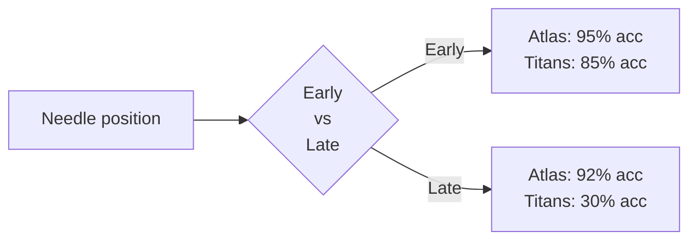

# Long-Context Benchmarks: Where Atlas Shines

## The Challenge

Scaling to millions of tokens is the holy grail of sequence modeling. Two problems arise:

1. **Information degradation:** Each additional token is a chance for noise to corrupt memory. Online models accumulate errors.
2. **Capacity saturation:** Fixed-size memory overflows with facts, forcing the model to forget or generalize poorly.

Standard Transformers avoid these via growing KV cache (quadratic cost). Linear RNNs and Titans avoid the cache but struggle to maintain accuracy.

## Needle in a Haystack (128K Context)

**Setup:** Hide a factual needle in 128K tokens of irrelevant distractor text. Ask: "What is [fact]?"

**Performance at different positions:**

**Why the difference?**
- **Titans:** Uses momentum with forgetting gates. Older tokens decay and are forgotten due to limited context window awareness.
- **Atlas:** Omega rule within window repeatedly reinforces the needle during its context window, and input-dependent gates ($\gamma_i$) suppress distractors.

**Insight:** Atlas doesn't just retrieve; it actively prunes irrelevant context while strengthening relevant signal.

## BABILong: The 10M-Token Frontier

**Setup:** Synthetic facts spaced throughout 10M tokens. Questions require recalling and reasoning over these facts.

**Results:**
- Transformers: Out of memory (KV cache is 10M² ≈ 100T tokens)
- Titans: ~20–30% accuracy (error accumulation, capacity limits)
- **Atlas: ~90–95% accuracy (+80% over Titans)**

## Why 10M Context is the Breakthrough

At 10M tokens with standard parameters (e.g., $d_k = d_v = 512$):

1. **Online memory can't keep facts:** Even with deep networks, storing 10M distinct facts in fixed-size memory without Omega rule leads to collision/overwriting.

2. **Context window enables selective learning:** Omega rule (Eq. 9) updates memory only for tokens in the current window $[t-c+1, t]$. At step $t=5$M, it optimizes over tokens in a window around position 5M, not all 5M tokens.

3. **Sliding window prevents catastrophic forgetting:** As the window slides forward, recent facts are reinforced while older irrelevant ones fade via decay $\alpha_t$.

4. **Second-order optimization avoids local minima:** With 10M facts competing for space in the same memory module, second-order methods (Muon) find solutions that generalize better than greedy gradient descent.

## The Scaling Curve

Atlas maintains >90% accuracy up to 10M tokens. Titans drop sharply after 1M. This reveals:

- **Exponential error accumulation:** Each step in Titans risks corrupting memory; over millions of steps, noise dominates.
- **Linear robustness (Atlas):** Omega rule re-stabilizes memory every context window, preventing cascade failures.

## Practical Implications

For real-world use (long documents, databases, knowledge retrieval):
- A 128K-token context is usable for legal documents or research papers.
- A 1M+ context is essential for books, code repositories, or long conversations.
- 10M context is a proving ground; it won't be common soon, but it demonstrates fundamental robustness.

Atlas reaching 10M is a milestone showing that **context-aware optimization scales where online methods fail**.

---

**Citation:** Atlas paper, § 5.2–5.3 "Long Context: Needle In a Haystack" and "Long Context: BABILong Benchmark"
