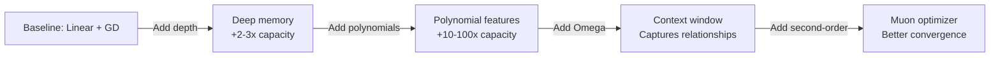

# Comparing Architectures: What Drives Long-Context Performance

## The Family of Models

The Atlas paper introduces a systematic family of architectures, each adding one or more improvements:

| Model | Memory | Optimizer | Features | Context | Capacity |
|-------|--------|-----------|----------|---------|----------|
| **Attention** | Non-param | NP | - | ✓ | ✓ |
| **Linear RNN** | Linear | GD | - | ✗ | Limited |
| **RetNet** | Linear + gate | GD | - | ✗ | Limited |
| **Titans** | Deep | GD (momentum) | ✗ | ✗ | Higher |
| **DLA** | Deep | GD | Linear | ✗ | Higher |
| **DeepTransformer** | Deep | GD | Polynomial | ✗ | Super-linear |
| **SWDT** | Deep | GD | Polynomial | ✓ (sliding) | Super-linear |
| **OmegaNet** | Deep | GD | Polynomial | ✓ (sliding) | Super-linear |
| **Atlas** | Deep | Muon | Polynomial | ✓ (sliding) | Super-linear + robust |

## Key Design Differences

### Memory Depth
- **Shallow (Linear):** Matrix $M \in \mathbb{R}^{d_v \times d_k}$. Capacity bottleneck at $O(d_k)$.
- **Deep (MLP):** $M(·)$ with $L_M \geq 2$ hidden layers. Capacity jumps to $O(d_k d_v)$.

**Impact:** Titans already uses deep memory; this is table-stakes for long context.

### Optimization Algorithm
- **First-order (GD):** Gradient descent or GD with momentum. Fast but can converge to poor local minima.
- **Second-order (Muon):** Approximates Newton's method using curvature. Slower but finds flatter, more robust solutions.

**Impact:** For noisy or ambiguous facts, second-order makes a measurable difference, especially on long sequences.

### Feature Mapping
- **None:** Keys used as-is. Attention is linear in key dimension.
- **Polynomial ($\phi_p$):** Keys expanded to $O(d_k^p)$ effective dimensions. Hugely increases capacity without parameter blow-up.

**Impact:** Enables storing thousands of distinct facts in fixed-size memory.

### Context Window
- **None (online):** Memory updated only with current token. Fast but greedy.
- **Sliding window (Omega):** Memory optimized over $c$ past tokens. Captures relationships but still efficient.
- **Global:** Optimized over all tokens. Expensive but most expressive.

**Impact:** Sliding window (size 128–256) balances context understanding with training efficiency.

## The Cascade: Each Improvement Compounds

Each addition alone helps; together they synergize to unlock 10M+ token understanding where previous models topped out at 100K.

## Atlas: The Full System

Atlas combines all these with careful engineering:
- **Why deep?** Superlinear capacity for diverse facts
- **Why polynomials?** Reach $O(d_k^p)$ storage without parameter explosion
- **Why Omega?** Remember fact relationships across a window
- **Why Muon?** Avoid spurious local minima that poison memory
- **Why sliding window instead of global?** Efficiency and context drift avoidance

The experiments validate that **no single component is sufficient alone**; the gains come from orchestrating all five properties.

---

**Citation:** Atlas paper, Table 1 (p. 2) and § 4 discussion of model families
