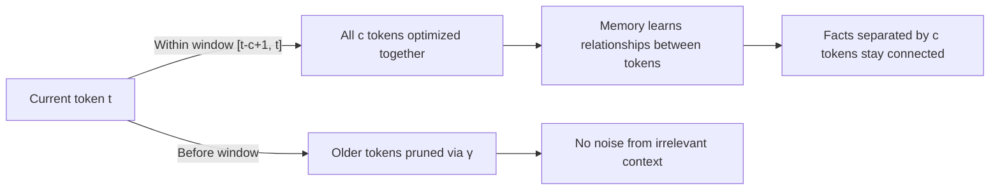

# The Omega Rule: From Online to Context-Aware Memory

## The Problem with Online Updates

Most existing recurrent models optimize memory using **online updates**, considering only the current token:

$$\min_M \mathcal{L}(M; k_t, v_t) + \text{Ret}_t(M, M_{t-1})$$

where $\text{Ret}(·, ·)$ is a retention gate.

This is efficient but **greedy**: memory learns to map individual tokens without understanding their relationships or context. A token like "John" might be important only when paired with a question "who ordered the pizza?", but the online learner treats it the same way every time.

## The Alternative: Global Optimization

An idealized alternative optimizes memory using *all* past tokens:

$$\min_M \sum_{i=1}^{t} \mathcal{L}(M; k_i, v_i)$$

This captures context but has two critical flaws:
1. **Efficiency:** Optimizing over all $t$ tokens at each step is expensive and requires storing all past keys/values.
2. **Context drift:** In long sequences, irrelevant early tokens contaminate memory. A document's first paragraph is forgotten by the time we reach the conclusion.

## The Omega Rule: Best of Both Worlds

The **Omega rule** optimizes memory over a **sliding context window** of size $c$:

$$\min_M \sum_{i=t-c+1}^{t} \gamma_i^{(t)} \mathcal{L}(M; k_i, v_i)$$

where:
- $\gamma_i^{(t)} \in [0, 1]$ are hard gates for each token in the window
- $c \geq 1$ is the window length

**Special cases:**
- $c = 1$: collapses to online (Delta rule) update
- $c = \infty$: becomes global optimization over all tokens

Decay parameters $\gamma_i^{(t)}$ can be input-dependent, allowing the model to actively prune irrelevant context—unlike fixed global optimization.

## Why This Works for Long Context

The Omega rule gives the memory a rolling context window. Every new token reinforces the memory's ability to map recent facts, while distant irrelevant tokens fade away. This balances:
- **Expressiveness** (understand token relationships)
- **Efficiency** (avoid global optimization cost)
- **Generalization** (forget irrelevant context)

---

**Citation:** Atlas paper, § 3.2 "Long-term Memory with Context Memorization", Equations 6–9
