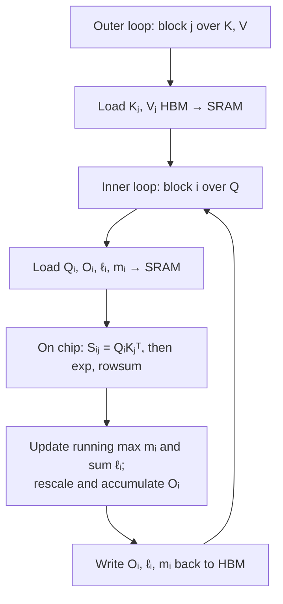

# The trick: never write the big matrix down

Standard attention, stripped to its essence (*Algorithm 0*):

> 1. Load Q, K; compute **S = QKᵀ**; write S to HBM.
> 2. Read S; compute **P = softmax(S)**; write P to HBM.
> 3. Load P, V; compute **O = PV**; write O to HBM.

See the problem? S and P are both N×N. For GPT-2, N=1024 — that's a million-entry
matrix written to slow HBM and read back, *per head, per layer*. That round-trip is
the bottleneck.

FlashAttention's goal, stated plainly:

> "Our main goal is to **avoid reading and writing the attention matrix to and from
> HBM.**" — *Section 1*

To pull that off it needs to (i) compute softmax without ever holding a whole row at
once, and (ii) not store the N×N matrix for the backward pass. Two classic techniques
do exactly that: **tiling** and **recomputation**.

## Problem 1: softmax couples the whole row

Softmax normalizes across an entire row — you need the max and the sum over *all* N
columns before you can finish any single entry. That seems to forbid processing K in
small blocks. The escape is **online (running) softmax**: keep two running statistics
per row and patch them up as each new block arrives.

> "For numerical stability, the softmax of vector x is computed as m(x) := maxᵢ xᵢ,
> f(x) := [eˣ¹⁻ᵐ⁽ˣ⁾ … eˣᴮ⁻ᵐ⁽ˣ⁾], ℓ(x) := Σ f(x)ᵢ." — *Section 3.1*

The key algebra: if you've processed block 1 and now see block 2, you can merge them
without re-reading block 1's raw scores —

> "if we keep track of some extra statistics (m(x), ℓ(x)), we can **compute softmax
> one block at a time.**" — *Section 3.1*

When a new block's max beats the old max, you rescale the running output by
`e^(m_old − m_new)` and carry on. The result is *exact* — same answer as computing
softmax over the full row — just assembled incrementally.

## Tiling: the two-loop structure

Split Q, K, V into blocks sized to *fit in SRAM*, then loop:

Block sizes are chosen so Kⱼ, Vⱼ, Qᵢ all fit on chip — the paper sets
`Bc = ⌈M/4d⌉`, `Br = min(⌈M/4d⌉, d)` for SRAM size M. Everything between loading and
writing happens **in SRAM**: the matmul, the exp, the rescale, the second matmul. The
N×N matrix is born and consumed on chip, block by block — **it never touches HBM.**

> Tiling lets the algorithm run "in **one CUDA kernel**, loading input from HBM,
> performing all the computation steps... then write the result back to HBM. This
> avoids repeatedly reading and writing of inputs and outputs." — *Section 3.1*

## Problem 2: the backward pass wants S and P

The backward pass normally needs the stored N×N matrices to compute gradients. Rather
than store them (defeating the whole point), FlashAttention **recomputes** them:

> "By storing the output O and the softmax normalization statistics (m, ℓ), we can
> **recompute the attention matrix S and P easily in the backward pass** from blocks
> of Q, K, V in SRAM. This can be seen as a form of selective gradient
> checkpointing." — *Section 3.1*

> **Isn't recomputing wasteful?** It adds FLOPs — yes. But those FLOPs run on data
> already in fast SRAM, while the alternative (reading the stored matrix back from
> HBM) pays the slow-memory tax. "Even with more FLOPs, our recomputation speeds up
> the backward pass due to reduced HBM accesses." More math, less waiting — net win.

That's the whole idea: **trade a bit of recomputation for a lot less memory traffic.**
The result is exact attention, in one fused kernel, with memory that grows *linearly*
in sequence length instead of quadratically.
