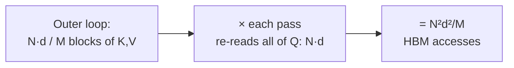

# Counting the traffic, not the math

The paper backs up the "it's about memory" story with a clean complexity result. This
is the lesson where the intuition becomes a formula you can actually compute.

> **Theorem 2.** Standard attention requires **Θ(Nd + N²)** HBM accesses, while
> FlashAttention requires **Θ(N²d²M⁻¹)** HBM accesses. — *Section 3.2*

Where N = sequence length, d = head dimension, M = SRAM size. The ratio of the two
dominant terms is what matters:

> standard / flash  ≈  N²  /  (N²d²M⁻¹)  =  **M / d²**

> "For typical values of d (64-128) and M (around 100KB), **d² is many times smaller
> than M**, and thus FlashAttention requires many times fewer HBM accesses." —
> *Section 3.2*

Plug in real numbers: d=64 → d²=4096, M≈100,000 → ratio ≈ 24×. The paper measures up
to **9× fewer** HBM accesses in practice (Fig. 2), and that traffic reduction is the
whole speedup.

## Where the formula comes from

The proof is a counting argument worth internalizing:

> "Given SRAM of size M, we load blocks of K, V of size Θ(M) each. For each block of
> K and V, we iterate over **all** blocks of Q to compute the intermediate values,
> resulting in **Θ(Nd·M⁻¹) passes over Q**. Each pass loads Θ(Nd) elements, which
> amounts to **Θ(N²d²M⁻¹)** HBM accesses." — *Section 3.2*

So a **bigger M (SRAM)** means fewer passes over Q, means less traffic. The paper
confirms this empirically: larger block sizes → fewer HBM accesses → faster runtime,
up to the point where SRAM fills or compute takes over (Fig. 2 middle).

## FLOPs went UP — and it was still faster

The clinching data point. For GPT-2 medium (*Figure 2, left*):

| Metric | Standard | FlashAttention |
| --- | --- | --- |
| GFLOPs | 66.6 | **75.2** (more!) |
| HBM R/W (GB) | 40.3 | **4.4** (9× less) |
| Runtime (ms) | 41.7 | **7.3** (5.7× faster) |

Read that table top to bottom: FlashAttention does *more* arithmetic and finishes in
a fraction of the time. If FLOPs set the clock, this would be impossible. They don't —
**HBM traffic does.**

## Can anyone do better? A lower bound

> **Proposition 3.** There does not exist an algorithm computing exact attention with
> o(N²d²M⁻¹) HBM accesses **for all M** in [d, Nd]. — *Section 3.2*

In other words, FlashAttention is **asymptotically optimal** for exact attention in
the number of HBM accesses across the relevant SRAM range. You can't beat it by
cleverness alone — only by changing the problem (e.g., approximating, or adding more
SRAM).
