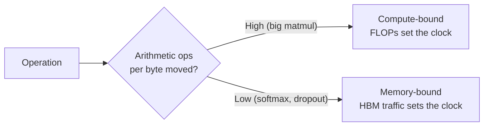

# Why the GPU spends its day waiting

Before you can fix attention, you have to know what it's actually waiting on. The
answer lives in the GPU's memory hierarchy — a few sizes of memory, each a trade
between *fast* and *big*.

> The A100 GPU "has 40-80GB of high bandwidth memory (HBM) with bandwidth
> 1.5-2.0TB/s and 192KB of on-chip SRAM per each of 108 streaming multiprocessors
> with bandwidth estimated around 19TB/s." — *Section 2.1*

Read those numbers again. SRAM is **~13× faster** than HBM, but **~200,000× smaller**.

| Memory | Bandwidth | Size | Role |
| --- | --- | --- | --- |
| SRAM (on-chip) | ~19 TB/s | ~20 MB total | scratchpad — tiny, blazing |
| HBM (GPU "RAM") | ~1.5 TB/s | 40 GB | where your tensors live |
| DRAM (CPU) | ~12.8 GB/s | >1 TB | off the GPU entirely |

Every GPU kernel does the same dance: **load inputs from HBM → compute → write
outputs back to HBM.** If the loads and stores dominate, the expensive compute units
sit idle, drumming their fingers.

## Compute-bound vs memory-bound

The single most useful classification in this whole module:

> "**Compute-bound:** the time is determined by how many arithmetic operations there
> are... Typical examples are matrix multiply with large inner dimension.
> **Memory-bound:** the time is determined by the number of memory accesses...
> Examples include elementwise (activation, dropout) and reduction (sum, **softmax**,
> batch norm, layer norm)." — *Section 2.1*

The dividing line is **arithmetic intensity** — arithmetic operations per byte of
memory accessed. Low intensity → you're starved for data → memory-bound.

Here's the trap attention falls into: it's a *mix*. The `QKᵀ` and `PV` matmuls are
compute-heavy, but the **softmax, masking, and dropout** in between are all
memory-bound elementwise/reduction ops on a giant N×N matrix. And softmax is exactly
where the standard implementation parks that matrix in slow HBM.

## Kernel fusion: the standard fix, and why it's not enough

> "The most common approach to accelerate memory-bound operations is **kernel
> fusion**: if there are multiple operations applied to the same input, the input can
> be loaded once from HBM, instead of multiple times." — *Section 2.1*

Fusion is the right instinct: load once, do all the work, write once. But there's a
catch that matters specifically for **training**:

> "In the context of model training, the intermediate values still need to be written
> to HBM to save for the backward pass, reducing the effectiveness of naive kernel
> fusion." — *Section 2.1*

So you can't *just* fuse and never write the N×N matrix — the backward pass needs it.
FlashAttention's two tricks (next lesson) are precisely how it fuses the whole
attention op into one kernel **and** avoids storing that matrix anyway.
