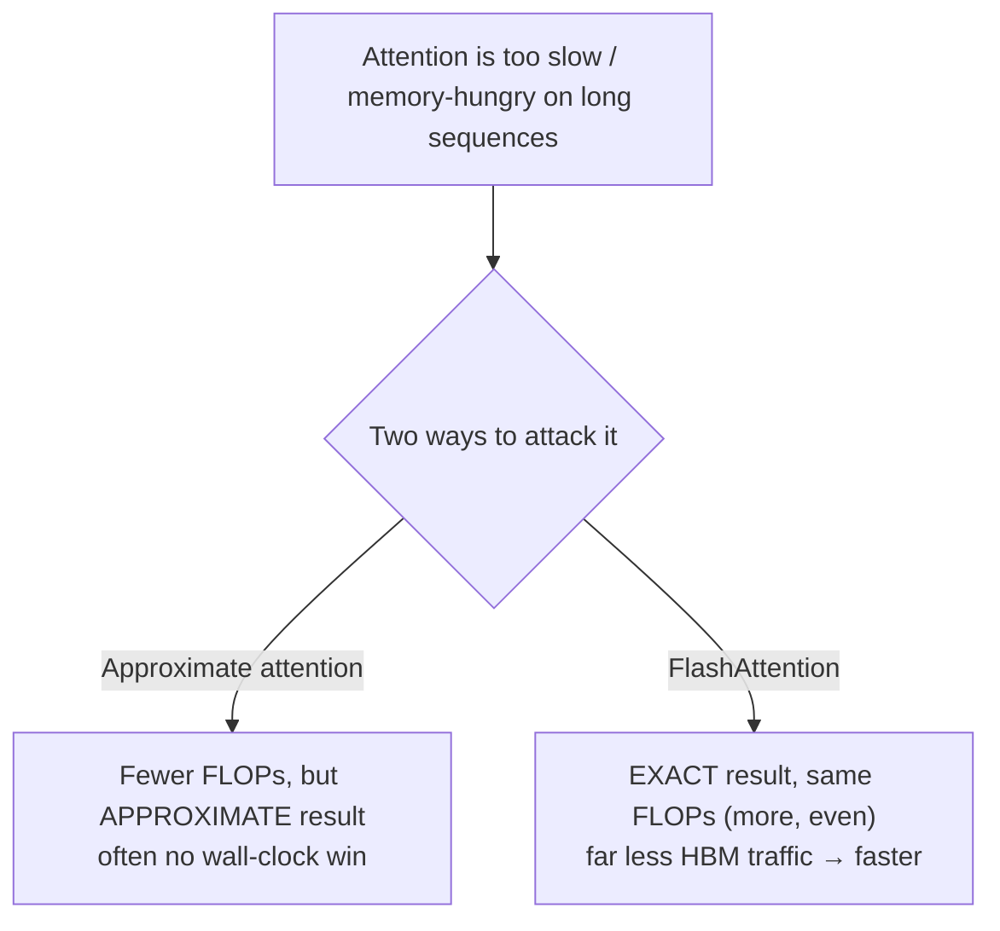

# The speedup that wasn't

Here's a puzzle that bugged the FlashAttention authors. For years, researchers
published "efficient" attention methods — Reformer, Linformer, Performer, sparse
transformers — that cut attention's compute from quadratic to linear in sequence
length. On paper, a clear win. In practice?

> "Although these methods reduce the compute requirements to linear or near-linear
> in sequence length, **many of them do not display wall-clock speedup** against
> standard attention and have not gained wide adoption." — *Section 1*

Think about how strange that is. You did **fewer** floating-point operations and
the clock got **no faster**. Where did the savings go?

> **Wait — fewer FLOPs should mean less time, right?** Only if FLOPs are what you're
> waiting on. On a modern GPU, compute has outpaced memory for years. Most attention
> operations are waiting on *memory*, not arithmetic. Cutting FLOPs you weren't
> bottlenecked on buys you nothing.

## The missing principle: IO-awareness

The paper's central claim is that prior work optimized the wrong resource:

> "We argue that a missing principle is making attention algorithms **IO-aware** —
> accounting for reads and writes between levels of GPU memory." — *Abstract*

An IO-aware algorithm counts **memory traffic** between the GPU's slow-but-big
memory (HBM) and its fast-but-tiny on-chip memory (SRAM) — not just FLOPs. The big
realization: the standard attention implementation writes a giant N×N matrix to
slow HBM and reads it back, twice. That traffic, not the matrix multiplies, is what
sets the clock.

## What FlashAttention is (and isn't)

This is the surprising part. FlashAttention does **not** approximate. It computes
*exactly* `softmax(QKᵀ)V` — the same numbers, bit-for-bit close — and even does
*more* FLOPs (it recomputes some values). Yet it runs up to **7.6× faster** on
GPT-2 attention, because it slashes HBM accesses.

> "Even with the increased FLOPs due to recomputation, our algorithm both **runs
> faster** and **uses less memory** — linear in sequence length — than standard
> attention, thanks to the massively reduced amount of HBM access." — *Section 1*

The headline results it unlocks:

| Result | Number |
| --- | --- |
| BERT-large end-to-end speedup vs MLPerf 1.1 record | 15% |
| GPT-2 speedup vs HuggingFace | 3× |
| Long-Range Arena speedup | 2.4× |
| Attention memory footprint | **linear** in N (was quadratic) |
| First Transformer to beat chance on Path-X (seq 16K) | 61.4% |

Keep one idea in your pocket for the rest of this module: **the bottleneck is memory
traffic, not math.** Everything FlashAttention does is in service of moving less
data between HBM and SRAM.
