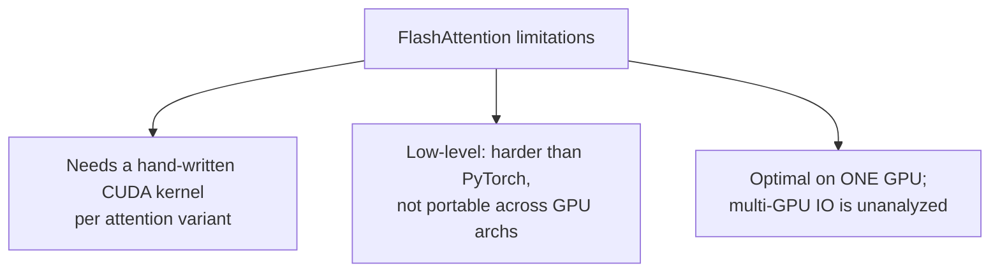

# What it buys you — and what it costs

A faster attention kernel is nice. But the reason FlashAttention reshaped the field is
that **cheaper memory unlocks longer context**, and longer context unlocks new
capabilities — not just faster versions of old ones.

## Faster, at the same quality

Because the math is *exact*, models train to the **same perplexity** — you just get
there sooner (*Tables 1–3*):

| Setting | Baseline | FlashAttention |
| --- | --- | --- |
| BERT-large training | 20.0 min (MLPerf record) | 17.4 min (**15% faster**) |
| GPT-2 small | 9.5 days (HuggingFace) | 2.7 days (**3.5×**) |
| Long-Range Arena | 1.0× | **2.4×** |

No quality trade-off, because there's no approximation. That's the difference between
FlashAttention and the prior "efficient attention" methods.

## Longer context → better models → new capabilities

Linear memory means you can afford sequences that used to OOM:

> "FlashAttention trains GPT-2 with context length 4K **faster than Megatron trains
> GPT-2 with context length 1K**, while achieving 0.7 better perplexity." — *Section 4.2*

And the headline: the **first** Transformer to beat chance on tasks that need very
long context (*Table 6*):

| Task (seq length) | Prior Transformers | FlashAttention |
| --- | --- | --- |
| Path-X (16K) | random | **61.4%** |
| Path-256 (64K) | random (OOM) | **63.1%** (block-sparse) |

> FlashAttention is "up to **20× more memory efficient** than exact attention
> baselines" — *Section 4.3* — which is exactly why those 16K–64K sequences fit at all.

## Block-sparse: stacking approximation on top

FlashAttention is exact, but you can *also* skip blocks you don't need. Given a
block-sparsity mask, "the algorithm is identical to Algorithm 1, except we **skip zero
blocks**" (*Section 3.3*). The IO complexity gains a factor of the sparsity s:

> Block-sparse FlashAttention requires Θ(Nd + N²d²M⁻¹**s**) HBM accesses, where s is
> the fraction of nonzero blocks. — *Proposition 4*

That's 2–4× on top of FlashAttention — but now you're approximating again, so it's a
quality/speed dial, not a free lunch.

## The costs (Section 5)

FlashAttention isn't magic. The paper is candid about its limits:

> "Our current approach... requires writing a **new CUDA kernel for each new attention
> implementation**... in a considerably lower-level language than PyTorch, and
> requires significant engineering effort. Implementations may also not be
> transferrable across GPU architectures." — *Section 5*

So the trade you're really making: **enormous runtime/memory wins, paid for in
engineering effort and portability.** For a primitive used in every Transformer on
Earth, that trade was obviously worth it — but it's the reason the authors call for
compiling high-level code to IO-aware kernels as future work.
