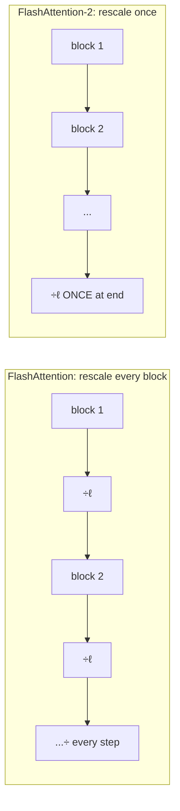
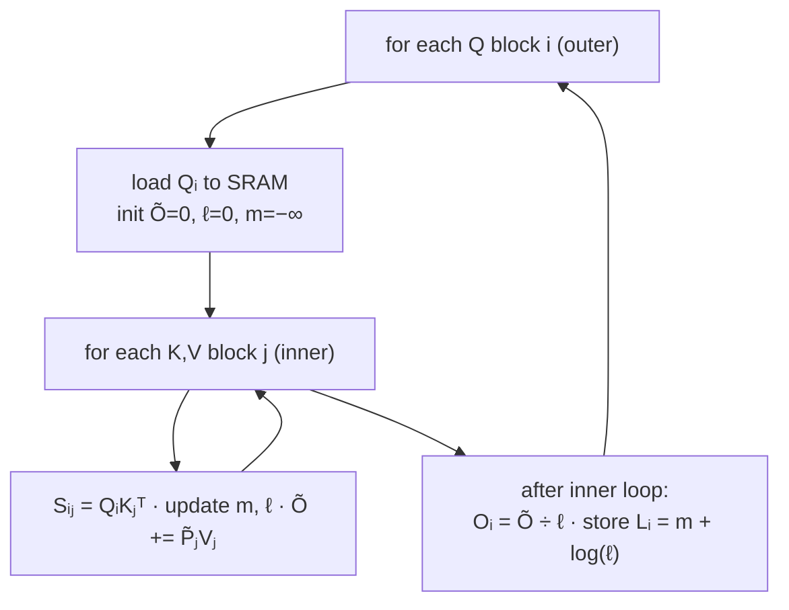

# Tweak 1: stop paying the non-matmul tax

Recall from the motivation: a non-matmul FLOP costs ~16× a matmul FLOP. FlashAttention's online softmax did an honest but expensive thing — it rescaled the running output by `diag(ℓ⁽²⁾)⁻¹` on *every* block. That division is non-matmul work, repeated every inner step. FlashAttention-2 makes two surgical edits that change the *cost*, not the *answer*.

## Edit 1: defer the rescaling to the very end

Instead of normalizing the output each block, keep an **un-normalized** running output Õ and only divide once, after the loop finishes.

> "We can instead maintain an 'un-scaled' version of O⁽²⁾ and keep around the statistics ℓ⁽²⁾ ... Only at the very end of the loop do we scale the final Õ⁽last⁾ by diag(ℓ⁽last⁾)⁻¹ to get the right output." — *Section 3.1.1*

Same final O. Far fewer divisions. That's the entire trick — move a repeated non-matmul op outside the loop.

## Edit 2: store one number for the backward pass, not two

The forward pass needs to hand the backward pass enough to reconstruct softmax. FlashAttention saved both the row-max *m* and the row-sum-of-exponentials *ℓ*. FlashAttention-2 saves a single combined statistic:

> "We do not have to save both the max m⁽ʲ⁾ and the sum of exponentials ℓ⁽ʲ⁾ for the backward pass. We only need to store the logsumexp L⁽ʲ⁾ = m⁽ʲ⁾ + log(ℓ⁽ʲ⁾)." — *Section 3.1.1*

Half the bookkeeping memory, and the backward pass recomputes P from L directly.

## The forward loop, in one picture

Algorithm 1 is two nested loops. The crucial detail (we'll see why it matters next lesson): the **outer loop is over rows of Q**, the inner loop streams the K/V blocks.

The output is provably exact — `O = softmax(QKᵀ)V` — using **O(N²d) FLOPs** and only **O(N)** extra memory (just the logsumexp L).

## Bonus: causal masking skips half the work

For autoregressive models, position *i* can't attend to future positions *j > i*. Because FlashAttention-2 already works in blocks, it just **skips entire blocks** that are fully in the future:

> "for any blocks where all the column indices are more than the row indices (approximately half of the blocks for large sequence length), we can skip the computation of that block. This leads to around 1.7-1.8× speedup." — *Section 3.1.1*

And it only applies the actual element-wise mask to the **one diagonal block** per row that straddles the boundary — everything below it needs no mask at all.
