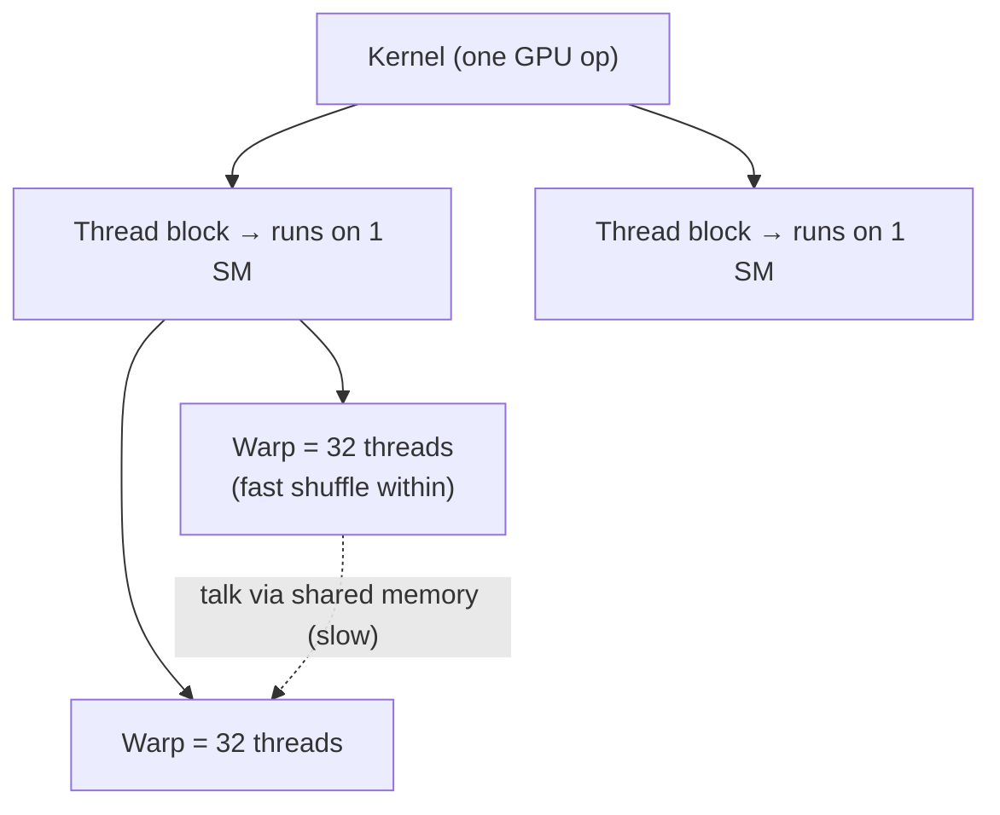
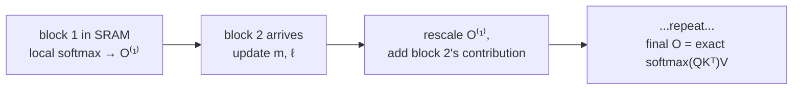

# The memory hierarchy is the whole game

Before you can understand FlashAttention-2's tricks, you need the two facts everything else hangs on.

## Fact 1: GPU memory is a steep, narrow pyramid

The A100 has two levels of memory you control:

| Level | Size | Bandwidth |
|---|---|---|
| **HBM** (high-bandwidth memory, "the big one") | 40–80 GB | 1.5–2.0 TB/s |
| **SRAM** (on-chip shared memory) | 192 KB *per SM* × 108 SMs | ~19 TB/s |

SRAM is ~10× faster but ~400,000× smaller. The entire job of a fast attention kernel is: **load a tile into SRAM, do all your work on it there, and write back to HBM as little as possible.** Every avoided HBM round-trip is free speed.

## Fact 2: threads are organized in a strict hierarchy

> "Threads are organized into thread blocks, which are scheduled to run on streaming multiprocessors (SMs). Within each thread block, threads are grouped into warps (a group of 32 threads)." — *Section 2.1*

Remember the communication cost ladder: threads **within a warp** talk for free (shuffle instructions); warps **within a block** must go through shared memory (slow); blocks **don't talk at all**. FlashAttention-2's three tweaks each move work to a *cheaper* rung of this ladder.

## Standard attention: the quadratic memory bomb

Given Q, K, V ∈ ℝ^(N×d), attention is three steps:

> S = QK⊤, P = softmax(S), O = PV — *Section 2.2*

The naive implementation **materializes S and P (both N×N) to HBM**: compute S → write to HBM → read back for softmax → write P → read back to multiply by V. With N typically 1k–8k, those N×N matrices cost **O(N²) memory** and a flood of slow HBM traffic. Worse, you must *save* P for the backward pass.

## FlashAttention: tiling + online softmax

FlashAttention's insight: never write S or P to HBM at all. **Tile** the inputs, bring blocks into SRAM, and compute attention block-by-block.

The obstacle: softmax needs the max and sum over an *entire row* — but you only have one block at a time. The fix is **online softmax**: keep a running max *m* and running normalizer *ℓ*, and **rescale the partial output** each time a new block arrives.

> "By computing attention with respect to each block and rescaling the output, we get the right answer at the end, while avoiding expensive memory reads/writes of the intermediate matrices S and P." — *Figure 1 caption*

The result: memory drops from O(N²) to **O(N)** (10–20× saving) and you get a 2–4× speedup — all **exact**, no approximation. FlashAttention-2 doesn't change this foundation; it sharpens *how the tiled work is partitioned*. That's the next lesson.
