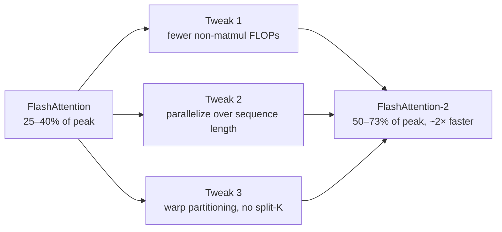

# The 75% that was being left on the table

FlashAttention already won. It made attention **exact** (no approximation) while cutting memory from quadratic to linear and running 2–4× faster than the optimized baselines. It got adopted everywhere. So why write a second paper?

Here's the uncomfortable number. Run an optimized matrix-multiply (GEMM) on an A100 and it hits **80–90%** of the GPU's theoretical peak FLOPs/s. Run FlashAttention's forward pass on the same chip and it reaches only **30–50%**. The backward pass is worse — **25–35%**.

> "FlashAttention is still not nearly as fast as optimized matrix-multiply (GEMM) operations, reaching only 25-40% of the theoretical maximum FLOPs/s." — *Abstract*

Attention is *made of* matrix multiplies. So if a pure GEMM can hit 85%, why does an algorithm built from GEMMs stall at a third of the chip's ability? Sit with that for a second before reading on.

## The diagnosis: it's not the math, it's the partitioning

The arithmetic was already minimal. The waste was in **how the work was spread across the GPU's hardware** — and that waste came in two flavors:

| Symptom | What it means | Root cause |
|---|---|---|
| **Low occupancy** | Most of the GPU's processors sit idle | Not enough independent work scheduled to fill the chip |
| **Shared-memory thrashing** | Cores burn time reading/writing scratch memory | Warps inside a block have to swap partial results through shared memory |

> "the inefficiency is due to suboptimal work partitioning between different thread blocks and warps on the GPU, causing either low-occupancy or unnecessary shared memory reads/writes." — *Abstract*

## The third culprit: non-matmul FLOPs are 16× more expensive

Modern GPUs have specialized units (Tensor Cores) that do matrix-multiply absurdly fast. On an A100: **312 TFLOPs/s** of FP16 matmul, but only **19.5 TFLOPs/s** of FP32 non-matmul (the softmax rescaling, the max/sum bookkeeping).

> **Wait — non-matmul is only a tiny fraction of the FLOPs. Why obsess over it?** Because each one is ~16× more expensive in *wall-clock time*. 312 / 19.5 ≈ 16. A FLOP spent rescaling costs as much as 16 FLOPs spent multiplying. Spend your time on matmul; treat every non-matmul op as a luxury.

That's the whole paper: **three changes to *where and how* the work runs**, no change to the answer. The result is ~2× over FlashAttention, 50–73% of peak — finally in GEMM's neighborhood — and up to **225 TFLOPs/s (72% model FLOPs utilization)** training GPT-style models end-to-end.

The payoff is concrete: 2× faster attention means you can train a **16k-context** model for what an 8k-context model used to cost.
