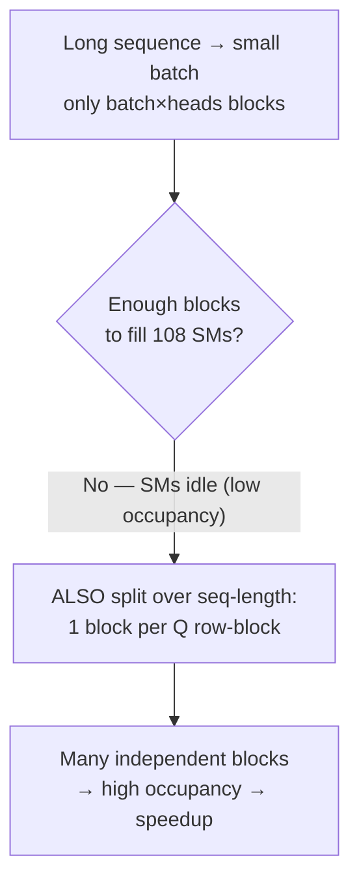
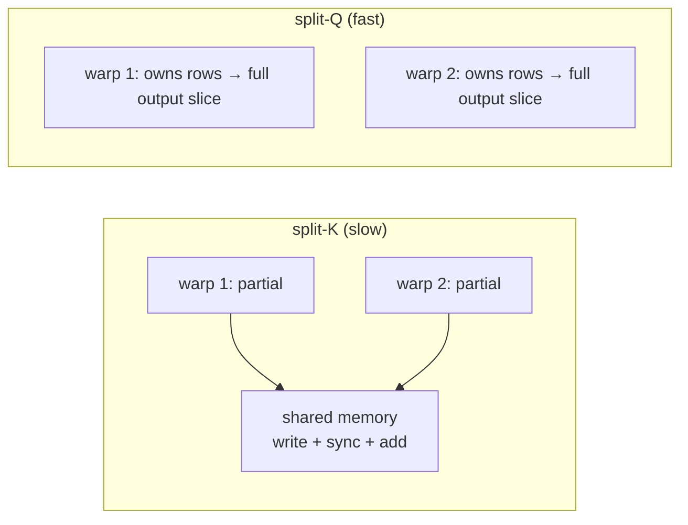

# Tweaks 2 & 3: fill the chip, then quiet the chatter

The algorithm tweaks shaved non-matmul FLOPs. But the bigger wins come from *scheduling* — making sure all 108 SMs are busy (tweak 2) and that warps inside each SM don't waste time talking to each other (tweak 3).

## Tweak 2: parallelize over the sequence length

The original FlashAttention launched **one thread block per (batch × head)**. That's plenty of blocks to fill 108 SMs — *when batch and head counts are large*.

> Think about the regime this paper targets: **long sequences**. A 100k-context model has long sequences, which forces **small batch sizes** (memory). batch × heads might be only 8 or 16 blocks — and 90+ SMs sit idle.

The fix: also split the work **along the sequence dimension**, launching more blocks.

> "In the case of long sequences (which usually means small batch sizes or small number of heads), to make better use of the multiprocessors on the GPU, we now additionally parallelize over the sequence length dimension." — *Section 3.2*

This is why the loop order from the last lesson matters. The outer loop is over **row blocks of Q**, and those rows are **independent** — so each can be its own thread block:

> "the outer loop (over sequence length) is embarrassingly parallel, and we schedule them on different thread blocks that do not need to communicate with each other." — *Section 3.2 (Forward pass)*

> **Wait — isn't more parallelism always better?** No: when batch×heads is *already* ≥ 80 blocks, the chip is full and this adds nothing. The seq-length split is specifically what rescues the long-context / small-batch regime. (Swapping the loop order and the seq-length parallelism were first done by Phil Tillet in the Triton implementation.)

## Tweak 3: split-Q instead of split-K (kill the warp chatter)

Zoom inside one thread block: its 4 (or 8) warps must cooperate on one block of attention. *How* you divide the work among them decides how much they have to synchronize through slow shared memory.

| Scheme | What's split across warps | Cost |
|---|---|---|
| **split-K** (FlashAttention) | K and V split; Q shared | Each warp computes a partial QKᵀ, then **writes to shared memory, syncs, and sums** — lots of round-trips |
| **split-Q** (FlashAttention-2) | Q split; K and V shared | Each warp owns whole rows → computes its slice of output **with no inter-warp communication** |

> "In FlashAttention-2, we instead split Q across 4 warps while keeping K and V accessible by all warps. After each warp performs matrix multiply to get a slice of QKᵀ, they just need to multiply with their shared slice of V to get their corresponding slice of the output. There is no need for communication between warps." — *Section 3.3*

Because each warp owns complete output rows, there's nothing to reduce across warps — the shared-memory traffic that throttled FlashAttention's forward pass simply disappears.

## Picking block sizes is a balancing act

Bigger blocks mean fewer shared-memory loads — but more registers and more SRAM per block. Push too far and you hit **register spilling** (slowdown) or run out of SRAM entirely (the kernel won't launch). In practice the choices are {64,128} × {64,128}, hand-tuned per head dimension. The paper flags auto-tuning as future work.
