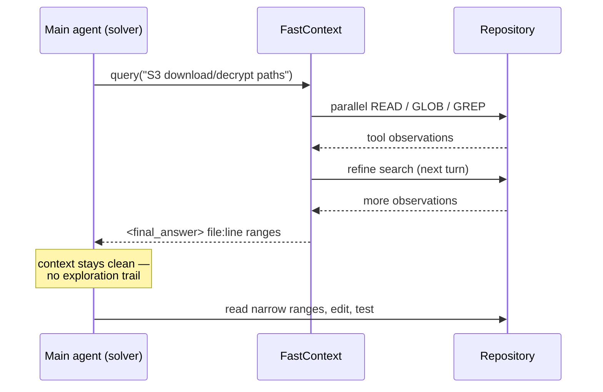
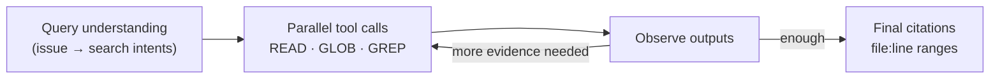

# The delegation contract: evidence in, not patches out

FastContext is not another solver. It is a **runtime delegation mechanism**:

> "the main agent delegates repository exploration to the explorer, which **returns
> evidence rather than a patch**. The main agent then consumes this narrowed
> context, avoiding the long sequence of exploratory reads and searches that would
> otherwise remain in its own conversation history." — *Section 3.1*

The whole design is built around one asymmetry: the explorer does the messy, broad
searching in *its own* conversation; the main agent only ever sees the clean result.

## Three tools, on purpose

The subagent exposes exactly three read-only, language-agnostic tools (*Section 3.1*):

| Tool | Job |
| --- | --- |
| `READ` | line-numbered file contents |
| `GLOB` | path discovery by pattern |
| `GREP` | regex search over repository text (ripgrep) |

No edit. No patch submission. It can only look. At each turn it either issues one or
more tool calls **or** stops with a final evidence list — and multiple calls in the
same turn run **in parallel**, so it can chase several hypotheses at once before
synthesizing.

## The output contract

The explorer returns a compact `<final_answer>` block of file paths and line ranges:

> ```
> <final_answer>
> /src/router.py:42-58 (Router definition)
> /tests/test_router.py:101-119
> </final_answer>
> ```
> — *Section 3.1*

That format is "directly consumable as focused context for the main agent." Crucially,
the explorer's intermediate reads and reasoning are written to a **separate** log —
"only the final evidence block is returned to the main-agent trajectory" (*Appendix B*).

## How a delegation plays out



Internally, each FastContext turn follows the same loop (*Figure 3, right*):



The main-agent prompt also says **when to skip** the helper: if the issue already
names the relevant file or symbol, don't bother delegating (*Appendix B*).
