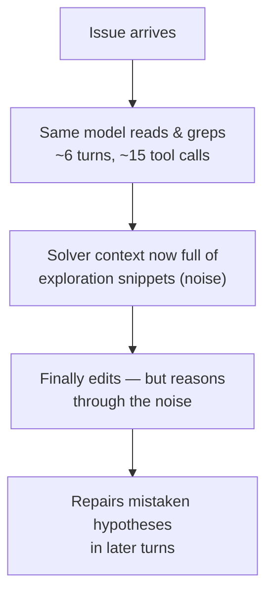

# The agent spends most of its budget *looking*, not fixing

You hand a coding agent a bug report and walk away. By the time it finally edits a
line of code, it has already read a dozen files, run a handful of `grep`s, and
filled its own context window with snippets — most of which have nothing to do with
the fix. Then it has to reason about the patch *through* all that noise.

That browsing-before-fixing phase is the bottleneck this paper attacks. From the
abstract:

> "repository exploration remains a major bottleneck: locating relevant code
> consumes substantial token budget and **pollutes the agent's context** with
> irrelevant snippets." — *Abstract*

## How big is the bottleneck, really?

The authors ran all 300 GPT-5.4 trajectories on SWE-bench Multilingual and bucketed
every tool call into read / search / edit / test / other (*Section 2, Figure 2*).
The numbers are stark:

| Where the main agent's budget goes | Share |
| --- | --- |
| Reading + searching, as a share of tool-use turns | **56.2%** (9.96 of 17.72 turns) |
| Reading + searching, as a share of total tokens | **46.5%** |
| Sequential exploration turns before the *first* edit (median) | **6** |
| Exploration tool calls before the first edit (median) | **15.5** |
| Turn at which editing starts (average) | **8.47** |

So before the agent does the thing you actually asked for, it burns roughly half its
tokens and most of its early turns just navigating.

## Why not just let it read more?

> **Wait — isn't more context always better?** No. Exploration that misses the key
> file *or* drags in irrelevant code both hurt: "the main agent must reason from
> noisy context and may spend later turns **repairing a mistaken hypothesis** rather
> than addressing the true cause." — *Section 1*

The root cause is structural: **the same model explores and solves**, so every
exploratory read and search stays in the solver's history forever.

The fix the paper proposes: pull exploration *out* of the solver entirely and give
it to a dedicated, trained subagent. That's **FastContext**.
