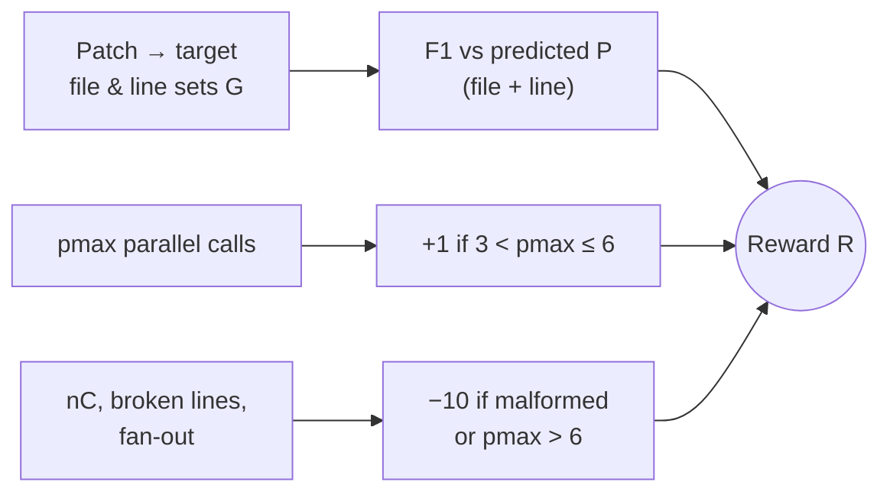

# Stage 2: optimize for *coverage*, not imitation (RL)

SFT teaches the explorer to *act* like the reference model. But acting like the
reference model isn't the actual goal — the goal is returning citations that cover the
code a fix really touches. The paper names the gap directly:

> "SFT imitation does not directly optimize whether the final citations **cover the
> code locations needed to solve the issue**. We therefore refine the explorer with
> task-grounded RL." — *Section 3.3*

The trick for making the reward objective: take 400 issue-resolution prompts that
ship with a **reference patch**, parse each patch into the file-and-line ranges it
actually edits, and treat those as ground-truth exploration labels. The explorer is
rolled out as the real subagent (READ/GLOB/GREP, up to 8 turns) and scored against
those labels.

## The reward: F1 + a nudge − a slap

The reward is **deterministic** and tied to the output contract (*Section 3.3, Eq. 2*):

> R = F1(P_f, G_f) + F1(P_l, G_l) + r_parallel − r_format
>
> where G_f, G_l are the target **file** and **line** sets from the patch, and
> P_f, P_l are the sets parsed from the model's citations.

Three pieces, each doing one job:

| Term | What it rewards / punishes |
| --- | --- |
| `F1(P_f,G_f) + F1(P_l,G_l)` | **task outcome** — file-level + line-level F1 vs the patch (empty set scores 0) |
| `r_parallel` | **bounded parallelism** — a small +1 bonus for useful fan-out |
| `r_format` | **penalty** — rejects empty, over-long, malformed, or over-fanned-out answers |

The penalty and bonus are sharp thresholds (*Appendix A.4, Eqs. 3–4*), where `nC` is
the citation count, `bC` broken citation lines, and `pmax` the max parallel calls in
any turn:

> r_format = 10 · 1[ nC < 1  ∨  nC > 20  ∨  bC > 0  ∨  pmax > 6 ]
>
> r_parallel = 1[ 3 < pmax ≤ 6 ]

> **Why a hard −10 instead of a gentle nudge?** A malformed or 50-citation answer
> isn't *slightly* worse — it breaks the contract the main agent depends on. The
> penalty (≈5× a perfect F1 of 2.0) makes "return a clean, bounded evidence set" a
> precondition, not a preference.

Optimization is **GRPO** initialized from the 4B-SFT checkpoint, sampling 16
trajectories per prompt. The payoff: RL mainly lifts **recall** at similar precision —
exactly what "cover the patch-relevant locations while staying well-formed" asks for
(*Section 4.4*).
