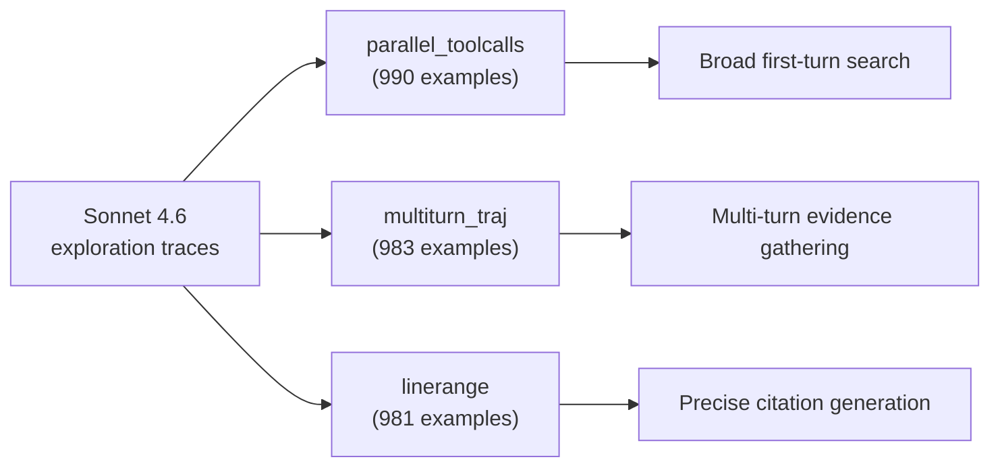

# Stage 1: teach the behaviors by imitation (SFT)

A blank 4B model doesn't know how to explore a repo. So the first training stage
**bootstraps** it from a strong reference model. The authors collected exploration
traces from Sonnet 4.6 and built a filtered corpus of **2,954 supervised examples**
(*Section 3.2, Appendix A.1*).

The clever part is *what* they supervise. Instead of training only on the final
answer, they decompose supervision to match the three runtime behaviors the subagent
must actually perform:

> "Instead of training only on final locations, we decompose supervision according to
> the runtime behaviors the subagent must perform." — *Section 3.2*

## Three data sources, one per behavior

| Source | Behavior taught | What the example contains |
| --- | --- | --- |
| `parallel_toolcalls` | **broad first-turn search** | query + top-level dir listing → issue nonredundant parallel calls covering paths, symbols, entry points |
| `multiturn_traj` | **multi-turn evidence gathering** | full trajectories: system/user messages, assistant tool-call args, raw tool observations |
| `linerange` | **precise citation generation** | retrieved file contents → emit only a narrow `<final_answer>` block |

These merge into one multi-turn chat dataset using the **same tool schemas as
inference** — the model trains on exactly the interface it will run on.

## Loss only on what the model controls

The objective is an **assistant-token-only** cross-entropy: a mask keeps the loss on
the assistant's own text *and* its structured tool-call arguments, and zeros out the
system/user/tool-observation tokens.

> Loss = − (1/|D|) · Σ over (x, y) · Σ over tokens t · mₜ · log pθ(yₜ | x, y<t)
>
> where mₜ masks out non-assistant tokens. — *Eq. 1, Section 3.2*

> **Why mask the tool observations?** Those tokens are produced by the environment,
> not the policy — training the model to "predict" them would waste capacity learning
> to reproduce file contents it didn't write. You only want it to learn the
> *decisions*: which tools to call and which lines to cite.

Backbones are off-the-shelf Qwen: **Qwen3-4B-Instruct** for the deployment-sized
explorer and **Qwen3-Coder-30B** as a scaling reference (*Appendix A.2*). SFT gets the
model behaving like an explorer — but imitation alone has a blind spot, which is what
the next stage fixes.
