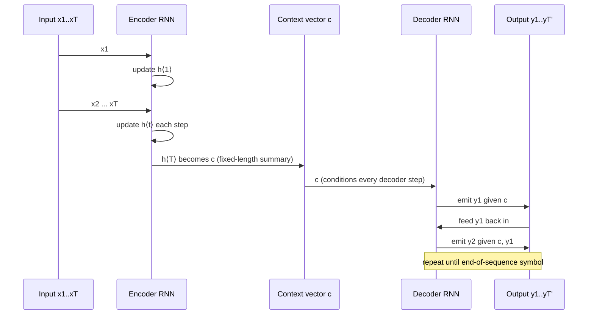

## First, the plain RNN you already half-know

Before the encoder–decoder split, recall what a single RNN does (Section 2.1):
it walks through a sequence one symbol at a time, and at each step it updates a
hidden state based on what it just saw *and* what it remembered from before:

```
h⟨t⟩ = f(h⟨t−1⟩, x_t)
```

That's it — a running summary that gets revised at every timestep. Train it to
predict the next symbol from the running summary, and you get a language model:
`p(x_t | x_{t−1}, ..., x_1)`. Chain those per-step predictions together and you
get the probability of an entire sequence (Eq. 3). Nothing about this requires
the sequence to have a known length in advance — the RNN just keeps going until
it hits an end-of-sequence symbol.

### Two RNNs, one bottleneck vector

Here's the question this paper actually answers: what if the thing you want to
predict isn't *the next symbol in the same sequence*, but a **different**
sequence entirely — and possibly a different length? You can't condition the
output sequence on "the input so far" the way a language model conditions on
its own past, because by the time you start generating output, the entire input
is already finished and gone.

The fix: run an RNN over the *input* sequence until it's fully consumed, and
freeze whatever hidden state it ends up in. That final hidden state — call it
`c` — is a fixed-length **summary of the entire input**, no matter whether the
input was 2 words or 20. Then hand `c` to a *second* RNN, whose job is to
generate the output sequence, conditioned on `c` at every single step.



Formally, the decoder's hidden state and output are conditioned on three
things — the previous decoder state, the previous output symbol, *and* the
fixed context vector — at every step:

```
h⟨t⟩ = f(h⟨t−1⟩, y_{t−1}, c)
P(y_t | y_{t−1}, ..., y_1, c) = g(h⟨t⟩, y_{t−1}, c)
```

Compare that to the plain RNN equation above: `c` has been threaded into both
the state update *and* the output distribution. Every word the decoder
generates gets to "see" the whole input again, via `c` — it's not just trusting
its own fading memory of having generated earlier words.

> **Wait — if `c` only depends on the input, why pass it to every decoder
> step instead of just the first one?** Because RNN hidden states decay —
> if you only injected `c` at step 1, by step 8 it might be diluted by seven
> rounds of update. Re-supplying `c` at every step keeps the input summary
> available no matter how long the output sequence runs.

### Training: one objective, two networks, jointly

Both RNNs are trained together (not encoder-then-decoder in two phases) to
maximize the conditional log-likelihood of the correct output given the input,
averaged over the training pairs:

```
max_θ  (1/N) Σ_n  log p_θ(y_n | x_n)
```

Because every step of this computation is differentiable, ordinary
gradient-based training applies — no special-cased SMT machinery, no separate
alignment model. Once trained, the same network does double duty: generate a
target sequence from scratch given an input, **or** just compute the
probability `p(y|x)` for an existing `(x, y)` pair — which is exactly the
"scoring" use case from the previous lesson.
