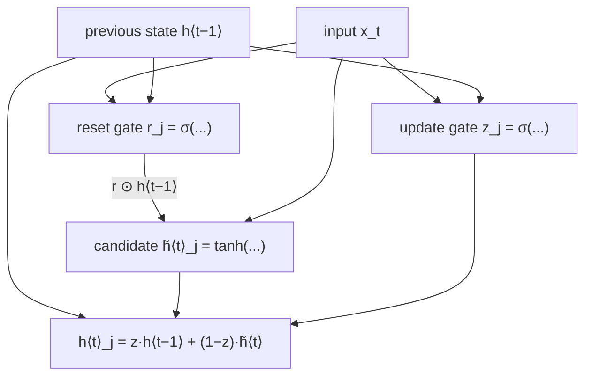

## What should `f` actually be?

Go back to the very first equation: `h⟨t⟩ = f(h⟨t−1⟩, x_t)`. So far `f` has
been a placeholder. The simplest choice is a plain sigmoid or tanh squashing
function — but the paper's own preliminary experiments ran into a wall:

> "We were not able to get meaningful result with an oft-used tanh unit
> without any gating." — Section 2.3

A plain tanh unit has no way to *protect* information across many timesteps —
every update overwrites the hidden state wholesale. That's the same vanishing-
gradient problem LSTM (Hochreiter & Schmidhuber, 1997) was built to solve, with
a memory cell and four gates. This paper proposes something with the same
spirit but only **two** gates — simpler to compute, and (the paper claims) just
as effective for this task.

### Two questions, two gates

Think of each hidden unit `j` as needing to answer two independent questions at
every timestep:

1. **"Should I even look at my old memory right now, or start fresh from the
   current input?"** → the **reset gate** `r_j`
2. **"How much of my old memory should I keep vs. replace with what I'm seeing
   now?"** → the **update gate** `z_j`

Both gates are computed the same way — a sigmoid over a linear combination of
the current input and the previous hidden state, so they always land in
`[0, 1]`:

```
r_j = σ([W_r x]_j + [U_r h⟨t−1⟩]_j)      (reset gate, Eq. 5)
z_j = σ([W_z x]_j + [U_z h⟨t−1⟩]_j)      (update gate, Eq. 6)
```

The reset gate then decides how much of the *old* hidden state is allowed to
influence the **candidate** new state `h̃`:

```
h̃⟨t⟩_j = φ([W x]_j + [U (r ⊙ h⟨t−1⟩)]_j)      (Eq. 8, φ = tanh)
```

Notice `r ⊙ h⟨t−1⟩` — element-wise multiply. When `r_j → 0`, that term vanishes
entirely, and the candidate state is computed *as if there were no history at
all* — a fresh start driven only by the current input. When `r_j → 1`, the full
previous state feeds into the candidate, same as an ungated RNN.

Finally the update gate blends the **old** state and the **candidate** state to
produce the actual new hidden state:

```
h⟨t⟩_j = z_j h⟨t−1⟩_j + (1 − z_j) h̃⟨t⟩_j      (Eq. 7)
```



> **Wait — isn't this just a fancier weighted average?** At the *top* level,
> yes — `h⟨t⟩` is a convex combination of old state and new candidate, gated
> by `z`. The trick is that `z` and `r` are themselves *learned, input-dependent*
> functions, not fixed constants — the network decides per-timestep, per-unit,
> how much to remember and how much of its memory is even relevant input to the
> candidate computation.

### Why two *different* gates, not one

You might wonder why reset and update aren't the same gate wearing two hats.
The paper's answer: separating them lets *different hidden units specialize
to different timescales*.

> "Those units that learn to capture short-term dependencies will tend to have
> reset gates that are frequently active, but those that capture longer-term
> dependencies will have update gates that are mostly active." — Section 2.3

A unit tracking "is the current clause still in the subjunctive" might reset
constantly (short memory needed). A unit tracking "is this sentence about
geography" might keep its update gate near 1 for dozens of steps (long memory
needed) — same gating mechanism, different learned behavior per unit. The
paper also notes this is related to a *leaky-integration unit* (Bengio et al.,
2013): the update gate's blending is an adaptive, learned version of the fixed
leak rate those units use.

This hidden unit is what later literature calls the **Gated Recurrent Unit
(GRU)** — though this paper, being the one that introduces it, just calls it
"the proposed hidden unit." Compared to LSTM's four gates and separate memory
cell, GRU folds memory directly into the hidden state and uses only two gates
— fewer parameters, simpler to implement, and (per the paper's footnote) able
to match LSTM-style behavior on this task.
