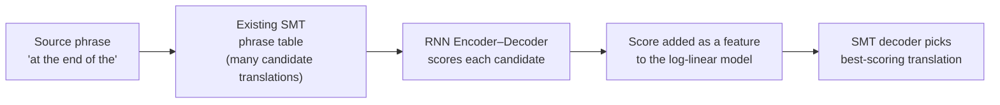

## A sentence has no fixed length. A neural network's input does.

Picture a translation system as a function: feed it an English sentence, get
back a French one. Easy to say — but a plain feedforward neural network needs a
fixed number of input slots and a fixed number of output slots, decided before
training even starts. Sentences don't cooperate. "Go." is two words. "After the
treaty was signed, both delegations returned home in silence." is eleven. How do
you build one network that swallows either?

By 2014, neural nets were already winning at vision (Krizhevsky et al., 2012) and
speech (Dahl et al., 2012), and were creeping into machine translation as
*rescorers* — bolt-on features added to an existing system, not the system
itself. Cho et al. set out to build something more central: a network whose job
*is* turning one variable-length sequence into another.

> "In this paper, we propose a novel neural network model called RNN
> Encoder–Decoder that consists of two recurrent neural networks (RNN). One RNN
> encodes a sequence of symbols into a fixed-length vector representation, and
> the other decodes the representation into another sequence of symbols."
> — Abstract

Read that twice — it's the whole idea in one sentence. **Encode** the variable
input into one fixed-size vector. **Decode** that fixed vector back out into a
variable-length output. The bottleneck in the middle (call it `c`, for context)
is what makes a single network handle sentences of any length: every input,
short or long, gets squeezed down to the same-shaped vector before generation
starts.

> **Wait — doesn't squeezing a whole sentence into one fixed vector throw
> information away?** Yes, and that's exactly the limitation later work (like
> attention mechanisms) would target. But in 2014, the question wasn't yet
> "how do we avoid the bottleneck" — it was "can a single trainable network
> even *do* variable-length sequence-to-sequence mapping at all." This paper is
> the proof that it can.

### Where this gets used: not as a translator, but as a critic

The paper doesn't propose replacing the translation system outright. Statistical
machine translation (SMT) at the time worked by proposing thousands of candidate
phrase translations and *scoring* each one — a log-linear model with hand-built
features decides which candidate wins. Cho et al.'s plan: train the RNN
Encoder–Decoder to assign a probability to *(source phrase, target phrase)*
pairs, then bolt that probability on as one more feature in the existing
scoring model.

So the encoder–decoder isn't (yet) generating translations end-to-end in
production — it's a learned scoring function plugged into a pipeline that
already exists. That framing matters for everything that follows: the
architecture is general (Section 2 describes it with no mention of
translation at all), and Section 3 is just *one* way to use it.

> "The performance of a statistical machine translation system is empirically
> found to improve by using the conditional probabilities of phrase pairs
> computed by the RNN Encoder–Decoder as an additional feature in the existing
> log-linear model." — Abstract
