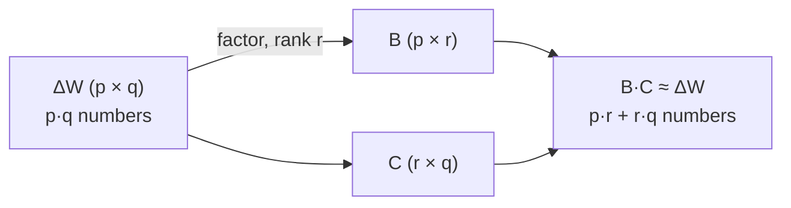

# From intrinsic dimension to low-rank updates

Intrinsic dimension said: *adaptation lives in a tiny subspace.* LoRA turns that observation into a practical fine-tuning method. This lesson is the bridge.

## Why full fine-tuning hurts

Fine-tuning every weight means **one full copy of the model per task**. At modern scale that's brutal:

> "Llama 3.1–8B has 32 layers … each layer has about 218 million parameters." — *Sahaj, Exploring LoRA Pt 1*

And training memory is roughly **4× the model size** (gradients + optimizer states + activations). Storing and serving a separate 8B checkpoint for every downstream task does not scale.

## The leap: a low-rank weight *update*

Random subspace training showed the *learned* solution sits on a low intrinsic dimension. LoRA's hypothesis sharpens this to the **update itself**:

> The adapter modules "can be decomposed into low-rank matrices with a very low intrinsic rank." — *Sahaj, Pt 1*

So instead of learning a full ΔW, learn a **rank-r** approximation of it.

## Low-rank approximation, quickly

A matrix `A` of shape `p × q` with rank `r < min(p, q)` is **rank-deficient** — it carries redundancy, so a full grid of numbers is overkill. You can approximate it by a product of two thin matrices:

> **A₍p×q₎ ≈ B₍p×r₎ · C₍r×q₎**

LoRA freezes `W₀` and learns the update as `B·A`:

> **W = W₀ + B·A**,  with  **B** of shape `p × r` and **A** of shape `r × q`

The crucial twist: LoRA does **not** compute `B, A` by SVD up front. It **learns** them by gradient descent for the specific task — trading a little capacity for huge efficiency.

## The savings, in numbers

You go from `p·q` trainable numbers to `p·r + r·q`. With `r` small, that's a landslide:

| Weight | Full ΔW | LoRA (r) | Trainable |
|---|---|---|---|
| 2000 × 200 | 400,000 | 2000×3 + 3×200 | **6,600** |
| Llama 3.1–8B (r = 2) | billions | — | **≈ 5 million** |

> "An adapter of size 2000 × 200 is decomposed into 2000 × 3 and 3 × 200." — *Sahaj, Pt 1*

Same intrinsic-dimension idea, now structured and learnable. Next: watch it run on a real MLP, weight by weight.
