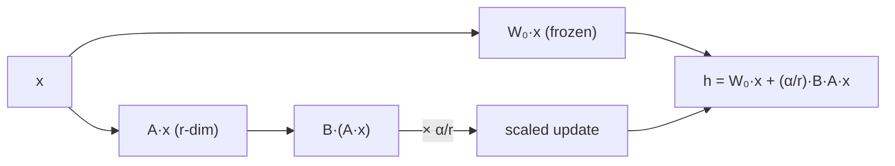

# LoRA on an MLP, by the numbers

Now the whole story lands on a concrete network. No transformers, no hand-waving — a plain MLP where every matrix size is countable.

## The base model

```
Linear(20 → 2000) → ReLU → Linear(2000 → 200) → ReLU → Linear(200 → 2) → LogSoftmax
```

| Layer | Weight shape | Params (w + b) |
|---|---|---|
| seq.0 | 20 × 2000 | 40,000 + 2,000 |
| seq.2 | 2000 × 200 | 400,000 + 200 |
| seq.4 | 200 × 2 | 400 + 2 |
| **Total** | | **442,602** |

We adapt only the two big linear layers, **seq.0** and **seq.2**, at rank **r = 3**.

## Initialization: start as a no-op

LoRA adds a `B·A` branch to each target layer, initialized so it does **nothing** on the first step:

- `A` ← random Gaussian
- `B` ← **zeros**

So `B·A = 0` at the start (`torch.all(lora_B @ lora_A == 0)` is `True`).

> "No inductive bias, because in the first few epochs only the base model is in play." — *Sahaj, Exploring LoRA Pt 2*

## Counting the new parameters

For a layer `in → out` at rank `r`: `A` is `r × in`, `B` is `out × r`.

| Layer | A (r × in) | B (out × r) | LoRA params |
|---|---|---|---|
| seq.0 (20 → 2000) | 3 × 20 = 60 | 2000 × 3 = 6,000 | **6,060** |
| seq.2 (2000 → 200) | 3 × 2000 = 6,000 | 200 × 3 = 600 | **6,600** |
| **Total** | | | **12,660** |

That's **12,660** trainable params instead of 442,602 — a **97.1% reduction**, while the frozen base weights are provably untouched after training.

## The forward pass



`α` is a scaling factor (default **1**) that tunes how loudly the update speaks. Note the update branch's output dimension equals the base layer's (2000), **whatever `r` is** — `r` only controls the thin waist in the middle.

## Merging: zero added latency

After training you fold the update back in:

> **W_merged = W₀ + (α/r) · B·A**

The merged model is **442,602** params again — original size, original inference speed, no extra layers. On disk the adapter is **51 KB** vs the **1,770 KB** base model: ship one base, swap tiny adapters per task.

## Where you are now

You built the intuition from the bottom: **count params → see the redundancy (ID) → measure it (random subspace) → make it practical and learnable (LoRA on an MLP).** You're now ready for the dense version — the **LoRA paper subject** (Hu et al., ICLR '22): GPT-3 at 175B, which matrices to adapt, why rank 1 can be enough, and the deployment trade-offs.
