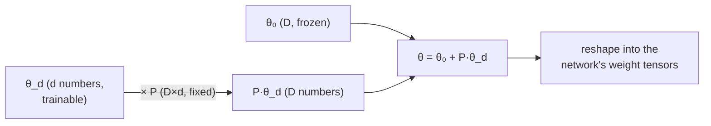

# Measuring ID: random subspace training

We claimed MNIST has a d₉₀ of ~750. How do you *measure* that without searching all 199,210 directions? Li et al.'s trick is the conceptual ancestor of LoRA, so it's worth getting exactly right.

## The idea: train inside a random slice

Instead of letting the optimizer touch all `D` weights, freeze them and let it move only inside a small, **randomly chosen d-dimensional subspace**:

> **θ₍D₎ = θ₀ + P · θ₍d₎**

| Symbol | Shape | Role |
|---|---|---|
| `θ₀` | `D` | original weights — **frozen**, no gradients |
| `θ_d` | `d` | the only trainable knobs — start at **0** |
| `P` | `D × d` | fixed **random projection**, maps the small update into full weight space |

> "Instead of tweaking all weights, we project into a compact subspace and optimize just a few directions that matter." — *Sahaj, Intrinsic Dimension Pt 2*

Gradients flow back through `P` into `θ_d` only; `θ₀` and `P` never change.

## Finding d₉₀: sweep d upward

1. Pick a small `d`. Generate a random `P`, freeze `θ₀`.
2. Train **only** `θ_d`. Measure accuracy.
3. Increase `d` and repeat until you clear the 90% bar.

The first `d` that clears it is **d₉₀**. For the MNIST FC net:

> "A network with 199,210 parameters achieved the 90% threshold (d₉₀) with an intrinsic dimension of only **750**." — *Li et al., 2018*

That's a **~266:1** compression of the *learning problem*. A stunning corollary: to reproduce the trained net you store only **(i)** the seed for `θ₀`, **(ii)** the seed for `P`, and **(iii)** the **750 floats** in `θ_d`.

## Why a *random* projection is allowed

A random `P` with unit-length columns approximately preserves geometry — distances, angles, inner products — so "steps of unit length in `θ_d` chart out unit-length motions of `θ_(D)`." A random slice is a fair probe of the landscape.

## The catch (and the door to LoRA)

`P` has shape `D × d` = 199,210 × 750 ≈ **150 million entries** — far larger than the network it adapts. This method is a *measuring instrument*, not a deployment recipe: materializing a dense random `P` per layer is wasteful.

The fix is the next lesson's insight: keep the "train in a small subspace" idea, but replace the dense random `P` with a **structured low-rank factorization you learn** — `B·A`. That is LoRA.
