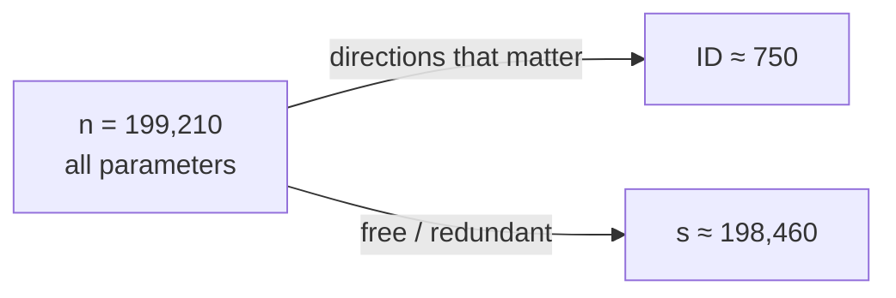

# Solution sets, the valley, and d₉₀

The optimizer's job is to drive a **cost** `C` down to zero. Plot `C` over all `n` parameters and you get a surface — the **objective landscape**. The key question of this whole subject: how many of those `n` directions does the optimizer *actually* need?

## The valley: not every direction matters

Picture a network with just 3 parameters. Its cost surface is a **V-shaped valley** with a flat trough running along one axis:

> "A straight line (ridge or trough) extending infinitely along the y-dimension where the function value is 0." — *Sahaj, Pt 1*

Move along `x` or `z` and cost changes — those directions *matter*. Move along `y` and cost stays at zero — that direction is **free**. So although `n = 3`, only **2** directions do real work.

## n = s + ID

That observation has a clean formula:

> **n = s + ID**

- **s** = the dimension of the **solution set** — the flat directions you can slide along while staying optimal.
- **ID** = the **intrinsic dimension** — the directions that genuinely constrain the solution.

In the valley: `n = 3`, `s = 1` (the free trough), so `ID = 2`.

For MNIST that means roughly **198,460 directions you can move in without changing the cost** — enormous redundancy. That redundancy is *why* big networks train so easily: there are countless paths to a good solution.

## Defining d₉₀

We rarely need a *perfect* solution, so intrinsic dimension is defined at a performance threshold:

> "The ID measures the **minimum number of parameters needed to reach satisfactory solutions**." — *Li et al., 2018 (arXiv:1804.08838)*

The dimension at which the network first clears **90%** of its full performance is its **d₉₀**.

| Setting | n (total params) | d₉₀ | share |
|---|---|---|---|
| MNIST 784–200–200–10 | 199,210 | ≈ 750 | **0.376%** |
| RoBERTa-Large fine-tune | 354,000,000 | 207 | **0.00006%** |

For RoBERTa, full fine-tuning hits 85% accuracy; tuning just **207** parameters reaches **76.5%** — which *is* 90% of 85%. A third of a percent, or six hundred-thousandths of a percent, is enough.

## The payoff

> "**Larger models are easier to fine-tune** due to their low IDs." — *Sahaj, Pt 1*

As `n` grows, the d₉₀ a task needs tends to **shrink** — bigger pre-trained models leave a lower-dimensional adaptation problem. Longer pre-training does the same. Hold onto this: it is the entire reason LoRA works. Next we'll see *how* you measure d₉₀ without trying all 199,210 knobs.
