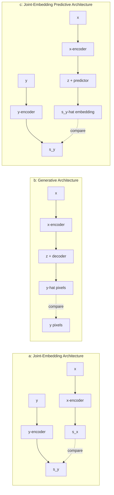

## Three architectures, one energy function

The paper frames *every* self-supervised approach — including its own — through
one lens: Energy-Based Models (EBMs). The objective is always the same shape:

> "...the self-supervised objective is to assign a high energy to incompatible
> inputs, and to assign a low energy to compatible inputs." — *Section 2*

Translate "compatible" as *"these two things came from the same image"* and the
framework covers nearly everything. The differences are all about **where** the
compatibility is measured and **how** prediction happens.

| Family | Predicts | Risk |
|---|---|---|
| Joint-Embedding (DINO, SimCLR) | Same embedding for two augmented views | **Representation collapse** — encoder ignores the input and outputs a constant |
| Generative (MAE, BEiT) | Raw pixels of masked regions, from a decoder conditioned on mask tokens `z` | Capacity wasted on irrelevant pixel detail |
| Joint-Embedding **Predictive** (I-JEPA) | The *embedding* of masked regions, from a predictor conditioned on mask tokens `z` | Still collapse-prone — needs the same defense as (a) |

JEPA is structurally a hybrid: like a Generative Architecture, it conditions a
network on `z` (positional info about *what* to predict) instead of demanding
invariance to a fixed augmentation set. But like a Joint-Embedding Architecture,
its loss lives in embedding space, not pixel space — so it inherits collapse risk,
not pixel-reconstruction overhead.

> **Wait — if collapse is a known failure mode, why not just avoid embedding-space
> losses entirely?** Because embedding space is *where the semantics live*. The
> fix isn't to abandon it — it's architectural: I-JEPA uses an asymmetric design
> between its two encoders (a target encoder updated only by exponential moving
> average, never by gradient) to make the trivial "output a constant" solution
> unreachable by gradient descent. You'll see exactly how in the next lesson.
